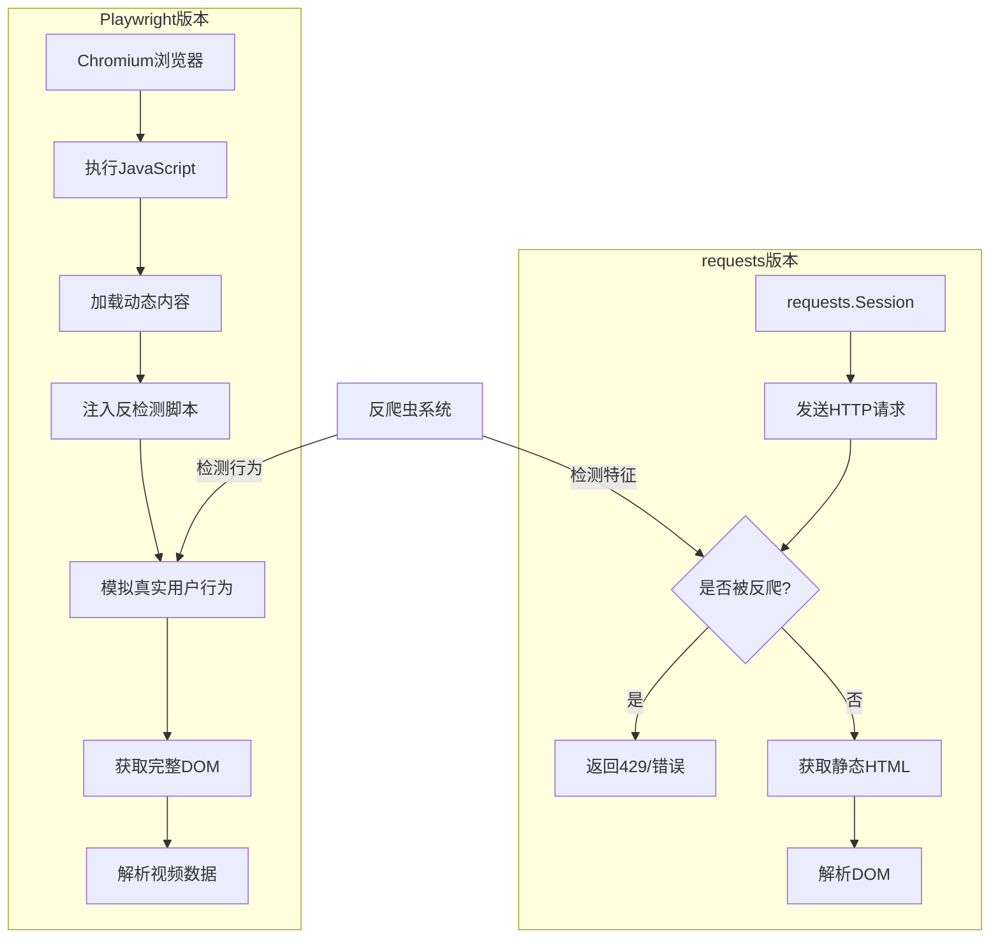
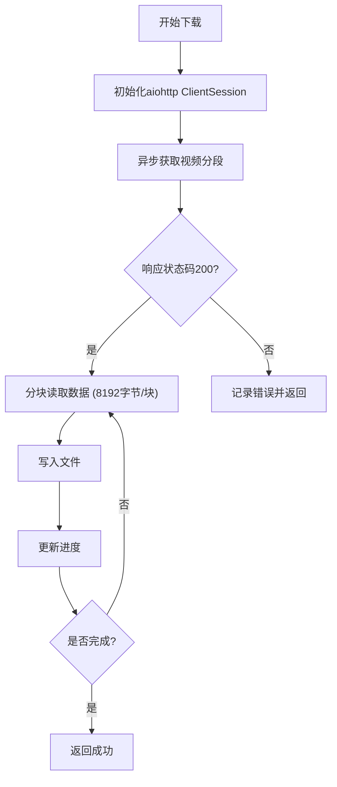
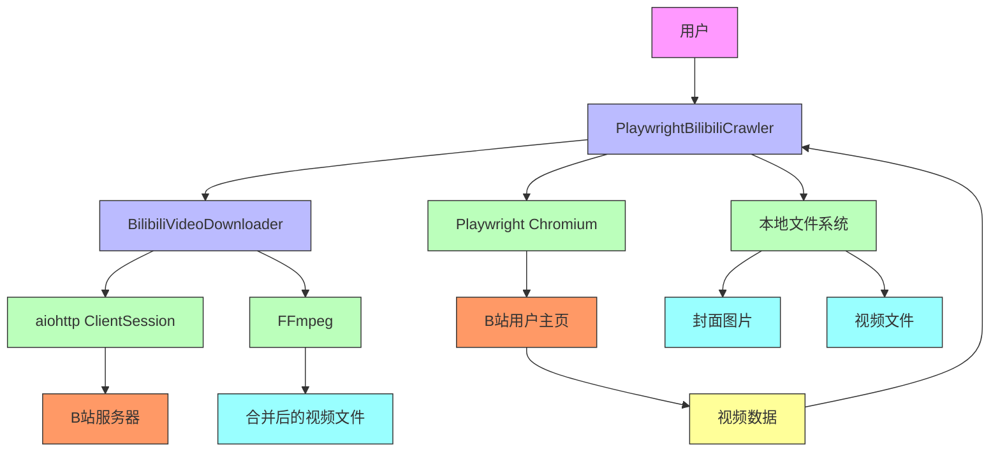

# 技术实现原理

<cite>
**本文档引用文件**  
- [bilibili_cover_crawler_playwright.py](file://bilibili_cover_crawler_playwright.py)
- [config.py](file://config.py)
- [bilibili_cover_crawler.py](file://bilibili_cover_crawler.py)
</cite>

## 目录
1. [项目概述](#项目概述)
2. [Playwright爬虫工作流程](#playwright爬虫工作流程)
3. [Playwright与requests版本对比](#playwright与requests版本对比)
4. [异步下载机制](#异步下载机制)
5. [数据流路径](#数据流路径)
6. [面向对象设计与配置驱动架构](#面向对象设计与配置驱动架构)
7. [组件交互图](#组件交互图)

## 项目概述

本项目是一个基于Python的哔哩哔哩视频封面与视频爬虫系统，包含两个核心版本：基于Playwright的浏览器自动化版本和基于requests的传统HTTP请求版本。系统通过模拟真实用户行为，从哔哩哔哩用户主页获取视频封面和视频数据，并支持异步下载与FFmpeg合并功能。项目采用配置驱动架构，实现了高内聚低耦合的设计，便于维护和扩展。

**本文档引用文件**  
- [bilibili_cover_crawler_playwright.py](file://bilibili_cover_crawler_playwright.py)
- [config.py](file://config.py)

## Playwright爬虫工作流程

Playwright爬虫的工作流程是一个高度模拟真实用户行为的自动化过程，具体步骤如下：

1. **启动无头浏览器**：通过`PlaywrightBilibiliCrawler.initialize_browser()`方法启动Chromium浏览器。该方法配置了真实的浏览器特征，如视窗大小、用户代理、地理位置等，并设置了额外的HTTP头以模拟真实请求。浏览器启动时，`headless`模式由`config.PLAYWRIGHT_CONFIG['headless']`控制，可选择有头或无头模式运行。

2. **访问目标用户主页**：使用`PlaywrightBilibiliCrawler.get_user_videos()`方法，通过`self.page.goto()`访问`https://space.bilibili.com/{uid}/upload/video`用户视频页面。在访问前，系统会执行`smart_delay()`智能延迟机制，避免请求过于频繁。

3. **注入JavaScript提取数据或解析DOM**：系统通过`add_stealth_scripts()`方法注入多个JavaScript脚本，隐藏自动化特征。例如，通过`Object.defineProperty(navigator, 'webdriver', { get: () => undefined })`隐藏webdriver属性，模拟`window.chrome`对象，以及设置真实的`navigator.plugins`和`navigator.languages`。这些脚本有效规避了反爬虫检测。

4. **获取封面与视频信息**：通过`scroll_and_collect_videos()`方法滚动页面，使用`config.VIDEO_SELECTORS`中定义的CSS选择器（如`.bili-video-card`、`.small-item`）定位视频元素。对于每个视频元素，调用`extract_video_info()`方法提取BV号、标题和封面URL。系统还通过`get_expected_video_count()`方法解析分页信息，验证数据完整性。

5. **下载资源**：提取到视频信息后，系统调用`download_covers_for_videos()`方法，使用`aiohttp`异步下载封面图片。下载前会通过`get_image_extension()`获取正确的文件扩展名，并使用`sanitize_filename()`清理文件名中的非法字符。

**本文档引用文件**  
- [bilibili_cover_crawler_playwright.py](file://bilibili_cover_crawler_playwright.py#L489-L526)
- [config.py](file://config.py#L137-L165)

## Playwright与requests版本对比

本项目提供了Playwright和requests两个版本的爬虫，它们在反爬虫能力和实现机制上存在显著差异。

### 传统requests版本的局限性

基于`requests`库的传统爬虫（`bilibili_cover_crawler.py`）存在以下局限性：
- **易被反爬**：由于`requests`发出的请求具有明显的自动化特征（如固定的User-Agent、缺少JavaScript执行能力），容易被哔哩哔哩的反爬虫系统识别。当请求过于频繁时，会立即返回“请求过于频繁”或429状态码。
- **无法处理动态内容**：`requests`只能获取静态HTML，无法执行JavaScript，因此无法获取通过AJAX加载的视频数据。
- **简单的反爬策略**：该版本仅通过`smart_delay()`和`handle_request_error()`实现简单的延迟和重试，反爬能力较弱。

### Playwright的优势

Playwright版本（`bilibili_cover_crawler_playwright.py`）通过模拟真实浏览器环境，显著提升了反爬能力：
- **高仿真度**：Playwright启动真实的Chromium浏览器，能够完整执行JavaScript，加载动态内容，其网络指纹与真实用户几乎无法区分。
- **全面的反检测机制**：通过`add_stealth_scripts()`注入脚本，隐藏了`navigator.webdriver`、`window.chrome`等自动化特征，并模拟了真实的插件、语言和地理位置信息。
- **智能的请求策略**：`smart_delay()`方法根据连续请求次数、失败次数和错误时间动态调整延迟，避免触发反爬限制。当连续请求达到`config.MAX_CONSECUTIVE_REQUESTS`（默认30次）时，会自动休息`config.LONG_BREAK_DURATION`（默认15秒）并更新浏览器上下文。
- **更高的成功率**：由于其高仿真度，Playwright版本的请求成功率远高于`requests`版本，能够在更短的请求间隔（3-8秒 vs 15-30秒）下稳定运行。

**图表来源**  
- [bilibili_cover_crawler_playwright.py](file://bilibili_cover_crawler_playwright.py#L587-L626)
- [bilibili_cover_crawler.py](file://bilibili_cover_crawler.py#L100-L150)

## 异步下载机制

系统采用`aiohttp`库实现异步下载机制，显著提升了多文件并发下载的效率。

### 异步下载实现

`BilibiliVideoDownloader.download_segment()`方法是异步下载的核心。它使用`aiohttp.ClientSession`创建一个HTTP会话，并通过`async with`语法异步获取视频分段。下载过程采用分块读取（`iter_chunked(8192)`），避免一次性加载大文件到内存。每下载一个块，就立即写入文件，并通过`progress_callback`更新进度条。

### 并发效率提升

异步机制允许同时下载多个视频分段。例如，在下载一个视频时，系统会同时下载视频流（video.m4s）和音频流（audio.m4s）。由于`aiohttp`基于`asyncio`，这些下载操作在单线程内并发执行，避免了多线程的上下文切换开销。相比同步下载，异步下载的效率提升主要体现在：
- **更高的吞吐量**：可以同时处理多个下载任务，充分利用网络带宽。
- **更低的资源消耗**：避免了多线程或多进程的内存和CPU开销。
- **更好的响应性**：主程序不会因等待I/O操作而阻塞，可以及时响应用户输入。

**图表来源**  
- [bilibili_cover_crawler_playwright.py](file://bilibili_cover_crawler_playwright.py#L166-L194)
- [config.py](file://config.py#L250-L260)

## 数据流路径

系统从用户输入到本地存储的完整数据流路径如下：

1. **输入UID**：用户通过命令行或交互式输入提供目标用户的UID。
2. **加载config配置**：程序导入`config.py`，加载所有配置参数，如请求延迟、浏览器设置、FFmpeg路径等。
3. **初始化Playwright浏览器**：调用`PlaywrightBilibiliCrawler.initialize_browser()`，启动浏览器并设置上下文。
4. **分页抓取视频列表**：访问用户视频页面，通过滚动和点击“下一页”按钮，分页抓取所有视频。`get_user_videos()`方法负责协调整个抓取过程。
5. **提取封面URL与视频流地址**：对于每个视频，`extract_video_info()`提取封面URL；对于视频下载，`get_video_info()`和`get_play_url()`通过B站API获取视频和音频流地址。
6. **异步下载**：`download_covers_for_videos()`或`download_video()`方法使用`aiohttp`异步下载封面或视频分段。
7. **调用FFmpeg合并**：下载完成后，`merge_video_audio()`方法调用FFmpeg将视频和音频分段合并为一个MP4文件。
8. **本地保存**：合并后的视频文件保存到`config.VIDEO_DOWNLOAD_CONFIG['output_dir']`，封面图片保存到以`UID_用户名`命名的目录中。

**图表来源**  
- [bilibili_cover_crawler_playwright.py](file://bilibili_cover_crawler_playwright.py#L1838-L1872)
- [config.py](file://config.py#L300-L320)

## 面向对象设计与配置驱动架构

系统采用面向对象设计和配置驱动架构，实现了高内聚低耦合。

### 主爬虫类职责划分

`PlaywrightBilibiliCrawler`类是主爬虫类，其职责明确划分：
- **浏览器管理**：`initialize_browser()`和`close_browser()`负责浏览器的生命周期。
- **页面操作**：`get_user_videos()`、`scroll_and_collect_videos()`等方法负责页面导航和数据抓取。
- **错误处理**：`handle_request_error()`和`wait_for_page_fully_loaded()`处理网络错误和页面加载问题。
- **视频下载协调**：通过`video_downloader`字段持有`BilibiliVideoDownloader`实例，委托其处理视频下载和合并。

`BilibiliVideoDownloader`类则专注于视频下载：
- **HTTP会话管理**：`init_session()`和`close_session()`管理`aiohttp`会话。
- **API交互**：`get_video_info()`和`get_play_url()`与B站API交互。
- **文件下载**：`download_segment()`执行异步下载。
- **视频合并**：`merge_video_audio()`调用FFmpeg合并音视频。

这种职责划分使得代码结构清晰，易于维护和测试。

### 配置驱动架构

系统通过`config.py`实现配置驱动架构，所有可变参数（如延迟时间、超时设置、路径等）都集中在此文件中。这种设计带来了以下优势：
- **高内聚**：配置逻辑集中，避免了硬编码。
- **低耦合**：代码与具体配置值解耦，修改配置无需改动代码。
- **易于扩展**：添加新功能（如支持新平台）只需修改配置，无需重构代码。
- **环境适应性**：通过修改`config.py`，程序可以轻松适应不同网络环境和用户需求。

**本文档引用文件**  
- [bilibili_cover_crawler_playwright.py](file://bilibili_cover_crawler_playwright.py#L489-L526)
- [config.py](file://config.py#L0-L50)

## 组件交互图

**图表来源**  
- [bilibili_cover_crawler_playwright.py](file://bilibili_cover_crawler_playwright.py)
- [config.py](file://config.py)