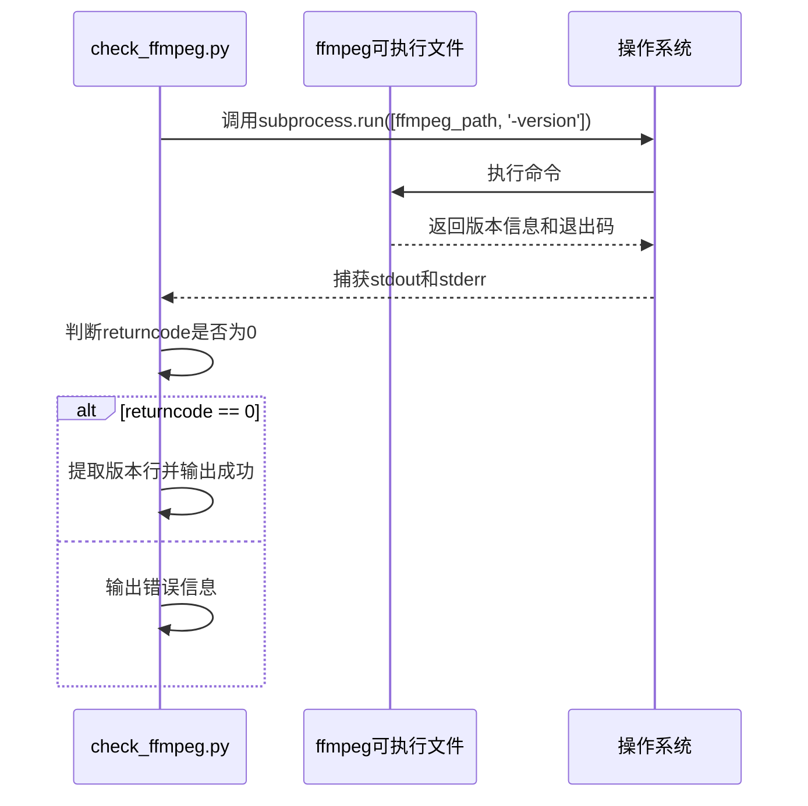

# FFmpeg相关问题

<cite>
**本文档中引用的文件**  
- [check_ffmpeg.py](file://check_ffmpeg.py)
- [config.py](file://config.py)
- [bilibili_cover_crawler_playwright.py](file://bilibili_cover_crawler_playwright.py)
</cite>

## 目录
1. [简介](#简介)
2. [FFmpeg检测与安装问题概述](#ffmpeg检测与安装问题概述)
3. [运行check_ffmpeg.py脚本检测安装状态](#运行check_ffmpegpy脚本检测安装状态)
4. [输出日志含义解析](#输出日志含义解析)
5. [按操作系统安装FFmpeg方法](#按操作系统安装ffmpeg方法)
6. [在config.py中设置自定义FFmpeg路径](#在configpy中设置自定义ffmpeg路径)
7. [验证FFmpeg是否正常工作](#验证ffmpeg是否正常工作)
8. [常见错误示例及修复方式](#常见错误示例及修复方式)
9. [程序检测逻辑分析](#程序检测逻辑分析)
10. [安装后验证建议](#安装后验证建议)

## 简介
本项目依赖FFmpeg工具进行视频下载和合并操作。当FFmpeg未安装、路径配置错误或版本不兼容时，可能导致视频功能无法使用。本文档详细说明如何检测、安装和配置FFmpeg，并提供常见问题的解决方案。

## FFmpeg检测与安装问题概述
FFmpeg是多媒体处理的核心工具，用于视频解码、编码、转码和合并等操作。在本项目中，FFmpeg主要用于合并从B站获取的视频流和音频流。若FFmpeg未正确安装或配置，将导致`--download-videos`功能失效。

可能导致的问题包括：
- `ffmpeg not found`：系统未找到FFmpeg可执行文件
- `bad file descriptor`：进程通信异常，可能与环境或权限有关
- 版本不兼容：旧版本FFmpeg不支持某些参数或格式

**Section sources**
- [bilibili_cover_crawler_playwright.py](file://bilibili_cover_crawler_playwright.py#L1000-L1100)

## 运行check_ffmpeg.py脚本检测安装状态
`check_ffmpeg.py` 是一个专用的检测脚本，用于检查FFmpeg的安装状态并提供安装指导。

### 执行方法
```bash
python check_ffmpeg.py
```

该脚本会依次执行以下步骤：
1. 检查系统基本信息（操作系统、Python版本、磁盘空间）
2. 按优先级顺序检测FFmpeg是否存在
3. 测试FFmpeg是否能正常运行
4. 若未找到，则显示详细的安装指南

脚本通过调用`shutil.which()`和文件路径遍历的方式查找FFmpeg，确保跨平台兼容性。

**Section sources**
- [check_ffmpeg.py](file://check_ffmpeg.py#L50-L100)

## 输出日志含义解析
`check_ffmpeg.py`脚本输出的日志信息具有明确的语义标识：

| 图标 | 含义 | 说明 |
|------|------|------|
| 🔍 | 检查中 | 正在检测某个路径或状态 |
| ✅ | 成功 | 已找到FFmpeg或测试通过 |
| ❌ | 失败 | 未找到文件或测试失败 |
| ⚠️ | 警告 | 存在潜在问题 |
| 🧪 | 测试 | 正在测试FFmpeg功能 |
| 💡 | 提示 | 提供使用建议 |

例如：
```
🔍 检查自定义路径: C:\ffmpeg\bin\ffmpeg.exe
✅ 在PATH中找到FFmpeg: C:\ffmpeg\bin\ffmpeg.exe
🧪 测试FFmpeg功能: C:\ffmpeg\bin\ffmpeg.exe
✅ FFmpeg工作正常: ffmpeg version 6.0
```

表示在系统PATH中找到了FFmpeg，并且测试其`-version`命令执行成功。

**Section sources**
- [check_ffmpeg.py](file://check_ffmpeg.py#L20-L40)

## 按操作系统安装FFmpeg方法
根据不同的操作系统，安装FFmpeg的方法有所不同。以下是各平台的推荐安装方式。

### Windows 安装方法
#### 方法1：手动安装（推荐）
1. 访问 [FFmpeg官网下载页面](https://ffmpeg.org/download.html)
2. 下载 Windows 版本（推荐选择 "Windows builds by BtbN"）
3. 解压到 `C:\ffmpeg`
4. 将 `C:\ffmpeg\bin` 添加到系统 `PATH` 环境变量
   - 右键“此电脑” → 属性 → 高级系统设置 → 环境变量
   - 在“系统变量”中找到 `Path`，点击编辑 → 新建 → 输入 `C:\ffmpeg\bin`
5. 重启命令行终端

#### 方法2：使用包管理器
```bash
# 使用 Chocolatey
choco install ffmpeg

# 使用 Scoop
scoop install ffmpeg

# 使用 winget
winget install ffmpeg
```

### Linux 安装方法
根据不同发行版使用对应命令：
```bash
# Ubuntu/Debian
sudo apt install ffmpeg

# CentOS/RHEL
sudo yum install ffmpeg

# Fedora
sudo dnf install ffmpeg

# Arch Linux
sudo pacman -S ffmpeg

# openSUSE
sudo zypper install ffmpeg
```

### macOS 安装方法
#### 使用 Homebrew（推荐）
```bash
brew install ffmpeg
```

#### 使用 MacPorts
```bash
sudo port install ffmpeg
```

安装完成后，所有方法都需重启终端以刷新环境变量。

**Section sources**
- [check_ffmpeg.py](file://check_ffmpeg.py#L120-L150)

## 在config.py中设置自定义FFmpeg路径
如果FFmpeg未安装在标准路径，或希望使用特定版本，可以在 `config.py` 中设置自定义路径。

### 配置项说明
```python
FFMPEG_CONFIG = {
    'enabled': True,                    # 是否启用FFmpeg功能
    'custom_path': '',                  # 自定义FFmpeg路径（优先级最高）
    'timeout': 300,                     # FFmpeg执行超时时间（秒）
    'quality_preset': 'fast',           # 编码预设
    'video_codec': 'copy',              # 视频编解码器
    'audio_codec': 'aac',               # 音频编解码器
    'extra_args': ['-strict', 'experimental'],  # 额外参数
    'search_paths': {                   # 各平台搜索路径
        'windows': [...],
        'linux': [...],
        'darwin': [...]
    }
}
```

### 设置自定义路径示例
#### Windows
```python
'custom_path': 'C:\\ffmpeg\\bin\\ffmpeg.exe'
```

#### Linux/macOS
```python
'custom_path': '/usr/local/bin/ffmpeg'
```

设置后，程序将优先使用此路径，忽略系统PATH和其他默认路径。

**Section sources**
- [config.py](file://config.py#L350-L390)

## 程序检测逻辑分析
`check_ffmpeg.py` 中的 `check_ffmpeg()` 函数实现了逐级检测机制，其逻辑如下：


**Diagram sources**
- [check_ffmpeg.py](file://check_ffmpeg.py#L50-L100)

该逻辑确保了最大兼容性：
1. **优先级最高**：配置文件中的 `custom_path`
2. **次优先级**：系统 `PATH` 环境变量中的 `ffmpeg`
3. **最后尝试**：各平台的常见安装路径列表

此机制保证了即使FFmpeg未加入环境变量，也能通过硬编码路径找到。

**Section sources**
- [check_ffmpeg.py](file://check_ffmpeg.py#L50-L100)

## 验证FFmpeg是否正常工作
除了存在性检测外，还需验证FFmpeg能否正常执行命令。

### 内部测试逻辑
`test_ffmpeg(ffmpeg_path)` 函数通过执行 `ffmpeg -version` 来测试：



**Diagram sources**
- [check_ffmpeg.py](file://check_ffmpeg.py#L105-L120)

### 手动验证方法
安装完成后，在终端执行：
```bash
ffmpeg -version
```

预期输出应包含版本信息，如：
```
ffmpeg version 6.0 Copyright (c) 2000-2023 the FFmpeg developers
```

若提示 `'ffmpeg' 不是内部或外部命令`，说明环境变量未正确配置。

**Section sources**
- [check_ffmpeg.py](file://check_ffmpeg.py#L105-L120)

## 常见错误示例及修复方式
以下是用户可能遇到的典型错误及其解决方案。

### 错误1：'ffmpeg not found'
**现象**：程序无法找到FFmpeg可执行文件  
**原因**：未安装FFmpeg或未配置路径  
**解决方案**：
1. 运行 `check_ffmpeg.py` 查看详细检测过程
2. 根据操作系统安装FFmpeg（见第5节）
3. 安装后重启终端
4. 执行 `ffmpeg -version` 验证

### 错误2：'bad file descriptor'
**现象**：在调用FFmpeg时出现文件描述符错误  
**原因**：子进程通信异常，可能由于权限、环境或FFmpeg损坏  
**解决方案**：
1. 重新安装FFmpeg
2. 确保运行目录有读写权限
3. 检查杀毒软件是否拦截
4. 使用管理员权限运行脚本（Windows）

### 错误3：FFmpeg版本过低
**现象**：合并视频失败，提示不支持的参数  
**解决方案**：
1. 升级到最新版本FFmpeg
2. 或在 `config.py` 中调整 `extra_args` 参数以兼容旧版本

**Section sources**
- [check_ffmpeg.py](file://check_ffmpeg.py#L105-L120)
- [bilibili_cover_crawler_playwright.py](file://bilibili_cover_crawler_playwright.py#L1050-L1080)

## 安装后验证建议
为确保FFmpeg正确安装并可被项目使用，请遵循以下步骤：

1. **安装FFmpeg**：根据操作系统选择合适的方法
2. **重启终端**：确保环境变量生效
3. **命令行验证**：
   ```bash
   ffmpeg -version
   ```
   应输出版本信息，无“未找到命令”错误
4. **运行检测脚本**：
   ```bash
   python check_ffmpeg.py
   ```
   应显示“FFmpeg已正确安装并可正常工作”
5. **测试视频下载**：
   ```bash
   python bilibili_cover_crawler_playwright.py 123456 --download-videos
   ```
   观察是否能成功合并视频

遵循此流程可最大程度避免配置问题。

**Section sources**
- [check_ffmpeg.py](file://check_ffmpeg.py#L155-L170)
- [bilibili_cover_crawler_playwright.py](file://bilibili_cover_crawler_playwright.py#L1000-L1100)