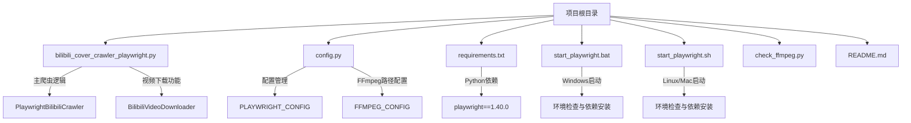
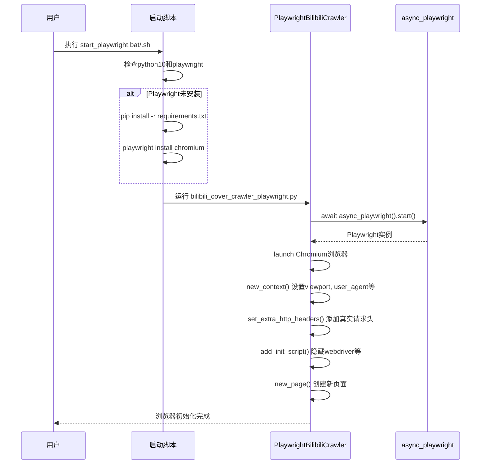

# Playwright浏览器初始化失败

<cite>
**本文档引用的文件**  
- [bilibili_cover_crawler_playwright.py](file://bilibili_cover_crawler_playwright.py)
- [requirements.txt](file://requirements.txt)
- [start_playwright.bat](file://start_playwright.bat)
- [start_playwright.sh](file://start_playwright.sh)
- [config.py](file://config.py)
- [README.md](file://README.md)
</cite>

## 目录
1. [简介](#简介)
2. [项目结构](#项目结构)
3. [核心组件](#核心组件)
4. [Playwright初始化流程](#playwright初始化流程)
5. [常见初始化失败原因及解决方案](#常见初始化失败原因及解决方案)
6. [依赖管理与环境配置](#依赖管理与环境配置)
7. [故障排查指南](#故障排查指南)
8. [性能与资源建议](#性能与资源建议)
9. [结论](#结论)

## 简介
本文档旨在深入分析基于Playwright的哔哩哔哩封面爬虫在浏览器初始化过程中可能遇到的问题，并提供详尽的解决方案。通过分析项目代码、配置文件和启动脚本，我们将系统性地解释Playwright浏览器启动失败的根本原因，包括但不限于浏览器驱动缺失、系统依赖未安装、执行权限不足等。同时，文档将指导用户如何正确安装Playwright及其依赖项，确保环境兼容性，并提供针对常见错误日志的解读与修复方法。

## 项目结构
本项目为一个基于Python的哔哩哔哩视频封面与视频爬取工具，采用Playwright进行浏览器自动化操作。项目结构清晰，包含核心爬虫脚本、配置文件、依赖声明和跨平台启动脚本。



**Diagram sources**
- [bilibili_cover_crawler_playwright.py](file://bilibili_cover_crawler_playwright.py#L0-L2313)
- [requirements.txt](file://requirements.txt#L0-L24)
- [start_playwright.bat](file://start_playwright.bat#L0-L50)
- [start_playwright.sh](file://start_playwright.sh#L0-L41)

**Section sources**
- [bilibili_cover_crawler_playwright.py](file://bilibili_cover_crawler_playwright.py#L0-L2313)
- [requirements.txt](file://requirements.txt#L0-L24)
- [start_playwright.bat](file://start_playwright.bat#L0-L50)
- [start_playwright.sh](file://start_playwright.sh#L0-L41)

## 核心组件
项目的核心功能由`PlaywrightBilibiliCrawler`类实现，该类负责初始化Playwright浏览器、管理页面会话、执行网络请求和内容抓取。另一个关键组件是`BilibiliVideoDownloader`，它处理视频信息获取、分段下载和使用FFmpeg合并音视频流。

**Section sources**
- [bilibili_cover_crawler_playwright.py](file://bilibili_cover_crawler_playwright.py#L0-L2313)

## Playwright初始化流程
`PlaywrightBilibiliCrawler`类的`initialize_browser`方法是浏览器初始化的核心。该流程包括启动Playwright实例、启动Chromium浏览器、创建具有真实用户特征的浏览器上下文、设置额外的HTTP头以模拟真实请求，以及添加反检测脚本。



**Diagram sources**
- [bilibili_cover_crawler_playwright.py](file://bilibili_cover_crawler_playwright.py#L1000-L1200)
- [start_playwright.bat](file://start_playwright.bat#L10-L30)
- [start_playwright.sh](file://start_playwright.sh#L10-L30)

**Section sources**
- [bilibili_cover_crawler_playwright.py](file://bilibili_cover_crawler_playwright.py#L1000-L1200)

## 常见初始化失败原因及解决方案
Playwright浏览器初始化失败通常由以下几个原因导致：

### 1. Playwright库或浏览器驱动未安装
这是最常见的问题。项目依赖`playwright==1.40.0`，并且需要通过`playwright install chromium`命令安装Chromium浏览器二进制文件。

**解决方案**：
- 确保已通过`pip install -r requirements.txt`安装了Playwright库。
- 执行`python -m playwright install chromium`来安装浏览器。项目启动脚本`start_playwright.bat`和`start_playwright.sh`已自动包含此检查和安装逻辑。

### 2. 系统级依赖缺失
在Linux等系统上，Chromium浏览器运行需要一系列系统级共享库和字体，如`libglib2.0-0`, `libnss3`, `libatk1.0-0`等。缺少这些依赖会导致浏览器进程意外退出。

**解决方案**：
- 在Linux上，首次运行前应执行`playwright install-deps`命令来安装所有系统依赖。
- 参考[Playwright官方文档](https://playwright.dev/python/docs/library#install-system-dependencies)获取不同操作系统的具体依赖列表。

### 3. Python环境或版本不兼容
项目明确要求使用`python10`（即Python 3.10+）。使用不兼容的Python版本可能导致库导入失败或运行时错误。

**解决方案**：
- 确认已安装Python 3.10或更高版本。
- 检查`python10`命令是否在系统PATH中可用。启动脚本中已包含对此命令的检查。

### 4. 权限不足
在某些受限的执行环境中（如某些共享主机或容器），可能没有足够的权限来创建进程或写入临时文件。

**解决方案**：
- 确保运行脚本的用户具有对项目目录的读写权限。
- 检查系统安全策略（如SELinux、AppArmor）是否阻止了浏览器进程的启动。

### 5. 资源不足
在内存或磁盘空间严重不足的环境中，浏览器进程可能无法成功启动。

**解决方案**：
- 确保系统有至少2GB的可用内存。
- 确保磁盘有足够空间用于浏览器缓存和临时文件。

### 6. 网络问题导致下载失败
如果在首次安装时网络连接不稳定，`playwright install`命令可能无法完整下载浏览器二进制文件。

**解决方案**：
- 检查网络连接，尝试重新运行`playwright install chromium`。
- 考虑使用国内镜像源或代理。

**常见错误日志解读**：
- **"Browser closed unexpectedly"**: 通常表示浏览器进程启动后立即崩溃，原因可能是系统依赖缺失或权限问题。
- **"Executable doesn't exist"**: 表明Playwright未能找到Chromium可执行文件，原因可能是`playwright install`未成功执行或安装路径被破坏。

**Section sources**
- [bilibili_cover_crawler_playwright.py](file://bilibili_cover_crawler_playwright.py#L1000-L1200)
- [start_playwright.bat](file://start_playwright.bat#L10-L30)
- [start_playwright.sh](file://start_playwright.sh#L10-L30)
- [README.md](file://README.md#L200-L300)

## 依赖管理与环境配置
为了确保环境的纯净和依赖的隔离，强烈建议使用Python虚拟环境。

### 使用虚拟环境的步骤：
1. 创建虚拟环境：`python -m venv venv`
2. 激活虚拟环境：
   - Windows: `venv\Scripts\activate`
   - Linux/macOS: `source venv/bin/activate`
3. 安装依赖：`pip install -r requirements.txt`
4. 安装浏览器：`playwright install chromium`
5. （Linux）安装系统依赖：`playwright install-deps`

项目中的`requirements.txt`文件精确锁定了所有Python依赖的版本，这有助于避免因版本冲突导致的兼容性问题。

**Section sources**
- [requirements.txt](file://requirements.txt#L0-L24)
- [README.md](file://README.md#L400-L450)

## 故障排查指南
当遇到浏览器初始化失败时，可以按照以下步骤进行排查：

1. **检查Python和Playwright安装**：
   ```bash
   python10 --version
   python10 -c "import playwright"
   ```

2. **验证Playwright安装**：
   ```bash
   python10 -m playwright install --dry-run
   ```
   此命令会列出所有需要安装的浏览器和依赖。

3. **检查系统依赖（Linux）**：
   ```bash
   python10 -m playwright install-deps --dry-run
   ```

4. **查看详细日志**：
   在`config.py`中将`LOG_LEVEL`设置为`DEBUG`，以获取更详细的日志输出，帮助定位问题。

5. **手动运行初始化代码**：
   编写一个最小化的测试脚本，仅包含Playwright的初始化代码，以排除项目其他逻辑的干扰。

**Section sources**
- [bilibili_cover_crawler_playwright.py](file://bilibili_cover_crawler_playwright.py#L1000-L1200)
- [config.py](file://config.py#L10-L50)
- [README.md](file://README.md#L500-L550)

## 性能与资源建议
为确保Playwright稳定运行，建议：
- **内存**：至少2GB可用内存。
- **磁盘空间**：预留至少1GB空间用于浏览器二进制文件和缓存。
- **CPU**：Playwright是多进程的，需要一定的CPU资源来渲染页面。
- **网络**：稳定的网络连接对于首次下载浏览器和后续的网页加载至关重要。

避免在Docker容器或CI/CD环境中无头运行时忽略系统依赖的安装。

## 结论
Playwright浏览器初始化失败是一个多因素问题，但通过系统性的检查和正确的环境配置，绝大多数问题都可以解决。关键在于确保Playwright库、浏览器二进制文件和系统级依赖都已正确安装，并且运行环境有足够的权限和资源。利用项目提供的启动脚本可以大大简化这一过程。对于复杂环境，使用虚拟环境进行依赖隔离是最佳实践。通过遵循本文档的指导，用户可以有效预防和解决Playwright初始化问题，确保爬虫程序的稳定运行。