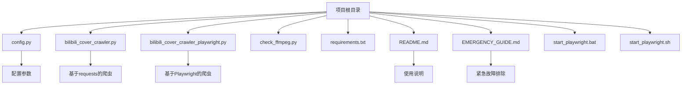
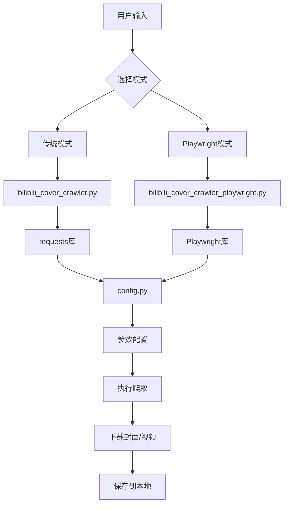
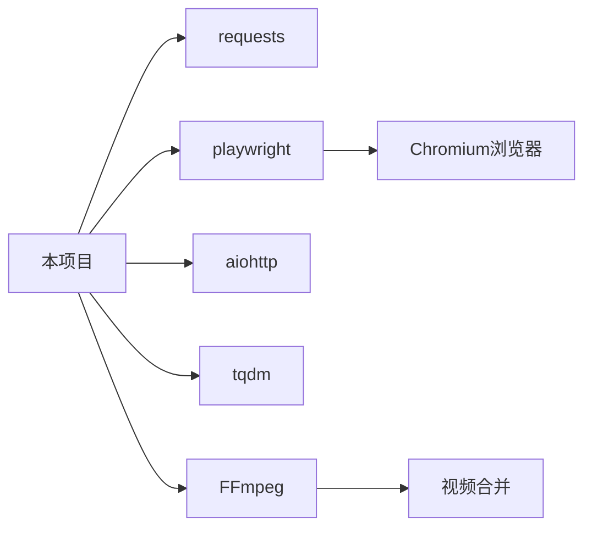

# 下载内容不完整或遗漏

<cite>
**本文档引用的文件**  
- [config.py](file://config.py)
- [bilibili_cover_crawler.py](file://bilibili_cover_crawler.py)
- [bilibili_cover_crawler_playwright.py](file://bilibili_cover_crawler_playwright.py)
- [README.md](file://README.md)
- [EMERGENCY_GUIDE.md](file://EMERGENCY_GUIDE.md)
</cite>

## 目录
1. [简介](#简介)
2. [项目结构](#项目结构)
3. [核心组件](#核心组件)
4. [架构概述](#架构概述)
5. [详细组件分析](#详细组件分析)
6. [依赖分析](#依赖分析)
7. [性能考虑](#性能考虑)
8. [故障排除指南](#故障排除指南)
9. [结论](#结论)

## 简介
本文档旨在分析在使用哔哩哔哩封面爬虫工具时，视频或封面下载过程中出现内容缺失、分页遗漏或任务中断的根本原因。重点检查分页逻辑是否因API响应异常或页面结构变化而失效，指导用户确认目标用户视频列表是否存在动态加载问题。通过启用详细日志模式排查请求与响应状态码，利用配置参数增强重试机制，并说明程序的断点续传功能。

## 项目结构
项目包含多个核心文件，分别负责配置、爬取逻辑、Playwright浏览器自动化、依赖管理和使用说明。



**Diagram sources**
- [config.py](file://config.py#L1-L400)
- [bilibili_cover_crawler.py](file://bilibili_cover_crawler.py#L1-L515)
- [bilibili_cover_crawler_playwright.py](file://bilibili_cover_crawler_playwright.py#L1-L2313)
- [README.md](file://README.md#L1-L553)
- [EMERGENCY_GUIDE.md](file://EMERGENCY_GUIDE.md#L1-L143)

**Section sources**
- [config.py](file://config.py#L1-L400)
- [bilibili_cover_crawler.py](file://bilibili_cover_crawler.py#L1-L515)
- [bilibili_cover_crawler_playwright.py](file://bilibili_cover_crawler_playwright.py#L1-L2313)
- [README.md](file://README.md#L1-L553)
- [EMERGENCY_GUIDE.md](file://EMERGENCY_GUIDE.md#L1-L143)

## 核心组件
核心组件包括基于`requests`的传统爬虫和基于`Playwright`的浏览器自动化爬虫。前者适用于简单场景，后者通过模拟真实用户行为，有效规避反爬机制，提高成功率。配置文件`config.py`集中管理所有可调参数，如请求延迟、重试次数和分页逻辑。

**Section sources**
- [config.py](file://config.py#L1-L400)
- [bilibili_cover_crawler.py](file://bilibili_cover_crawler.py#L1-L515)
- [bilibili_cover_crawler_playwright.py](file://bilibili_cover_crawler_playwright.py#L1-L2313)

## 架构概述
系统采用模块化设计，`BilibiliCoverCrawler`和`PlaywrightBilibiliCrawler`类分别封装了两种爬取策略。`config.py`提供全局配置，`README.md`和`EMERGENCY_GUIDE.md`提供操作和故障排除指导。`Playwright`版本通过启动真实浏览器实例，执行JavaScript，滚动页面并点击“下一页”按钮，实现对动态内容的完整抓取。



**Diagram sources**
- [bilibili_cover_crawler.py](file://bilibili_cover_crawler.py#L1-L515)
- [bilibili_cover_crawler_playwright.py](file://bilibili_cover_crawler_playwright.py#L1-L2313)
- [config.py](file://config.py#L1-L400)

## 详细组件分析

### 分页逻辑与内容缺失分析
分页逻辑是导致内容缺失或遗漏的关键环节。程序通过两种方式处理分页：API分页和DOM点击。

#### API分页（传统模式）
在`bilibili_cover_crawler.py`中，`get_user_videos`方法通过循环调用`USER_SPACE_API`，递增`pn`（页码）参数来获取数据。其停止条件是`page * config.PAGE_SIZE >= page_info.get('count', 0)`。如果API返回的`count`不准确，或因反爬导致某页请求失败，就会造成内容遗漏。

#### DOM点击分页（Playwright模式）
在`bilibili_cover_crawler_playwright.py`中，`click_next_page`方法通过`PAGINATION_CONFIG['next_page_selectors']`中定义的选择器（如`.vui_pagenation--btn-side:has-text("下一页")`）查找并点击“下一页”按钮。该方法会等待页面完全加载，并通过`get_pagination_info`解析`.vui_pagenation-go__count`等元素中的“共 X 页 / Y 个”文本，以验证当前页码和总页数，实现智能停止。

**问题分析**：
- **API响应异常**：传统模式依赖API，一旦API返回403/429错误，重试机制可能无法恢复，导致分页中断。
- **页面结构变化**：如果B站前端更新，导致分页按钮或计数元素的CSS选择器失效，`click_next_page`将无法找到按钮，提前终止爬取。
- **JavaScript加载不完全**：即使页面跳转，若JavaScript未完全执行，视频列表可能未加载，导致收集的视频数量不足。

```mermaid
sequenceDiagram
participant 用户 as 用户
participant 爬虫 as PlaywrightBilibiliCrawler
participant 页面 as B站页面
用户->>爬虫 : 启动爬取
爬虫->>页面 : 访问用户视频页
爬虫->>爬虫 : 滚动加载第一页视频
loop 检查下一页
爬虫->>页面 : 查找"下一页"按钮
alt 按钮存在且可点击
爬虫->>页面 : 点击按钮
爬虫->>页面 : 等待页面完全加载
爬虫->>页面 : 滚动加载新视频
else 按钮不存在或禁用
爬虫->>爬虫 : 解析分页信息
爬虫->>爬虫 : 验证是否为最后一页
break 终止循环
end
end
爬虫->>用户 : 完成下载
```

**Diagram sources**
- [bilibili_cover_crawler_playwright.py](file://bilibili_cover_crawler_playwright.py#L1135-L1238)
- [config.py](file://config.py#L270-L285)

**Section sources**
- [bilibili_cover_crawler_playwright.py](file://bilibili_cover_crawler_playwright.py#L1-L2313)
- [config.py](file://config.py#L1-L400)

### 重试机制与网络问题
当请求失败时，程序会触发重试机制。`handle_request_error`方法会检测反爬关键词（如“请求过于频繁”、“429”），并执行冷却等待。

#### 配置参数
- **MAX_RETRIES**: 在`config.py`中定义，控制单个请求的最大重试次数。默认值为3。
- **PAGE_RETRY_COUNT**: 虽然在文档中提及，但在代码中未直接找到此参数，其功能可能由`MAX_RETRIES`和外层循环共同实现。
- **RETRY_DELAY** 和 **RETRY_BACKOFF**: 定义了重试的初始延迟和退避倍数，实现指数退避策略。

**建议**：
- 在高延迟或不稳定网络环境下，应适当增加`MAX_RETRIES`和`RETRY_DELAY`，以提高任务的鲁棒性。
- 同时，增加`PLAYWRIGHT_CONFIG['timeout']`（默认120秒）以应对慢速网络。

```mermaid
flowchart TD
A[发起请求] --> B{请求成功?}
B --> |是| C[处理响应]
B --> |否| D[检查错误类型]
D --> E{是否为反爬?}
E --> |是| F[执行冷却等待]
E --> |否| G[等待RETRY_DELAY * (RETRY_BACKOFF^attempt)]
F & G --> H[重试次数+1]
H --> I{达到MAX_RETRIES?}
I --> |否| A
I --> |是| J[记录失败并继续]
```

**Diagram sources**
- [bilibili_cover_crawler.py](file://bilibili_cover_crawler.py#L190-L230)
- [config.py](file://config.py#L123-L123)

**Section sources**
- [bilibili_cover_crawler.py](file://bilibili_cover_crawler.py#L1-L515)
- [config.py](file://config.py#L1-L400)

## 依赖分析
项目依赖清晰，核心依赖包括`requests`、`playwright`、`aiohttp`和`FFmpeg`。`requirements.txt`列出了所有Python包，`start_playwright.bat/sh`脚本负责自动化安装Playwright浏览器。`FFmpeg`作为外部工具，用于视频下载后的音视频合并，其路径通过`FFMPEG_CONFIG['search_paths']`在多个平台进行查找。



**Diagram sources**
- [requirements.txt](file://requirements.txt#L1-L20)
- [bilibili_cover_crawler_playwright.py](file://bilibili_cover_crawler_playwright.py#L1-L2313)

## 性能考虑
程序性能以稳定性优先，而非速度。通过`REQUEST_DELAY_MIN/MAX`和`DOWNLOAD_DELAY_MIN/MAX`引入随机延迟，模拟人类操作。`MAX_CONSECUTIVE_REQUESTS`和`LONG_BREAK_DURATION`确保不会因连续请求而被封禁。`Playwright`模式虽然启动慢，但因其真实浏览器环境，整体成功率更高，减少了因失败重试而浪费的时间。

## 故障排除指南
当遇到下载不完整或任务中断时，请按以下步骤排查：

1.  **确认动态加载问题**：打开目标用户的视频页面，手动滚动并点击“下一页”，确认所有视频都能正常加载。如果页面有“加载中”或无限滚动，可能需要调整`SCROLL_STEP`和`MAX_SCROLL_ATTEMPTS`。
2.  **启用详细日志**：将`config.py`中的`LOG_LEVEL`设置为`logging.DEBUG`，并启用`ENABLE_HTML_DEBUG`。重新运行程序，检查日志中每一页的请求URL、响应状态码（重点关注403/429）以及HTML内容，确认分页按钮和视频元素是否存在。
3.  **调整重试参数**：在`config.py`中增加`MAX_RETRIES`（如改为5）和`RETRY_DELAY`（如改为15），以增强网络波动下的恢复能力。
4.  **检查网络稳定性**：确保网络连接稳定，避免在高峰时段或使用不稳定的WiFi/热点。
5.  **断点续传**：对于已中断的任务，无需担心。程序在下载前会检查文件是否存在，因此可直接重新运行命令，它将自动跳过已下载的部分，继续处理剩余内容。

**Section sources**
- [config.py](file://config.py#L1-L400)
- [bilibili_cover_crawler.py](file://bilibili_cover_crawler.py#L1-L515)
- [bilibili_cover_crawler_playwright.py](file://bilibili_cover_crawler_playwright.py#L1-L2313)
- [EMERGENCY_GUIDE.md](file://EMERGENCY_GUIDE.md#L1-L143)

## 结论
下载内容不完整的主要原因在于分页逻辑的失效，这通常由API异常或前端页面结构变更引起。推荐使用基于Playwright的版本，它通过模拟真实用户点击分页按钮，能更可靠地处理动态内容。通过合理配置`MAX_RETRIES`等参数增强重试机制，并利用程序内置的断点续传功能，可以有效解决内容缺失和任务中断的问题，确保下载任务的完整性和可靠性。