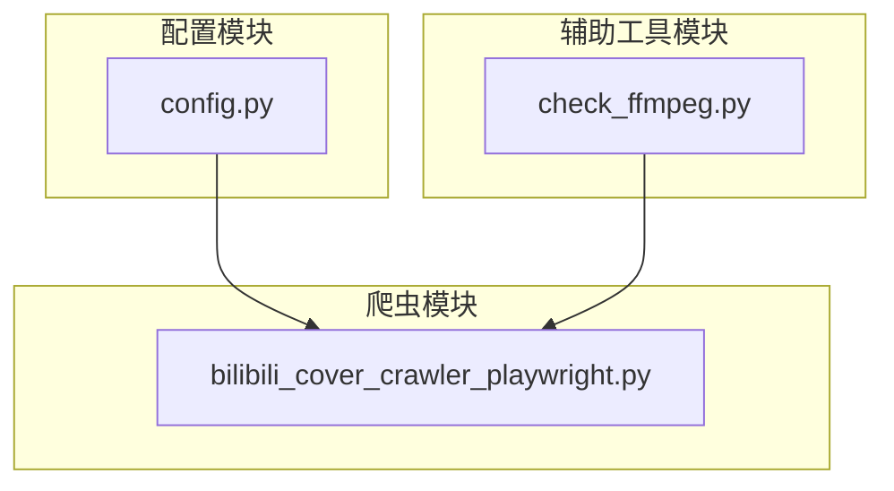
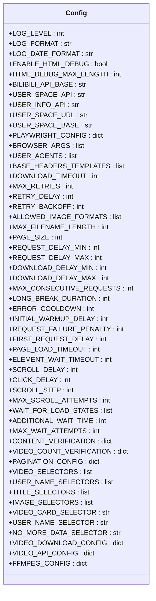
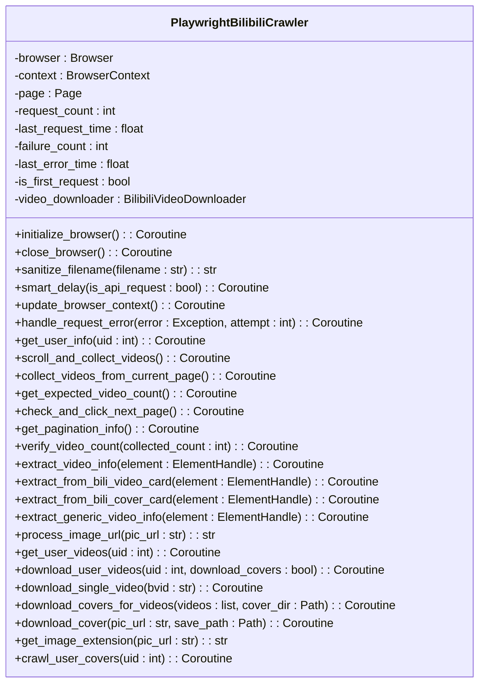
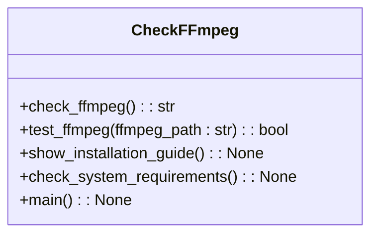
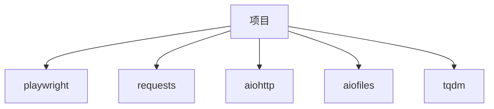

# 文件写入权限问题

<cite>
**本文档引用的文件**  
- [config.py](file://config.py)
- [bilibili_cover_crawler_playwright.py](file://bilibili_cover_crawler_playwright.py)
- [check_ffmpeg.py](file://check_ffmpeg.py)
</cite>

## 目录
1. [简介](#简介)
2. [项目结构](#项目结构)
3. [核心组件](#核心组件)
4. [架构概述](#架构概述)
5. [详细组件分析](#详细组件分析)
6. [依赖分析](#依赖分析)
7. [性能考虑](#性能考虑)
8. [故障排除指南](#故障排除指南)
9. [结论](#结论)

## 简介
本文档旨在解决因目录权限不足、磁盘空间不够或路径非法导致的文件写入失败问题。通过分析项目代码，提供详细的解决方案，包括如何检查目标输出目录的读写权限，避免使用系统保护目录，以及如何自定义下载路径。

## 项目结构
项目结构如下：
```
.
├── EMERGENCY_GUIDE.md
├── README.md
├── bilibili_cover_crawler.py
├── bilibili_cover_crawler_playwright.py
├── check_ffmpeg.py
├── config.py
├── requirements.txt
├── start_playwright.bat
└── start_playwright.sh
```

**Section sources**
- [config.py](file://config.py#L1-L400)
- [bilibili_cover_crawler_playwright.py](file://bilibili_cover_crawler_playwright.py#L1-L2313)

## 核心组件
本项目的核心组件包括 `config.py` 和 `bilibili_cover_crawler_playwright.py`。`config.py` 文件中定义了下载路径、日志级别、请求头等配置信息。`bilibili_cover_crawler_playwright.py` 文件中实现了基于 Playwright 的哔哩哔哩封面爬虫类，负责初始化浏览器、获取用户信息、滚动并收集视频信息、下载封面等核心功能。

**Section sources**
- [config.py](file://config.py#L1-L400)
- [bilibili_cover_crawler_playwright.py](file://bilibili_cover_crawler_playwright.py#L1-L2313)

## 架构概述
项目采用模块化设计，主要分为配置模块、爬虫模块和辅助工具模块。配置模块（`config.py`）集中管理所有配置信息，爬虫模块（`bilibili_cover_crawler_playwright.py`）实现核心爬取逻辑，辅助工具模块（`check_ffmpeg.py`）用于检测和安装 FFmpeg。



**Diagram sources**
- [config.py](file://config.py#L1-L400)
- [bilibili_cover_crawler_playwright.py](file://bilibili_cover_crawler_playwright.py#L1-L2313)
- [check_ffmpeg.py](file://check_ffmpeg.py#L1-L177)

## 详细组件分析

### 配置模块分析
配置模块 `config.py` 定义了多个配置项，包括日志级别、请求头、下载路径等。其中，`OUTPUT_DIR` 参数用于自定义下载路径。



**Diagram sources**
- [config.py](file://config.py#L1-L400)

### 爬虫模块分析
爬虫模块 `bilibili_cover_crawler_playwright.py` 实现了基于 Playwright 的哔哩哔哩封面爬虫类。该类负责初始化浏览器、获取用户信息、滚动并收集视频信息、下载封面等核心功能。



**Diagram sources**
- [bilibili_cover_crawler_playwright.py](file://bilibili_cover_crawler_playwright.py#L1-L2313)

### 辅助工具模块分析
辅助工具模块 `check_ffmpeg.py` 用于检测和安装 FFmpeg。该模块检查系统要求，包括操作系统、Python 版本和磁盘空间，并提供 FFmpeg 安装指南。



**Diagram sources**
- [check_ffmpeg.py](file://check_ffmpeg.py#L1-L177)

## 依赖分析
项目依赖于多个外部库，包括 `playwright`、`requests`、`aiohttp`、`aiofiles` 和 `tqdm`。这些库通过 `requirements.txt` 文件进行管理。



**Diagram sources**
- [requirements.txt](file://requirements.txt#L1-L5)

## 性能考虑
项目在性能方面做了多项优化，包括智能延迟机制、请求头更新、错误处理和重试机制。这些优化有助于降低被反爬虫系统检测的风险，提高爬取成功率。

## 故障排除指南
### 文件写入失败问题
文件写入失败通常由以下原因引起：
- **目录权限不足**：确保目标输出目录具有写权限。
- **磁盘空间不够**：检查磁盘空间，确保有足够的可用空间。
- **路径非法**：避免使用系统保护目录（如 `Program Files`、`/usr` 等），推荐将输出路径设置在用户主目录下。

### 解决方案
1. **检查目标输出目录的读写权限**：在 Linux/macOS 系统上，使用 `ls -l` 命令检查目录权限。
2. **避免使用系统保护目录**：推荐将输出路径设置在用户主目录下，例如 `~/Downloads`。
3. **自定义下载路径**：在 `config.py` 文件中修改 `OUTPUT_DIR` 参数，确保路径存在且可访问。
4. **检查路径中的特殊字符或中文命名**：避免路径中包含特殊字符或中文命名，可能导致问题。
5. **检查磁盘空间**：结合 `check_system_requirements()` 函数中的磁盘空间检测逻辑，建议保留至少 5GB 可用空间以应对高清视频下载需求。

**Section sources**
- [config.py](file://config.py#L1-L400)
- [bilibili_cover_crawler_playwright.py](file://bilibili_cover_crawler_playwright.py#L1-L2313)
- [check_ffmpeg.py](file://check_ffmpeg.py#L1-L177)

## 结论
本文档详细分析了因目录权限不足、磁盘空间不够或路径非法导致的文件写入失败问题，并提供了相应的解决方案。通过检查目标输出目录的读写权限、避免使用系统保护目录、自定义下载路径和检查磁盘空间，可以有效解决文件写入失败问题。希望本文档能帮助用户顺利使用本项目。