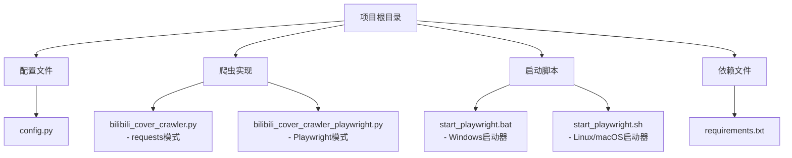
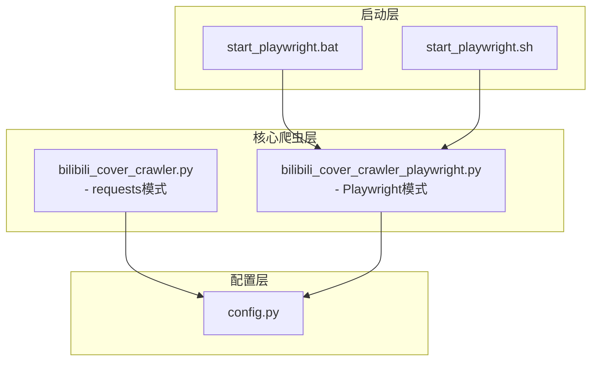
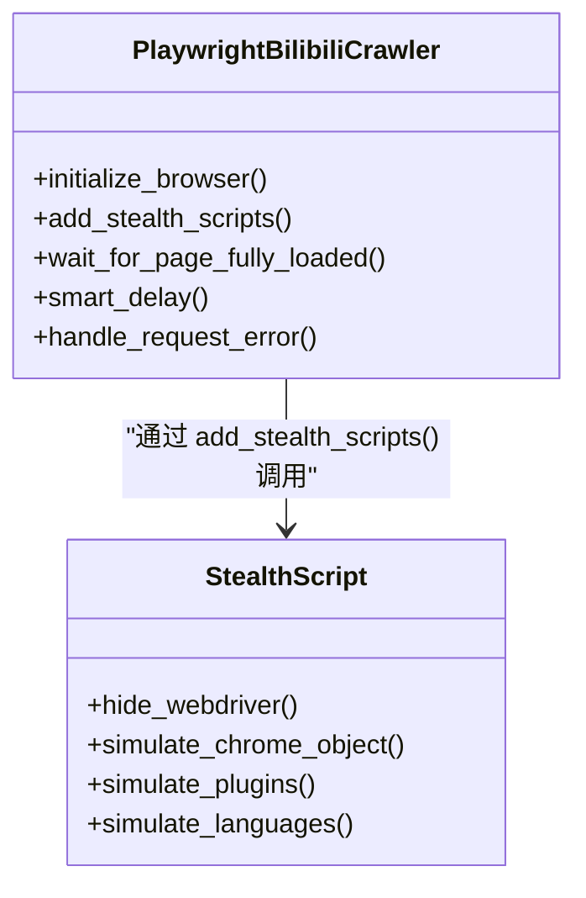
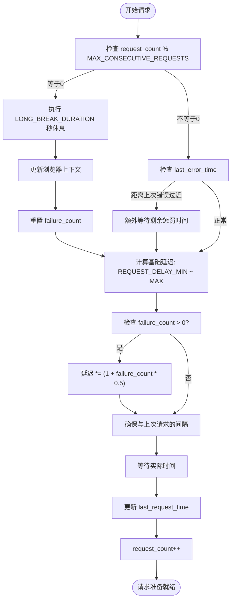
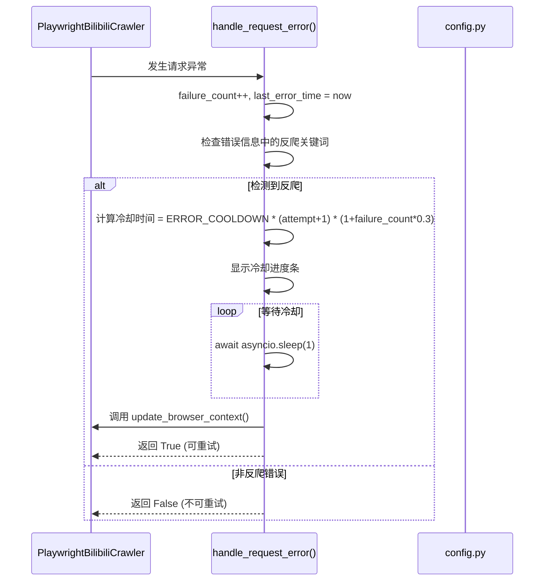
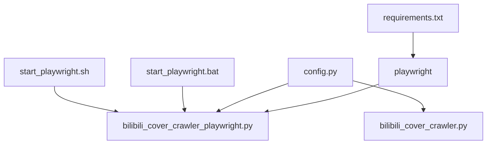

# 反反爬机制

<cite>
**本文档中引用的文件**  
- [config.py](file://config.py)
- [bilibili_cover_crawler_playwright.py](file://bilibili_cover_crawler_playwright.py)
- [bilibili_cover_crawler.py](file://bilibili_cover_crawler.py)
</cite>

## 目录
1. [引言](#引言)
2. [项目结构](#项目结构)
3. [核心组件](#核心组件)
4. [架构概述](#架构概述)
5. [详细组件分析](#详细组件分析)
6. [依赖分析](#依赖分析)
7. [性能考量](#性能考量)
8. [故障排除指南](#故障排除指南)
9. [结论](#结论)

## 引言
本文档系统阐述了哔哩哔哩封面爬虫项目中采用的多层次反反爬策略。重点分析了Playwright模式下如何通过浏览器指纹伪装、智能延迟机制、请求头轮换和自适应错误处理等手段有效规避网站的反爬虫检测。同时对比了基于requests的传统模式与Playwright模式在反反爬能力上的差异，突出了后者在模拟真实用户行为方面的显著优势。所有策略均通过`config.py`中的配置项实现高度可配置化。

## 项目结构
该项目是一个用于爬取哔哩哔哩用户视频封面的工具集，包含两个主要的爬虫实现和一个共享的配置文件。

**Diagram sources**
- [config.py](file://config.py)
- [bilibili_cover_crawler.py](file://bilibili_cover_crawler.py)
- [bilibili_cover_crawler_playwright.py](file://bilibili_cover_crawler_playwright.py)

**Section sources**
- [config.py](file://config.py)
- [bilibili_cover_crawler.py](file://bilibili_cover_crawler.py)
- [bilibili_cover_crawler_playwright.py](file://bilibili_cover_crawler_playwright.py)

## 核心组件
本项目的核心组件围绕两种不同的爬取策略展开：一种是基于`requests`库的传统HTTP请求模式，另一种是基于`Playwright`库的浏览器自动化模式。两者共享`config.py`中的配置，但`Playwright`模式在反反爬能力上更为强大。`config.py`定义了所有关键的反反爬参数，如请求延迟、用户代理、浏览器配置等。`bilibili_cover_crawler_playwright.py`实现了完整的浏览器自动化流程，包括初始化、页面加载、内容提取和错误处理。

**Section sources**
- [config.py](file://config.py#L1-L399)
- [bilibili_cover_crawler_playwright.py](file://bilibili_cover_crawler_playwright.py#L1-L799)

## 架构概述
系统的整体架构分为配置层、核心爬虫层和启动层。配置层（`config.py`）集中管理所有可调参数，实现了策略的可配置化。核心爬虫层包含两个独立的实现：`bilibili_cover_crawler.py`使用`requests`库进行直接的HTTP交互，而`bilibili_cover_crawler_playwright.py`则通过`Playwright`库控制一个真实的Chromium浏览器实例。启动层（`.bat`和`.sh`脚本）负责环境检查和程序启动，确保依赖项（如Playwright和Chromium浏览器）已正确安装。

**Diagram sources**
- [config.py](file://config.py)
- [bilibili_cover_crawler.py](file://bilibili_cover_crawler.py)
- [bilibili_cover_crawler_playwright.py](file://bilibili_cover_crawler_playwright.py)
- [start_playwright.bat](file://start_playwright.bat)
- [start_playwright.sh](file://start_playwright.sh)

## 详细组件分析

### Playwright浏览器指纹伪装
为了规避基于浏览器指纹的检测，`Playwright`模式采取了多维度的伪装策略。首先，在`PLAYWRIGHT_CONFIG`中设置了真实的视窗尺寸（1920x1080），并启用了JavaScript。其次，通过`BROWSER_ARGS`中的`--disable-blink-features=AutomationControlled`参数，从底层禁用了自动化控制的特征。最关键的是，`add_stealth_scripts()`方法通过`page.add_init_script()`注入了JavaScript脚本，将`navigator.webdriver`属性设置为`undefined`，从而隐藏了自动化工具的痕迹。此外，还模拟了真实的`navigator.plugins`和`navigator.languages`属性，进一步增强了浏览器的真实性。

**Diagram sources**
- [config.py](file://config.py#L35-L39)
- [bilibili_cover_crawler_playwright.py](file://bilibili_cover_crawler_playwright.py#L1000-L1100)

**Section sources**
- [config.py](file://config.py#L35-L39)
- [bilibili_cover_crawler_playwright.py](file://bilibili_cover_crawler_playwright.py#L1000-L1100)

### 智能延迟与请求头轮换
项目实现了精细化的智能延迟机制。`smart_delay()`方法是其核心，它通过`MAX_CONSECUTIVE_REQUESTS`（30次）限制连续请求次数，达到阈值后执行`LONG_BREAK_DURATION`（15秒）的长休息。在每次请求之间，通过`REQUEST_DELAY_MIN`（3秒）和`REQUEST_DELAY_MAX`（8秒）实现随机化请求间隔，模拟人类操作的不规律性。当请求失败时，`failure_count`计数器会增加，并在后续延迟中乘以惩罚系数，逐步增加等待时间。

同时，项目实现了请求头轮换策略。`USER_AGENTS`列表包含了多种主流浏览器（Chrome、Firefox、Safari等）在不同操作系统下的User-Agent字符串。`BASE_HEADERS_TEMPLATES`则为不同类型的浏览器提供了相应的请求头模板，包含了`Accept`、`Accept-Language`、`Sec-Fetch-*`等关键字段。在每次请求前，系统会随机选择一个User-Agent，并根据其类型匹配相应的模板，最后组合成完整的请求头，有效避免了因请求头单一而被识别。

**Diagram sources**
- [config.py](file://config.py#L150-L180)
- [bilibili_cover_crawler_playwright.py](file://bilibili_cover_crawler_playwright.py#L1200-L1300)

**Section sources**
- [config.py](file://config.py#L150-L180)
- [bilibili_cover_crawler_playwright.py](file://bilibili_cover_crawler_playwright.py#L1200-L1300)

### 错误处理与自适应机制
当遭遇429等反爬错误时，`handle_request_error()`方法会介入处理。该方法通过`anti_crawl_keywords`列表检测错误信息中的关键词（如"429", "Too Many Requests"）。一旦确认为反爬措施，系统将执行`ERROR_COOLDOWN`（180秒）的冷却，并通过`tqdm`进度条直观地显示冷却过程。与`requests`版本不同，`Playwright`版本在冷却后会调用`update_browser_context()`来更新浏览器上下文，相当于更换了一个新的浏览器会话，这比简单地更新请求头更有效。此外，冷却时间会根据重试次数`attempt`和连续失败次数`failure_count`进行动态调整，体现了自适应的特性。

**Diagram sources**
- [config.py](file://config.py#L170-L175)
- [bilibili_cover_crawler_playwright.py](file://bilibili_cover_crawler_playwright.py#L837-L869)

**Section sources**
- [config.py](file://config.py#L170-L175)
- [bilibili_cover_crawler_playwright.py](file://bilibili_cover_crawler_playwright.py#L837-L869)

### Playwright与requests模式对比
`Playwright`模式在反反爬能力上显著优于`requests`模式。`requests`模式虽然也实现了智能延迟和请求头轮换，但其本质仍是模拟HTTP请求，容易被服务器通过行为分析（如无JavaScript执行、缺少浏览器指纹）识别。而`Playwright`模式通过控制真实的浏览器实例，能够完美执行JavaScript、加载完整的DOM树，并模拟真实的用户交互（如滚动、点击），其行为与真人用户几乎无法区分。此外，`Playwright`可以轻松处理动态加载的内容，而`requests`模式需要精确解析API，一旦API变更即会失效。因此，`Playwright`模式在面对复杂的反爬策略时具有更强的鲁棒性和适应性。

**Section sources**
- [bilibili_cover_crawler.py](file://bilibili_cover_crawler.py)
- [bilibili_cover_crawler_playwright.py](file://bilibili_cover_crawler_playwright.py)

## 依赖分析
本项目的主要依赖关系清晰。`bilibili_cover_crawler_playwright.py`和`bilibili_cover_crawler.py`都直接依赖于`config.py`来获取配置参数。`bilibili_cover_crawler_playwright.py`还依赖于`playwright`库来实现浏览器自动化。`start_playwright.bat`和`start_playwright.sh`脚本则依赖于Python环境和`pip`包管理器来安装`requirements.txt`中列出的依赖项（包括`playwright`）。这种依赖结构确保了配置的集中化和启动流程的自动化。

**Diagram sources**
- [config.py](file://config.py)
- [bilibili_cover_crawler.py](file://bilibili_cover_crawler.py)
- [bilibili_cover_crawler_playwright.py](file://bilibili_cover_crawler_playwright.py)
- [start_playwright.bat](file://start_playwright.bat)
- [start_playwright.sh](file://start_playwright.sh)
- [requirements.txt](file://requirements.txt)

**Section sources**
- [config.py](file://config.py)
- [bilibili_cover_crawler.py](file://bilibili_cover_crawler.py)
- [bilibili_cover_crawler_playwright.py](file://bilibili_cover_crawler_playwright.py)

## 性能考量
尽管`Playwright`模式在反反爬方面优势明显，但其性能开销远大于`requests`模式。启动和维护一个完整的浏览器实例需要大量的内存和CPU资源。每个页面加载都伴随着完整的渲染过程，这比直接的HTTP请求慢得多。然而，这种性能牺牲是值得的，因为它极大地提高了爬取的成功率和稳定性。通过配置`slow_mo`和合理的延迟，可以在性能和隐蔽性之间找到平衡点。对于大规模爬取任务，建议在高性能服务器上运行，并合理设置`MAX_CONSECUTIVE_REQUESTS`以避免资源耗尽。

## 故障排除指南
当爬虫遇到问题时，首先应检查日志输出。`LOG_LEVEL`设置为`ERROR`，只有严重错误才会被记录。如果遇到429错误，说明反爬策略生效，应检查`ERROR_COOLDOWN`配置是否足够长。如果浏览器无法启动，应运行`start_playwright.bat`或`start_playwright.sh`脚本，它们会自动检查并安装缺失的依赖。对于FFmpeg相关的问题（如视频合并失败），`BilibiliVideoDownloader`类提供了详细的安装指南。此外，`ENABLE_HTML_DEBUG`选项可用于在DEBUG级别输出HTML内容，帮助诊断页面解析问题。

**Section sources**
- [config.py](file://config.py#L5-L10)
- [bilibili_cover_crawler_playwright.py](file://bilibili_cover_crawler_playwright.py#L500-L600)

## 结论
本项目通过`config.py`中的`PLAYWRIGHT_CONFIG`、`BROWSER_ARGS`、`ANTI_CRAWL`等配置项，实现了一套高度可配置化的多层次反反爬策略。`Playwright`模式通过浏览器指纹伪装、智能延迟、请求头轮换和自适应错误处理，成功模拟了真实用户的行为，有效规避了哔哩哔哩的反爬虫系统。相比传统的`requests`模式，`Playwright`在处理动态内容和复杂反爬机制方面展现出压倒性的优势。该设计不仅提高了爬取的成功率，也为应对未来可能出现的更严格的反爬措施提供了坚实的基础。