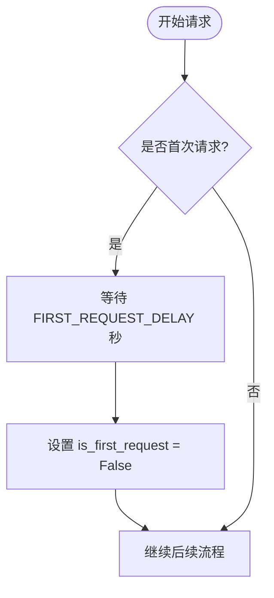
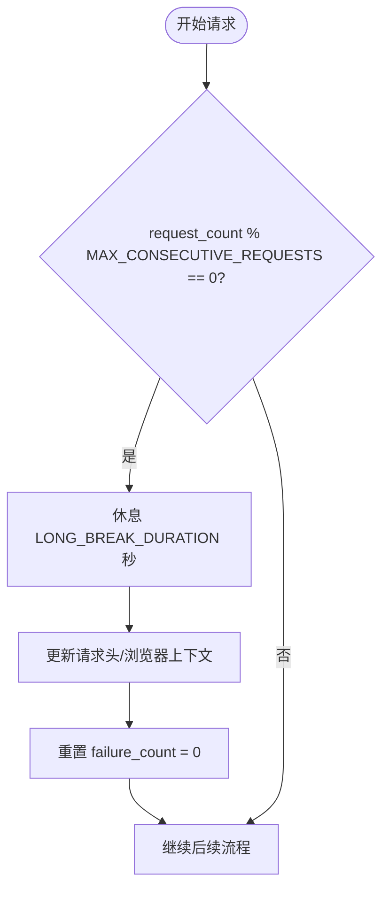
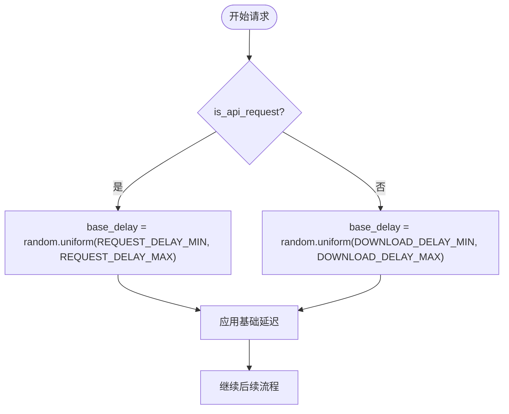
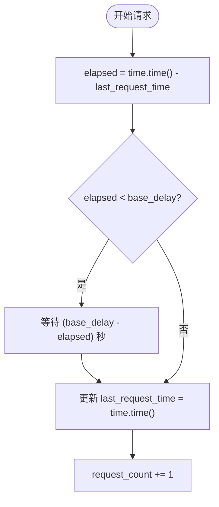
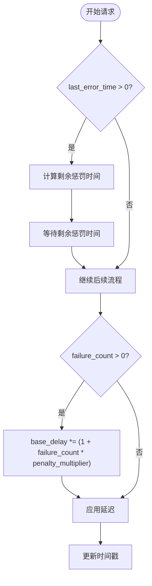
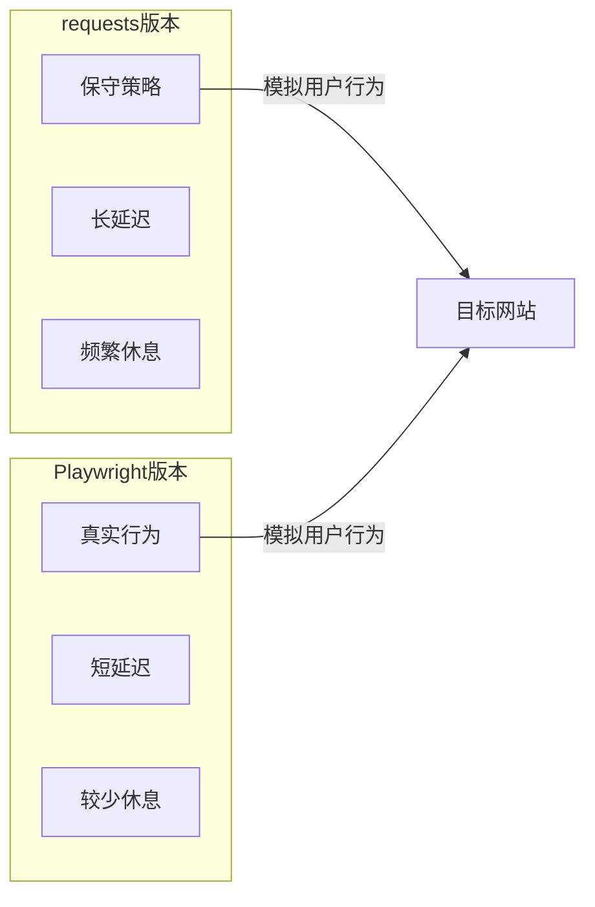
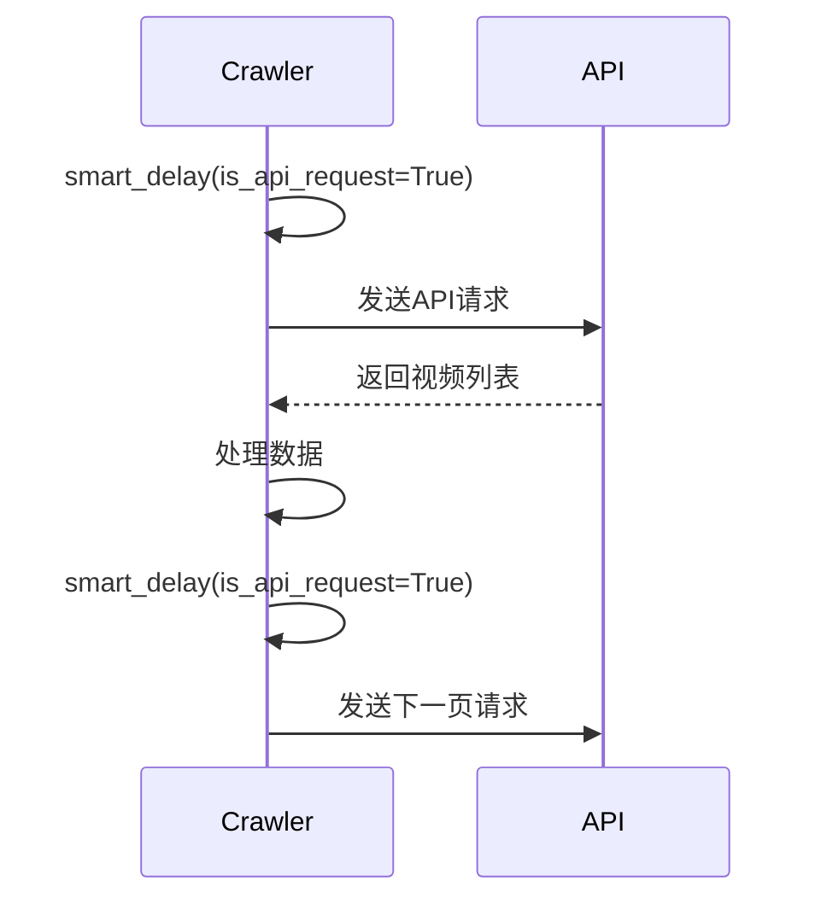
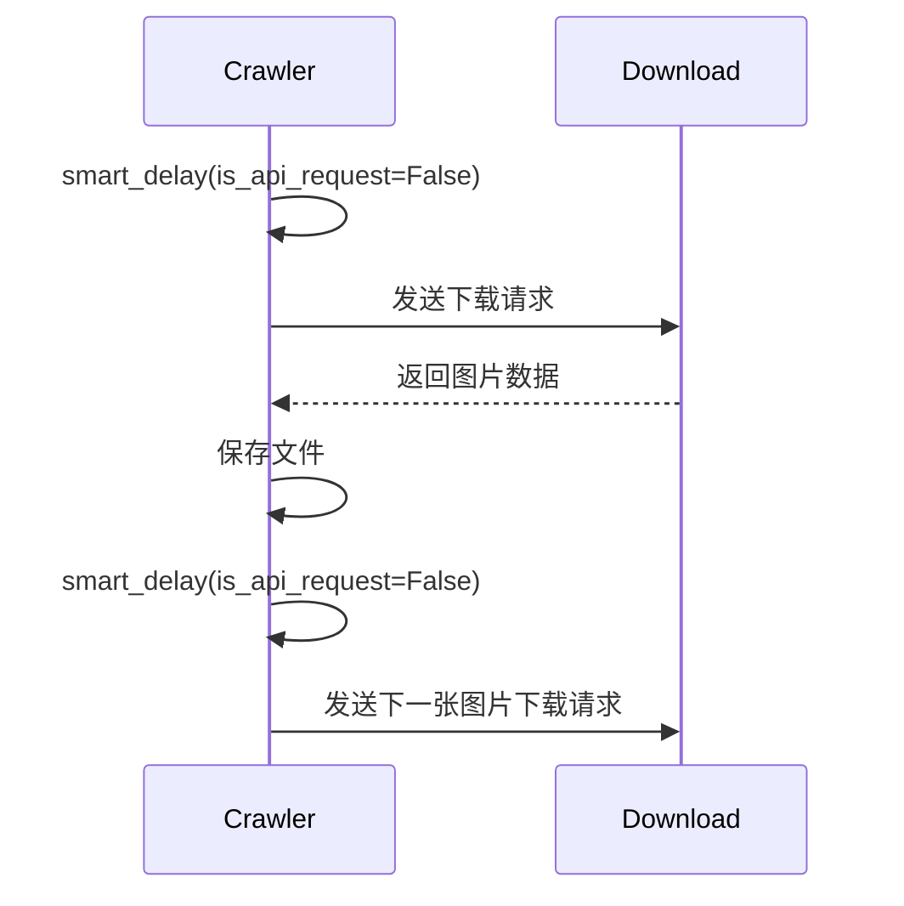

# 智能请求调度

<cite>
**本文档引用的文件**
- [bilibili_cover_crawler.py](file://bilibili_cover_crawler.py)
- [bilibili_cover_crawler_playwright.py](file://bilibili_cover_crawler_playwright.py)
- [config.py](file://config.py)
</cite>

## 目录
1. [智能延迟机制概述](#智能延迟机制概述)
2. [多层次延迟策略](#多层次延迟策略)
3. [请求计数与时间戳管理](#请求计数与时间戳管理)
4. [失败计数与惩罚机制](#失败计数与惩罚机制)
5. [Playwright与requests版本延迟策略对比](#playwright与requests版本延迟策略对比)
6. [关键方法中的流量控制](#关键方法中的流量控制)

## 智能延迟机制概述

智能请求调度机制通过`smart_delay`方法实现，旨在模拟人类用户行为，避免被目标网站的反爬虫系统检测。该机制在`BilibiliCoverCrawler`（requests版本）和`PlaywrightBilibiliCrawler`（Playwright版本）两个爬虫类中均有实现，通过配置文件`config.py`中的参数进行精细化控制。

**智能延迟机制的核心目标是：**
- 通过首次请求延迟、连续请求后的长休息以及随机化请求间隔来降低请求频率
- 利用请求计数器和时间戳确保请求间隔符合预设范围
- 在请求失败时自动延长后续延迟，实现自适应的流量控制
- 通过更新请求头或浏览器上下文来模拟用户行为变化

**Section sources**
- [bilibili_cover_crawler.py](file://bilibili_cover_crawler.py#L66-L113)
- [bilibili_cover_crawler_playwright.py](file://bilibili_cover_crawler_playwright.py#L747-L796)

## 多层次延迟策略

智能延迟机制实现了三个层次的延迟策略，通过`config.py`中的配置参数进行控制。

### 首次请求预热延迟

首次请求时，系统会执行额外的预热延迟，以模拟用户刚打开应用时的等待行为。该延迟由`FIRST_REQUEST_DELAY`参数控制，在requests版本中为30秒，在Playwright版本中为10秒。

**Diagram sources**
- [bilibili_cover_crawler.py](file://bilibili_cover_crawler.py#L68-L71)
- [bilibili_cover_crawler_playwright.py](file://bilibili_cover_crawler_playwright.py#L749-L752)
- [config.py](file://config.py#L125)

### 连续请求长休息机制

当连续请求次数达到`MAX_CONSECUTIVE_REQUESTS`阈值时，系统会执行长时间休息。在requests版本中，每3次请求后休息300秒（5分钟）；在Playwright版本中，每30次请求后休息15秒。休息期间会更新请求头或浏览器上下文，并重置失败计数。

**Diagram sources**
- [bilibili_cover_crawler.py](file://bilibili_cover_crawler.py#L73-L82)
- [bilibili_cover_crawler_playwright.py](file://bilibili_cover_crawler_playwright.py#L754-L763)
- [config.py](file://config.py#L123)

### 随机化请求间隔

系统根据请求类型（API请求或下载请求）在预设范围内生成随机延迟。API请求的延迟范围由`REQUEST_DELAY_MIN`和`REQUEST_DELAY_MAX`控制，下载请求的延迟范围由`DOWNLOAD_DELAY_MIN`和`DOWNLOAD_DELAY_MAX`控制。

**Diagram sources**
- [bilibili_cover_crawler.py](file://bilibili_cover_crawler.py#L94-L99)
- [bilibili_cover_crawler_playwright.py](file://bilibili_cover_crawler_playwright.py#L774-L779)
- [config.py](file://config.py#L119-L122)

## 请求计数与时间戳管理

智能延迟机制通过`request_count`计数器和`last_request_time`时间戳来确保请求间隔符合预设要求。

### 请求计数器

`request_count`是一个整数计数器，用于跟踪已发送的请求数量。每次成功执行`smart_delay`方法后，计数器都会递增1。该计数器用于判断是否需要执行长休息机制。

### 时间戳管理

`last_request_time`存储了上一次请求的时间戳（Unix时间戳）。系统通过计算当前时间与`last_request_time`的差值来确定是否需要额外等待，以确保实际请求间隔不低于计算出的基础延迟。

**Diagram sources**
- [bilibili_cover_crawler.py](file://bilibili_cover_crawler.py#L108-L113)
- [bilibili_cover_crawler_playwright.py](file://bilibili_cover_crawler_playwright.py#L789-L796)

## 失败计数与惩罚机制

当请求失败时，系统会启动失败计数与惩罚机制，自动延长后续请求的延迟。

### 失败计数

`failure_count`是一个整数计数器，用于跟踪连续失败的次数。每次请求失败时，该计数器递增1。当请求成功时，计数器会被重置为0。

### 惩罚机制

当`failure_count`大于0时，系统会在基础延迟上乘以一个惩罚倍数，公式为`1 + (failure_count * 0.8)`（requests版本）或`1 + (failure_count * 0.5)`（Playwright版本）。此外，如果距离上次错误的时间小于`REQUEST_FAILURE_PENALTY`，系统会额外等待剩余的惩罚时间。

**Diagram sources**
- [bilibili_cover_crawler.py](file://bilibili_cover_crawler.py#L84-L92)
- [bilibili_cover_crawler.py](file://bilibili_cover_crawler.py#L100-L107)
- [bilibili_cover_crawler_playwright.py](file://bilibili_cover_crawler_playwright.py#L765-L773)
- [config.py](file://config.py#L126)

## Playwright与requests版本延迟策略对比

Playwright版本和requests版本在延迟策略上存在显著差异，主要体现在延迟参数的设置上，反映了两种技术在模拟真实用户行为方面的不同需求。

### 延迟参数对比

| 参数 | requests版本 | Playwright版本 | 说明 |
| --- | --- | --- | --- |
| `REQUEST_DELAY_MIN` | 15 | 3 | Playwright因更真实而采用较短的最小延迟 |
| `REQUEST_DELAY_MAX` | 30 | 8 | Playwright的最大延迟也较短 |
| `MAX_CONSECUTIVE_REQUESTS` | 3 | 30 | Playwright可以处理更多连续请求 |
| `LONG_BREAK_DURATION` | 300 | 15 | Playwright的长休息时间更短 |
| `INITIAL_WARMUP_DELAY` | 60 | 30 | Playwright的预热延迟更短 |
| `FIRST_REQUEST_DELAY` | 30 | 10 | Playwright的首次请求延迟更短 |

### 策略差异分析

Playwright版本采用更短的延迟策略，因为Playwright通过模拟真实浏览器环境，已经具备了较高的反检测能力。相比之下，requests版本需要更保守的延迟策略来弥补其在模拟真实用户行为方面的不足。

**Diagram sources**
- [config.py](file://config.py#L119-L126)

## 关键方法中的流量控制

`smart_delay`方法在多个关键方法中被调用，实现流量控制。

### get_user_videos方法

在`get_user_videos`方法中，每次获取一页视频列表前都会调用`smart_delay(is_api_request=True)`，确保API请求的间隔符合要求。

**Section sources**
- [bilibili_cover_crawler.py](file://bilibili_cover_crawler.py#L167-L170)
- [bilibili_cover_crawler_playwright.py](file://bilibili_cover_crawler_playwright.py#L800-L803)

### download_cover方法

在`download_cover`方法中，每次下载封面图片前都会调用`smart_delay(is_api_request=False)`，确保下载请求的间隔符合要求。

**Section sources**
- [bilibili_cover_crawler.py](file://bilibili_cover_crawler.py#L250-L253)
- [bilibili_cover_crawler_playwright.py](file://bilibili_cover_crawler_playwright.py#L850-L853)