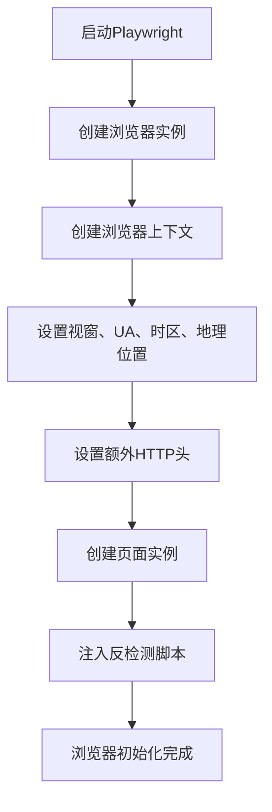
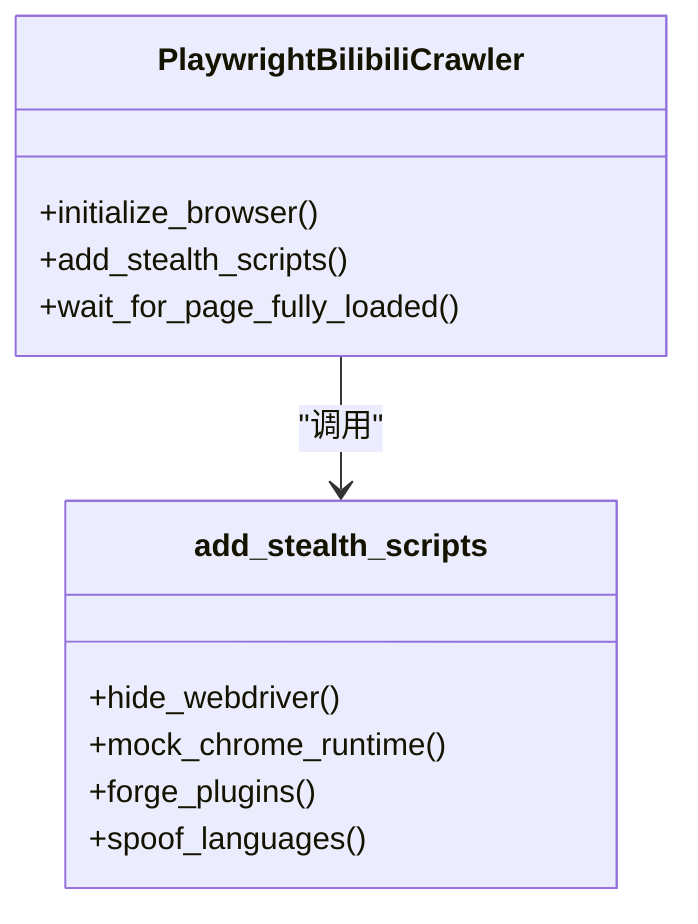

# 浏览器指纹伪装

<cite>
**本文档引用文件**   
- [bilibili_cover_crawler_playwright.py](file://bilibili_cover_crawler_playwright.py)
- [config.py](file://config.py)
- [bilibili_cover_crawler.py](file://bilibili_cover_crawler.py)
</cite>

## 目录
1. [项目概述](#项目概述)
2. [Playwright浏览器初始化与指纹伪装](#playwright浏览器初始化与指纹伪装)
3. [反检测脚本注入机制](#反检测脚本注入机制)
4. [浏览器启动参数与安全头设置](#浏览器启动参数与安全头设置)
5. [配置项详解](#配置项详解)
6. [与requests版本的对比分析](#与requests版本的对比分析)

## 项目概述

本项目旨在通过Playwright实现高级浏览器指纹伪装，以规避哔哩哔哩平台的反爬虫检测机制。相比传统的`requests`库，Playwright能够模拟完整的浏览器环境，包括JavaScript执行、DOM操作和用户行为，从而大幅降低被识别为自动化脚本的风险。核心功能集中在`PlaywrightBilibiliCrawler`类中，通过精细化配置浏览器参数、注入反检测脚本以及设置真实请求头，构建一个高度仿真的用户访问环境。

**Section sources**
- [bilibili_cover_crawler_playwright.py](file://bilibili_cover_crawler_playwright.py#L1-L50)
- [config.py](file://config.py#L1-L50)

## Playwright浏览器初始化与指纹伪装

在`PlaywrightBilibiliCrawler`类的`initialize_browser`方法中，通过`new_context`方法创建浏览器上下文，并设置多项关键参数来模拟真实用户环境：

- **视窗尺寸（viewport）**：从`config.py`中的`PLAYWRIGHT_CONFIG`读取，设置为1920x1080，模拟主流桌面显示器分辨率。
- **用户代理（user_agent）**：从`config.USER_AGENTS`中随机选择，支持Chrome、Firefox、Edge等主流浏览器的最新版本。
- **时区（timezone_id）**：固定设置为`Asia/Shanghai`，模拟中国地区用户。
- **地理位置（geolocation）**：设置为北京坐标（39.9042, 116.4074），并授予`geolocation`权限，增强地理位置的真实性。

此外，通过`set_extra_http_headers`方法设置了一系列安全头，包括`sec-ch-ua`、`sec-ch-ua-mobile`和`sec-ch-ua-platform`，这些头信息是现代浏览器（特别是Chromium内核）用于声明自身特性的关键字段，能有效欺骗服务器认为请求来自真实浏览器。

**Diagram sources **
- [bilibili_cover_crawler_playwright.py](file://bilibili_cover_crawler_playwright.py#L500-L550)
- [config.py](file://config.py#L100-L150)

**Section sources**
- [bilibili_cover_crawler_playwright.py](file://bilibili_cover_crawler_playwright.py#L500-L580)

## 反检测脚本注入机制

`add_stealth_scripts`方法通过`page.add_init_script`注入四大反检测脚本，从根本上隐藏自动化特征：

1. **隐藏navigator.webdriver属性**：通过`Object.defineProperty`将`navigator.webdriver`定义为`undefined`，这是最基础的反检测手段，防止被`navigator.webdriver === true`检测到。
2. **模拟chrome.runtime对象**：创建`window.chrome`对象并包含`runtime`属性，模拟Chrome扩展环境，避免因缺少该对象而被识别。
3. **伪造plugins插件列表**：将`navigator.plugins`的getter返回一个包含5个元素的数组，模拟真实浏览器中安装的插件数量。
4. **伪装languages语言设置**：将`navigator.languages`设置为`['zh-CN', 'zh', 'en']`，模拟中国地区用户的语言偏好。

这些脚本在页面加载前执行，确保在任何JavaScript检测代码运行前，浏览器环境已经被“净化”。

**Diagram sources **
- [bilibili_cover_crawler_playwright.py](file://bilibili_cover_crawler_playwright.py#L585-L610)

**Section sources**
- [bilibili_cover_crawler_playwright.py](file://bilibili_cover_crawler_playwright.py#L585-L610)

## 浏览器启动参数与安全头设置

在启动浏览器时，通过`args`参数传入一系列Chromium启动选项，进一步隐藏自动化特征：

- `--disable-blink-features=AutomationControlled`：禁用Blink渲染引擎的自动化控制特征，这是规避检测的核心参数。
- `--no-sandbox`、`--disable-setuid-sandbox`：在非生产环境禁用沙箱，提高兼容性。
- `--disable-features=TranslateUI`：禁用翻译UI，减少特征暴露。

同时，在`set_extra_http_headers`中设置的安全头模拟了真实浏览器的行为：
- `sec-ch-ua`：声明浏览器品牌和版本，如`"Chromium";v="120", "Not_A Brand";v="8", "Google Chrome";v="120"`。
- `sec-ch-ua-mobile`：设置为`?0`，表示非移动设备。
- `sec-ch-ua-platform`：设置为`"Windows"`，声明操作系统平台。

这些参数和头信息共同作用，使Playwright生成的请求与真实用户浏览器发出的请求几乎无法区分。

**Section sources**
- [bilibili_cover_crawler_playwright.py](file://bilibili_cover_crawler_playwright.py#L510-L520)
- [config.py](file://config.py#L150-L180)

## 配置项详解

`config.py`文件集中管理了所有配置，确保灵活性和可维护性：

- **PLAYWRIGHT_CONFIG**：定义浏览器的基本配置，如是否无头运行、操作延迟、超时时间等。
- **BROWSER_ARGS**：包含所有Chromium启动参数，是隐藏自动化特征的关键。
- **USER_AGENTS**：维护了一个包含多种浏览器和操作系统的User-Agent列表，每次启动时随机选择，增加多样性。
- **BASE_HEADERS_TEMPLATES**：提供不同浏览器的请求头模板，确保请求头与User-Agent匹配。

这些配置项使得爬虫行为更加动态和真实，避免了使用固定参数导致的模式化特征。

**Section sources**
- [config.py](file://config.py#L100-L200)

## 与requests版本的对比分析

与`bilibili_cover_crawler.py`中的`requests`版本相比，Playwright版本具有显著优势：

- **环境真实性**：`requests`仅模拟HTTP请求，缺乏JavaScript执行和DOM环境，极易被检测。而Playwright提供完整的浏览器环境，能执行页面上的JavaScript，获取动态渲染的内容。
- **指纹伪装能力**：`requests`无法修改`navigator`对象的属性，而Playwright可以通过`add_init_script`彻底伪造浏览器指纹。
- **反检测策略**：`requests`版本主要依赖请求频率控制和User-Agent轮换，策略单一。Playwright版本结合了参数伪装、脚本注入、行为模拟等多层次反检测手段。

尽管`requests`版本实现简单、资源消耗低，但在面对现代反爬虫系统时，其成功率远低于Playwright版本。Playwright虽然启动较慢、资源占用高，但其强大的环境模拟能力使其成为应对复杂反爬策略的首选方案。

**Section sources**
- [bilibili_cover_crawler.py](file://bilibili_cover_crawler.py#L1-L100)
- [bilibili_cover_crawler_playwright.py](file://bilibili_cover_crawler_playwright.py#L1-L100)