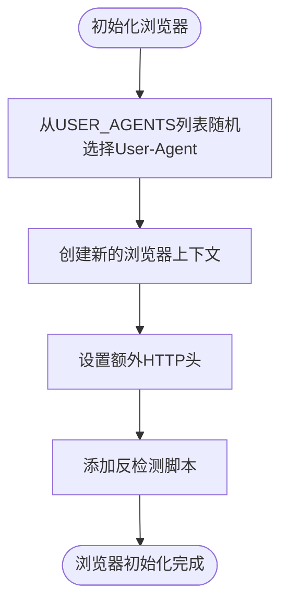
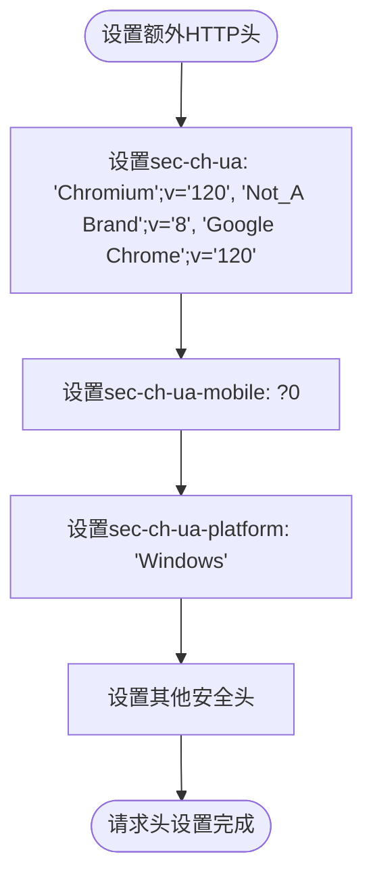
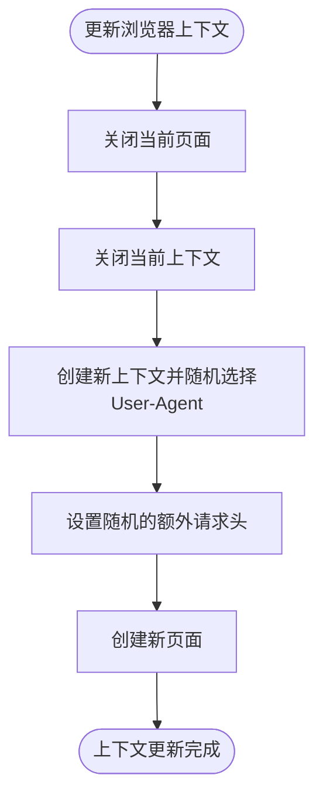
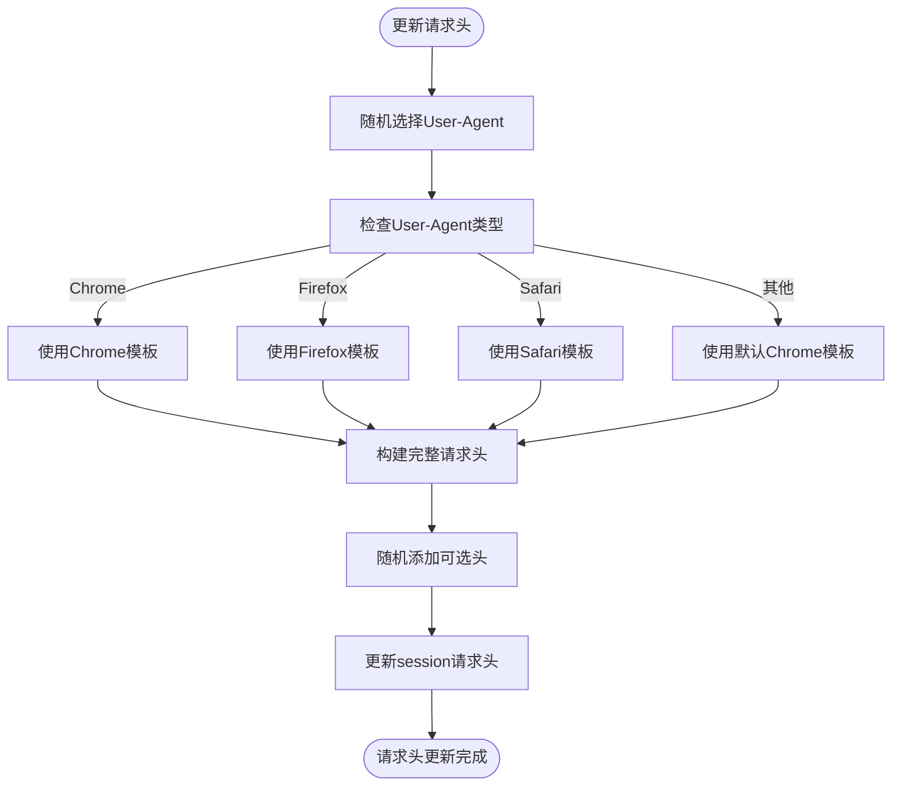
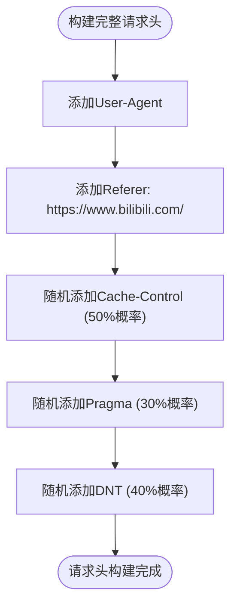
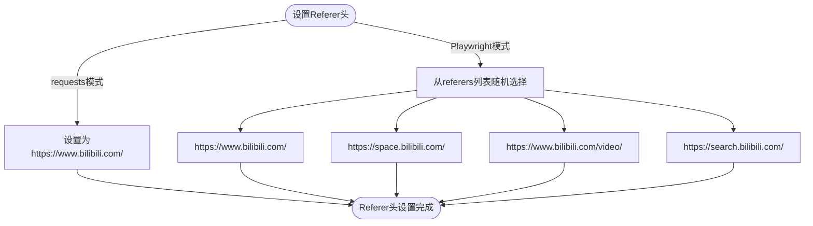
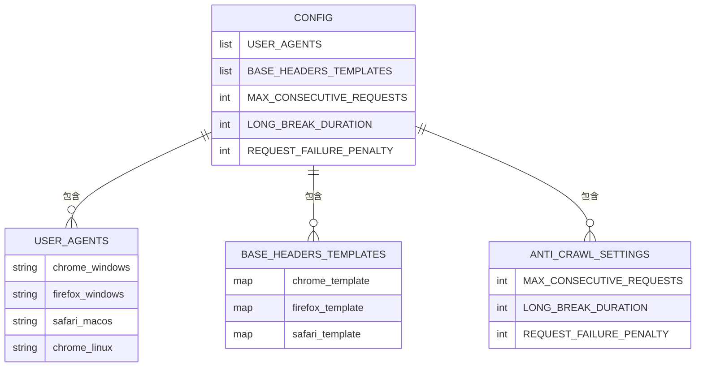
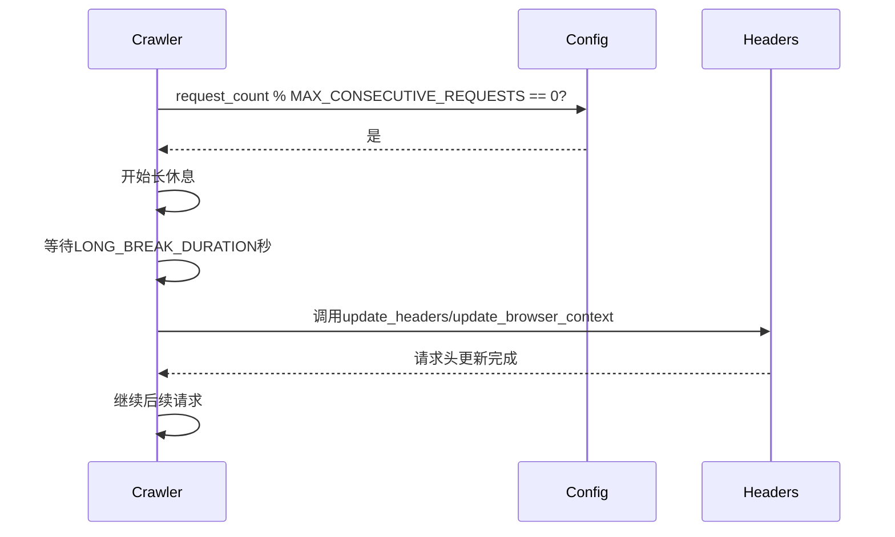

# 请求头轮换

<cite>
**本文档引用的文件**
- [config.py](file://config.py)
- [bilibili_cover_crawler.py](file://bilibili_cover_crawler.py)
- [bilibili_cover_crawler_playwright.py](file://bilibili_cover_crawler_playwright.py)
</cite>

## 目录
1. [引言](#引言)
2. [Playwright模式请求头轮换](#playwright模式请求头轮换)
3. [requests模式请求头轮换](#requests模式请求头轮换)
4. [Referer头模拟](#referer头模拟)
5. [配置项与可配置性](#配置项与可配置性)
6. [请求头更新时机](#请求头更新时机)
7. [结论](#结论)

## 引言
本文档详细说明了哔哩哔哩封面爬虫项目中的请求头轮换策略。该策略旨在通过动态变化的请求头来模拟真实用户行为，避免被目标网站识别为爬虫。文档将分别介绍Playwright模式和requests模式下的实现机制，并结合config.py中的配置项展示轮换策略的可配置性。

## Playwright模式请求头轮换
在Playwright模式下，系统通过`new_context`方法动态创建浏览器上下文，并在其中实现请求头的轮换。该模式利用Playwright的浏览器自动化能力，模拟真实用户的浏览器环境。

### User-Agent动态选择
系统在初始化浏览器上下文时，从`config.py`中定义的`USER_AGENTS`列表随机选择User-Agent。这个列表包含了多种主流浏览器（Chrome、Firefox、Safari、Edge）在不同操作系统（Windows、macOS、Linux）上的User-Agent字符串。

**Diagram sources**
- [bilibili_cover_crawler_playwright.py](file://bilibili_cover_crawler_playwright.py#L525-L554)
- [config.py](file://config.py#L60-L100)

### 设置现代浏览器特征头
在创建浏览器上下文后，系统通过`set_extra_http_headers`方法设置一系列现代浏览器特征头，包括`sec-ch-ua`、`sec-ch-ua-mobile`和`sec-ch-ua-platform`等。这些头部信息模拟了现代浏览器的客户端提示功能，使请求看起来更加真实。

**Diagram sources**
- [bilibili_cover_crawler_playwright.py](file://bilibili_cover_crawler_playwright.py#L553-L590)

### 上下文更新机制
当系统需要更新请求头时（如长时间休息后），会调用`update_browser_context`方法。该方法会关闭当前页面和上下文，创建新的上下文实例，并重新设置随机的User-Agent和额外请求头。

**Diagram sources**
- [bilibili_cover_crawler_playwright.py](file://bilibili_cover_crawler_playwright.py#L808-L843)

**Section sources**
- [bilibili_cover_crawler_playwright.py](file://bilibili_cover_crawler_playwright.py#L800-L843)

## requests模式请求头轮换
在requests模式下，系统通过`update_headers`方法实现请求头的轮换。该模式直接操作requests库的session对象，动态更新其请求头。

### User-Agent与模板匹配
系统首先从`USER_AGENTS`列表中随机选择一个User-Agent，然后根据User-Agent的类型匹配`BASE_HEADERS_TEMPLATES`中的相应模板。模板分为Chrome、Firefox和Safari三种，每种模板包含适合该浏览器的特定请求头。

**Diagram sources**
- [bilibili_cover_crawler.py](file://bilibili_cover_crawler.py#L37-L68)

### 可选头的随机添加
为了进一步增加请求的多样性，系统会以一定概率随机添加一些可选的请求头，如`Cache-Control`、`Pragma`和`DNT`等。这些头部的添加是随机的，模拟了真实用户浏览器的不一致性。

**Section sources**
- [bilibili_cover_crawler.py](file://bilibili_cover_crawler.py#L37-L68)

## Referer头模拟
系统通过设置`Referer`请求头来模拟真实的访问来源。在requests模式下，`Referer`头被固定设置为`https://www.bilibili.com/`，模拟用户从B站首页跳转而来。

在Playwright模式下，`Referer`头在视频下载等特定操作中被随机设置为B站的不同页面，如首页、用户空间、视频页面或搜索页面，进一步增加了请求的真实性。

**Section sources**
- [bilibili_cover_crawler.py](file://bilibili_cover_crawler.py#L57)
- [bilibili_cover_crawler_playwright.py](file://bilibili_cover_crawler_playwright.py#L820-L823)

## 配置项与可配置性
系统的请求头轮换策略具有高度的可配置性，所有相关配置都集中在`config.py`文件中。

### 核心配置项
- `USER_AGENTS`: 包含多种浏览器和操作系统的User-Agent字符串列表
- `BASE_HEADERS_TEMPLATES`: 不同浏览器类型的请求头模板
- `MAX_CONSECUTIVE_REQUESTS`: 连续请求最大次数，达到后触发长休息和请求头更新
- `LONG_BREAK_DURATION`: 长时间休息的持续时间

**Section sources**
- [config.py](file://config.py#L60-L150)

## 请求头更新时机
系统在多个关键时机更新请求头，以避免因固定请求模式被识别为爬虫。

### 初始化时更新
在爬虫初始化时，系统会立即调用请求头更新方法，确保首次请求就使用随机化的请求头。

### 长休息后更新
当连续请求次数达到`MAX_CONSECUTIVE_REQUESTS`设定的阈值时，系统会进入`LONG_BREAK_DURATION`秒的长休息。休息结束后，系统会自动更新请求头，然后继续后续请求。

**Section sources**
- [bilibili_cover_crawler.py](file://bilibili_cover_crawler.py#L65-L90)
- [bilibili_cover_crawler_playwright.py](file://bilibili_cover_crawler_playwright.py#L777-L811)

## 结论
本项目通过精心设计的请求头轮换策略，有效模拟了真实用户的浏览器行为，大大降低了被反爬虫系统检测的风险。在Playwright模式下，通过动态创建浏览器上下文实现全面的请求头轮换；在requests模式下，通过动态更新session的请求头实现轻量级的轮换。两种模式都结合了Referer头模拟和智能延迟机制，形成了完整的反检测方案。所有策略都通过`config.py`中的配置项实现了高度的可配置性，便于根据实际需求进行调整。