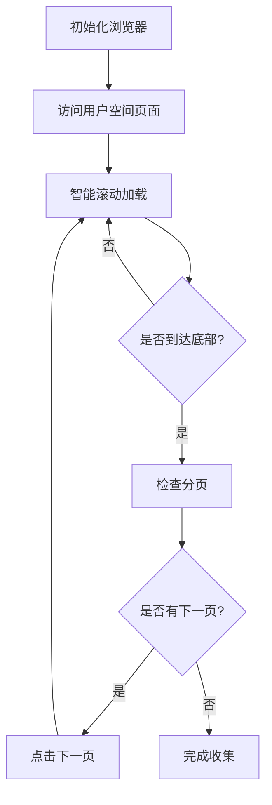
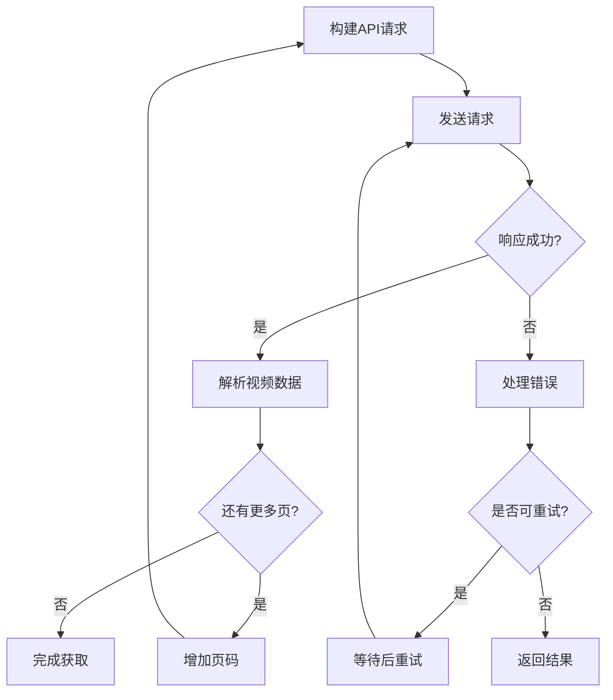
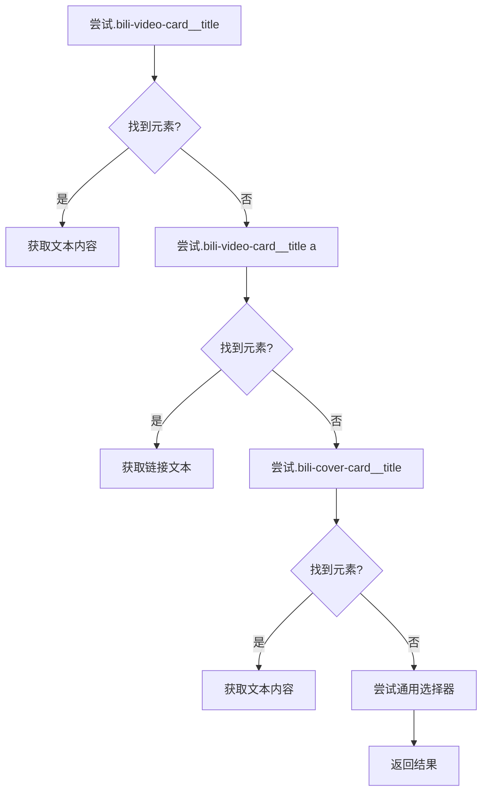
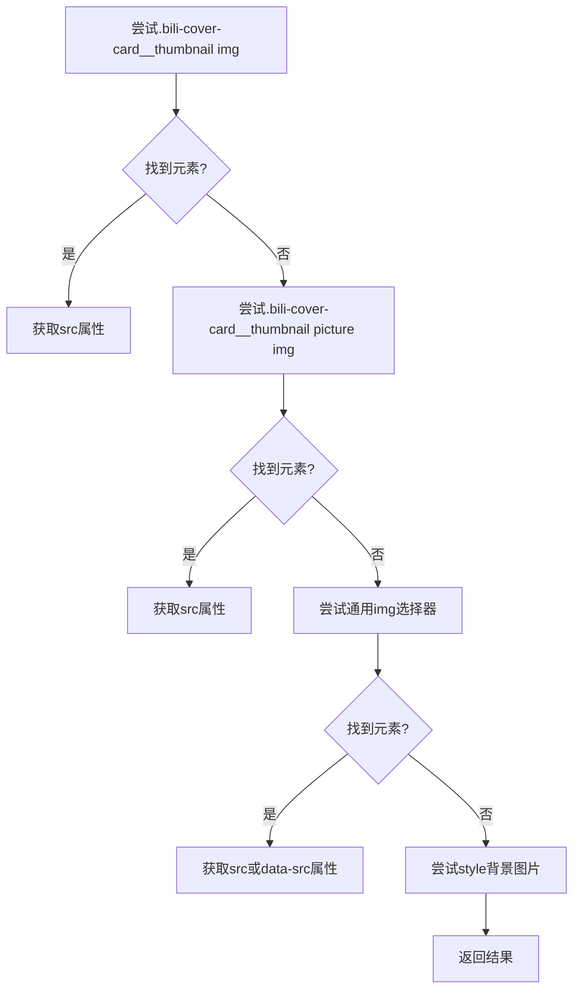
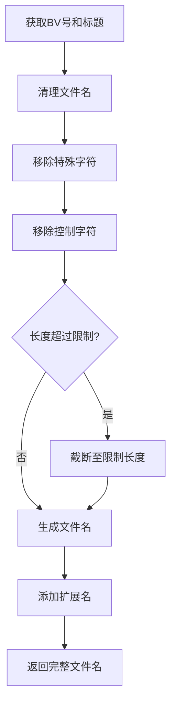
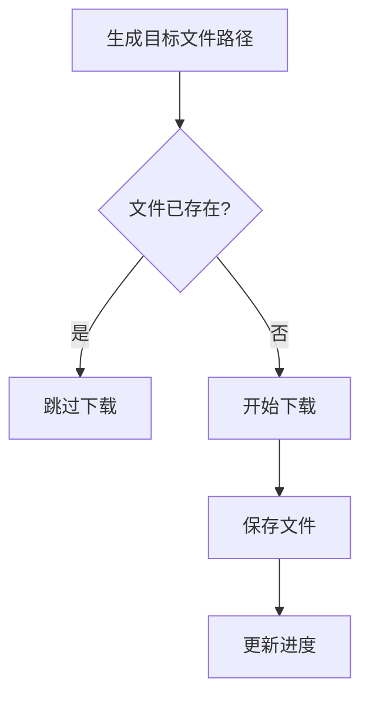
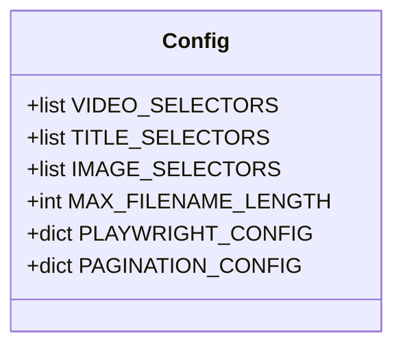
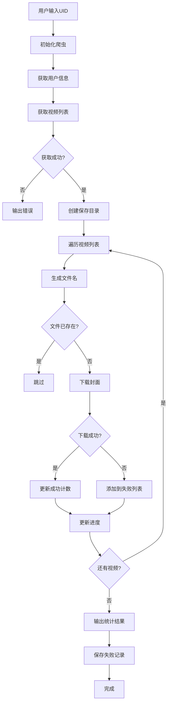

# 封面下载功能

<cite>
**本文档引用的文件**   
- [bilibili_cover_crawler.py](file://bilibili_cover_crawler.py)
- [bilibili_cover_crawler_playwright.py](file://bilibili_cover_crawler_playwright.py)
- [config.py](file://config.py)
</cite>

## 目录
1. [简介](#简介)
2. [核心功能实现](#核心功能实现)
3. [视频列表获取机制](#视频列表获取机制)
4. [视频信息提取过程](#视频信息提取过程)
5. [文件命名规则](#文件命名规则)
6. [断点续传逻辑](#断点续传逻辑)
7. [配置项说明](#配置项说明)
8. [完整流程示例](#完整流程示例)

## 简介
本项目提供两种模式的封面下载功能：基于requests的API调用模式和基于Playwright的浏览器自动化模式。两种模式均能有效获取B站用户的所有视频封面，并具备完善的反反爬虫策略和错误处理机制。

## 核心功能实现

### 双模式架构
项目采用双模式设计，分别通过 `bilibili_cover_crawler.py` 和 `bilibili_cover_crawler_playwright.py` 两个文件实现：

- **requests模式**：通过直接调用B站API获取数据，轻量级且资源占用低
- **Playwright模式**：通过浏览器自动化加载页面，更真实地模拟用户行为，降低被检测风险

两种模式都实现了完整的封面下载流程，包括用户信息获取、视频列表获取、封面下载和文件保存。

**Section sources**
- [bilibili_cover_crawler.py](file://bilibili_cover_crawler.py#L1-L515)
- [bilibili_cover_crawler_playwright.py](file://bilibili_cover_crawler_playwright.py#L1-L2313)

## 视频列表获取机制

### Playwright模式
Playwright模式通过浏览器自动化技术获取用户视频列表，主要流程如下：



**Diagram sources**
- [bilibili_cover_crawler_playwright.py](file://bilibili_cover_crawler_playwright.py#L800-L1599)

该模式通过 `scroll_and_collect_videos` 方法实现滚动加载，使用 `collect_videos_from_current_page` 方法收集当前页面的视频信息，并通过 `check_and_click_next_page` 方法处理分页点击。

**Section sources**
- [bilibili_cover_crawler_playwright.py](file://bilibili_cover_crawler_playwright.py#L800-L1599)

### requests模式
requests模式通过调用B站API分页获取视频数据，主要流程如下：



**Diagram sources**
- [bilibili_cover_crawler.py](file://bilibili_cover_crawler.py#L150-L250)

该模式通过 `get_user_videos` 方法实现分页获取，使用API参数 `pn`（页码）和 `ps`（每页数量）来控制分页。

**Section sources**
- [bilibili_cover_crawler.py](file://bilibili_cover_crawler.py#L150-L250)

## 视频信息提取过程

### 多层级CSS选择器
项目使用多层级CSS选择器来定位视频信息，确保在页面结构变化时仍能正确提取数据。

#### 标题提取
标题提取使用 `TITLE_SELECTORS` 配置项，按优先级顺序尝试不同的选择器：



**Diagram sources**
- [config.py](file://config.py#L230-L245)

#### 封面URL提取
封面URL提取使用 `IMAGE_SELECTORS` 配置项，优先提取高清封面：



**Diagram sources**
- [config.py](file://config.py#L247-L254)

### 高清封面优先提取
通过 `process_image_url` 方法实现高清封面的优先提取：

```mermaid
graph TD
A[输入图片URL] --> B{包含@符号?}
B --> |是| C[移除@后参数]
B --> |否| D
C --> D[处理相对路径]
D --> E{包含尺寸后缀?}
E --> |是| F[移除尺寸后缀]
E --> |否| G
F --> G[确保扩展名]
G --> H[返回处理后URL]
```

**Diagram sources**
- [bilibili_cover_crawler_playwright.py](file://bilibili_cover_crawler_playwright.py#L1621-L1655)

该方法会移除URL中的参数和尺寸后缀，确保获取到原始高质量图片。

**Section sources**
- [bilibili_cover_crawler_playwright.py](file://bilibili_cover_crawler_playwright.py#L1621-L1655)

## 文件命名规则

### 安全文件名生成
文件命名规则基于BV号和视频标题生成安全文件名，自动处理特殊字符和长度限制。



**Diagram sources**
- [bilibili_cover_crawler.py](file://bilibili_cover_crawler.py#L154-L163)

### 文件名清理
`sanitize_filename` 方法负责清理文件名中的非法字符：

```python
def sanitize_filename(self, filename):
    """清理文件名，移除不允许的字符"""
    # 移除Windows不允许的字符
    filename = re.sub(r'[<>:"/\\|?*]', '_', filename)
    # 移除控制字符
    filename = re.sub(r'[\x00-\x1f\x7f-\x9f]', '', filename)
    # 限制长度
    if len(filename) > config.MAX_FILENAME_LENGTH:
        filename = filename[:config.MAX_FILENAME_LENGTH]
    return filename.strip()
```

该方法会将Windows系统不允许的字符替换为下划线，并限制文件名长度。

**Section sources**
- [bilibili_cover_crawler.py](file://bilibili_cover_crawler.py#L154-L163)

## 断点续传逻辑

### 文件存在性检查
断点续传逻辑通过检查目标目录中是否存在同名文件来跳过已下载内容。



**Diagram sources**
- [bilibili_cover_crawler.py](file://bilibili_cover_crawler.py#L295-L340)

在下载封面前，程序会检查 `save_path.exists()`，如果文件已存在则直接跳过，避免重复下载。

**Section sources**
- [bilibili_cover_crawler.py](file://bilibili_cover_crawler.py#L295-L340)

## 配置项说明

### 核心配置项
项目通过 `config.py` 文件中的配置项支持页面结构变化的适应性：



**Diagram sources**
- [config.py](file://config.py#L1-L400)

#### 选择器配置
- **VIDEO_SELECTORS**: 视频元素选择器，按优先级排序
- **TITLE_SELECTORS**: 视频标题选择器，按优先级排序  
- **IMAGE_SELECTORS**: 图片选择器，按优先级排序

#### 浏览器配置
- **PLAYWRIGHT_CONFIG**: Playwright浏览器配置，包括视窗大小、超时等
- **PAGINATION_CONFIG**: 分页操作配置，包括下一页按钮选择器

#### 延迟配置
- **REQUEST_DELAY_MIN/MAX**: 请求间隔最小/最大值
- **DOWNLOAD_DELAY_MIN/MAX**: 下载间隔最小/最大值

**Section sources**
- [config.py](file://config.py#L1-L400)

## 完整流程示例

### 从用户输入到完成下载
从用户输入UID到完成所有封面下载的完整流程如下：



**Diagram sources**
- [bilibili_cover_crawler.py](file://bilibili_cover_crawler.py#L1-L515)

该流程展示了从用户输入开始，经过初始化、信息获取、目录创建、文件下载到最终结果输出的完整过程。

**Section sources**
- [bilibili_cover_crawler.py](file://bilibili_cover_crawler.py#L1-L515)