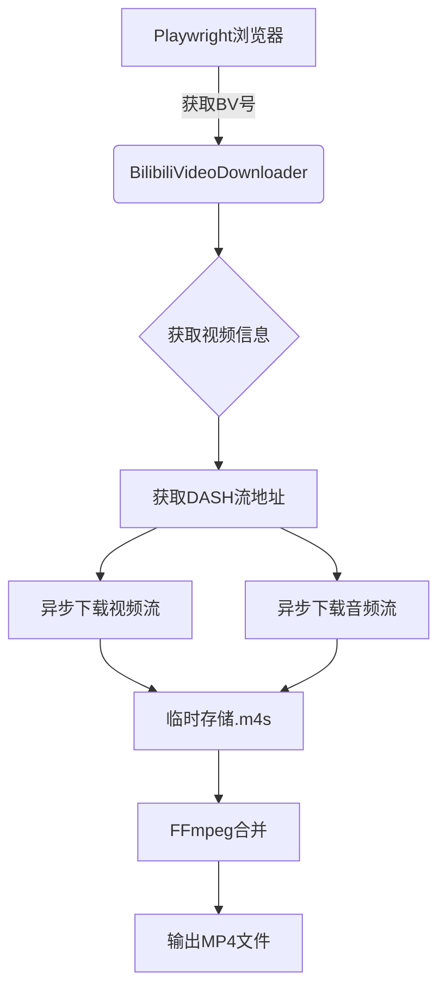
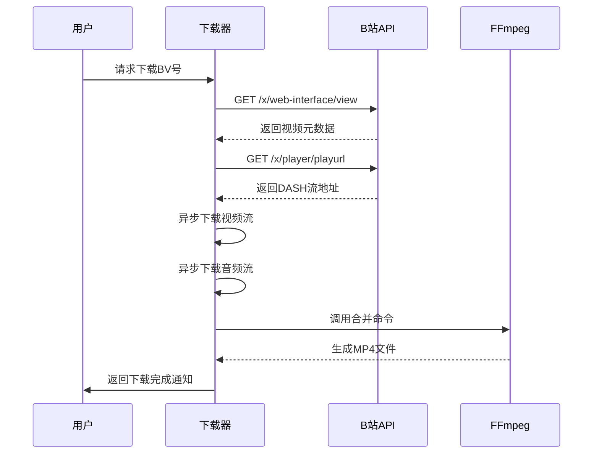
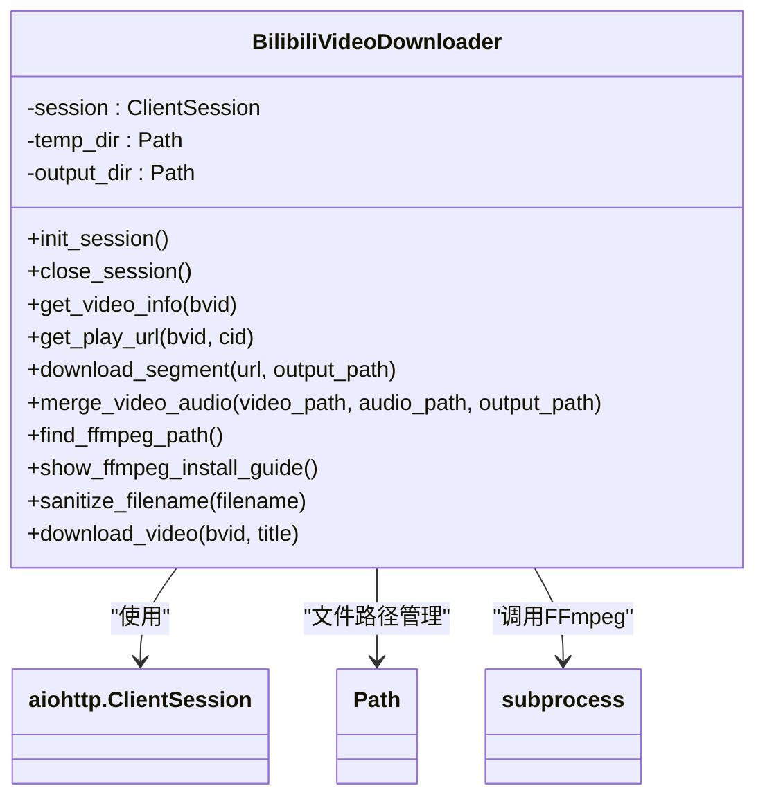
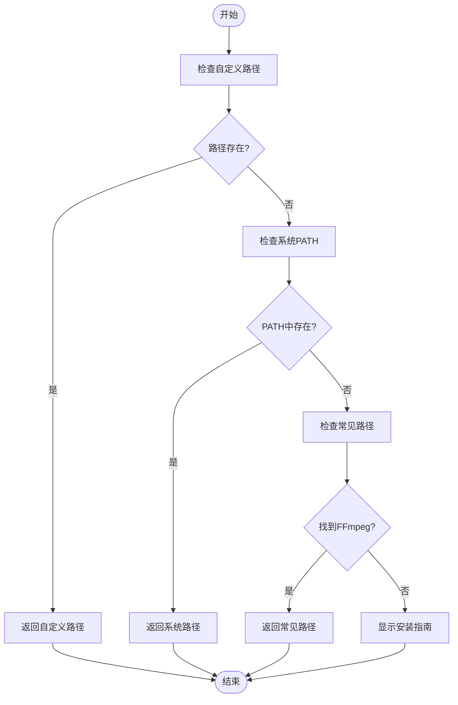
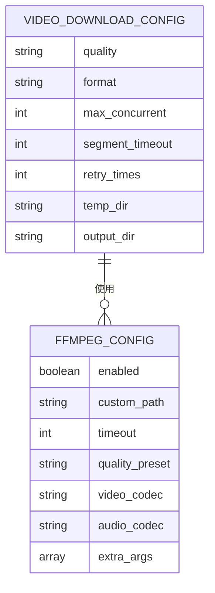

# 视频下载功能

<cite>
**本文档引用的文件**
- [bilibili_cover_crawler_playwright.py](file://bilibili_cover_crawler_playwright.py)
- [config.py](file://config.py)
- [check_ffmpeg.py](file://check_ffmpeg.py)
</cite>

## 目录
1. [项目概述](#项目概述)
2. [核心组件](#核心组件)
3. [视频下载流程](#视频下载流程)
4. [BilibiliVideoDownloader类设计](#bilibilivideodownloader类设计)
5. [FFmpeg集成机制](#ffmpeg集成机制)
6. [配置项说明](#配置项说明)
7. [异常处理与临时文件清理](#异常处理与临时文件清理)

## 项目概述

本项目实现了一个基于Playwright和aiohttp的哔哩哔哩视频下载器，能够通过B站API获取视频元数据，异步下载DASH流中的音视频分段，并使用FFmpeg进行合并。系统具备完善的反反爬策略、跨平台兼容性和可配置化选项，支持从单个BV号到用户全量视频的批量下载。

**Section sources**
- [bilibili_cover_crawler_playwright.py](file://bilibili_cover_crawler_playwright.py#L33-L2182)
- [README.md](file://README.md#L1-L552)

## 核心组件

系统由三大核心模块构成：基于Playwright的浏览器自动化爬虫、异步视频下载器和FFmpeg音视频处理引擎。各模块协同工作，实现了从视频发现、信息获取、流媒体下载到最终文件合成的完整闭环。

**Diagram sources**
- [bilibili_cover_crawler_playwright.py](file://bilibili_cover_crawler_playwright.py#L33-L2182)
- [config.py](file://config.py#L1-L400)

## 视频下载流程

视频下载遵循严格的分步流程，确保稳定性和成功率。

### 分步流程
1. **元数据获取**：调用B站视频信息API（/x/web-interface/view）获取视频基础信息
2. **DASH流解析**：从API响应中提取DASH格式的视频和音频分离地址
3. **异步分段下载**：使用aiohttp并发下载视频流（.m4s）和音频流（.m4s）到临时目录
4. **进度与重试**：实现下载进度显示和基于指数退避的错误重试机制
5. **音视频合并**：调用FFmpeg将分离的音视频流合并为最终MP4文件
6. **文件清理**：成功合并后自动清理临时.m4s文件

**Diagram sources**
- [bilibili_cover_crawler_playwright.py](file://bilibili_cover_crawler_playwright.py#L33-L2182)
- [config.py](file://config.py#L1-L400)

## BilibiliVideoDownloader类设计

`BilibiliVideoDownloader`类是视频下载功能的核心实现，采用异步编程模型和精细化的反反爬策略。

### 会话管理
通过aiohttp.ClientSession实现持久化HTTP会话，支持连接复用和超时控制。会话在首次下载时初始化，在下载完成后关闭，有效管理网络资源。

### 请求头轮换
实现动态请求头轮换机制，每次请求随机选择User-Agent和请求头模板，模拟真实浏览器行为，降低被检测风险。

### 智能延迟控制
采用多层级延迟策略：
- 基础请求间隔：2-6秒随机延迟
- 连续请求限制：每3次请求后强制休息
- 错误惩罚机制：失败后增加冷却时间
- 自适应延迟：根据系统负载动态调整

**Diagram sources**
- [bilibili_cover_crawler_playwright.py](file://bilibili_cover_crawler_playwright.py#L33-L2182)

**Section sources**
- [bilibili_cover_crawler_playwright.py](file://bilibili_cover_crawler_playwright.py#L33-L2182)

## FFmpeg集成机制

FFmpeg集成采用跨平台路径检测和智能引导机制，确保在不同操作系统上都能正常工作。

### 跨平台路径查找
`find_ffmpeg_path()`方法实现多级路径检测策略：
1. 优先检查配置文件中的自定义路径
2. 查询系统PATH环境变量
3. 按操作系统类型遍历常见安装路径
4. 返回第一个找到的有效FFmpeg可执行文件路径

### 安装指南引导
当未找到FFmpeg时，`show_ffmpeg_install_guide()`方法会根据操作系统类型显示详细的安装指南，包括：
- Windows：Chocolatey、Scoop包管理器或手动安装
- Linux：apt、yum、pacman等包管理器命令
- macOS：Homebrew安装命令
- 配置文件修改示例

**Diagram sources**
- [bilibili_cover_crawler_playwright.py](file://bilibili_cover_crawler_playwright.py#L33-L2182)
- [check_ffmpeg.py](file://check_ffmpeg.py#L1-L177)

**Section sources**
- [bilibili_cover_crawler_playwright.py](file://bilibili_cover_crawler_playwright.py#L33-L2182)
- [check_ffmpeg.py](file://check_ffmpeg.py#L1-L177)

## 配置项说明

系统通过config.py文件提供丰富的可定制化配置选项。

### 视频下载配置
`VIDEO_DOWNLOAD_CONFIG`包含以下关键参数：
- **quality**: 视频质量选择（high, medium, low）
- **max_concurrent**: 最大并发下载数（默认2）
- **retry_times**: 下载重试次数（默认5次）
- **temp_dir**: 临时文件目录（默认temp_videos）
- **output_dir**: 输出目录（默认downloaded_videos）

### FFmpeg配置
`FFMPEG_CONFIG`支持以下定制化选项：
- **quality_preset**: 编码预设（fast, medium, slow等）
- **video_codec**: 视频编解码器（copy, libx264等）
- **audio_codec**: 音频编解码器（aac, mp3等）
- **search_paths**: 跨平台路径检测顺序
- **install_guides**: 各平台安装指南链接

**Section sources**
- [config.py](file://config.py#L1-L400)

## 异常处理与临时文件清理

系统实现了完善的异常处理机制和资源管理策略。

### 网络错误重试
采用指数退避重试策略，初始延迟3秒，每次重试后延迟乘以退避因子，最大重试5次。对"请求过于频繁"等特定错误进行专门处理，触发更长的冷却时间。

### 合并失败处理
FFmpeg合并过程设置300秒超时，捕获超时异常和执行错误。合并失败时保留临时文件供调试，同时向用户显示详细的错误信息。

### 临时文件清理
实现自动清理机制，在以下情况清理临时.m4s文件：
- 音视频成功合并后
- 程序正常退出时
- 检测到重复下载任务时
- 用户手动触发清理

**Section sources**
- [bilibili_cover_crawler_playwright.py](file://bilibili_cover_crawler_playwright.py#L33-L2182)
- [config.py](file://config.py#L1-L400)