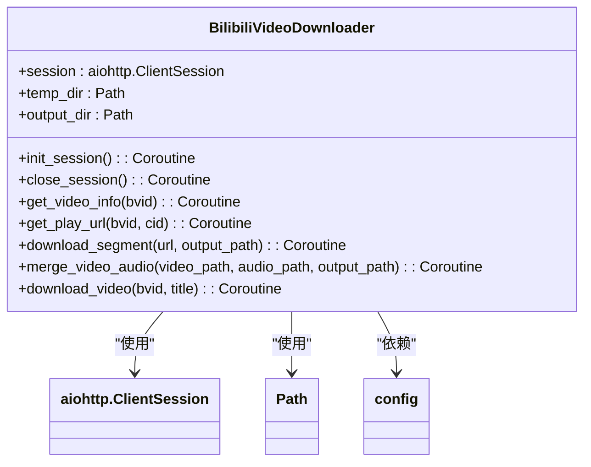
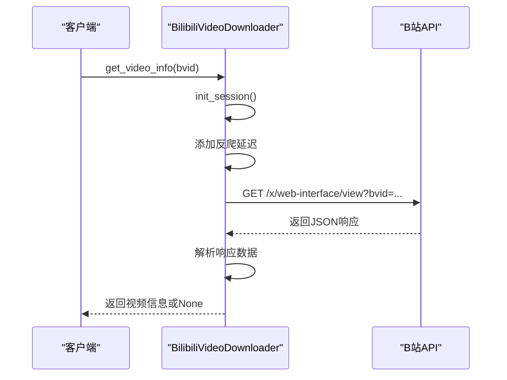
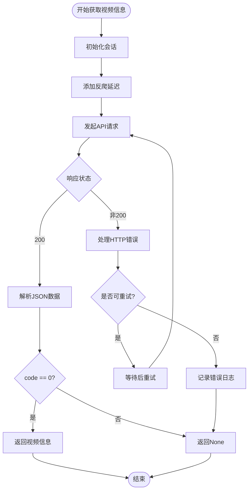

# 视频信息获取

<cite>
**本文档引用的文件**  
- [bilibili_cover_crawler_playwright.py](file://bilibili_cover_crawler_playwright.py)
- [config.py](file://config.py)
</cite>

## 目录
1. [简介](#简介)
2. [核心组件分析](#核心组件分析)
3. [视频信息获取流程](#视频信息获取流程)
4. [配置项详解](#配置项详解)
5. [错误处理机制](#错误处理机制)
6. [总结](#总结)

## 简介
本文档详细解析了从B站视频信息API（/x/web-interface/view）获取视频元数据的完整流程。重点介绍`BilibiliVideoDownloader`类中`get_video_info()`方法的实现机制，包括请求头构造、反爬延迟控制、错误重试策略和响应数据解析。结合`config.py`中的`VIDEO_API_CONFIG`和`VIDEO_DOWNLOAD_CONFIG`配置项，说明API参数设置、请求超时配置和用户代理轮换策略。同时涵盖常见问题如404错误、权限限制和响应超时的处理方案。

## 核心组件分析

`BilibiliVideoDownloader`类是视频信息获取的核心组件，负责与B站API进行交互。该类通过异步HTTP请求实现高效的数据获取，同时集成反爬虫机制以确保请求的稳定性和隐蔽性。



**Diagram sources**
- [bilibili_cover_crawler_playwright.py](file://bilibili_cover_crawler_playwright.py#L33-L490)

**Section sources**
- [bilibili_cover_crawler_playwright.py](file://bilibili_cover_crawler_playwright.py#L33-L490)

## 视频信息获取流程

视频信息获取流程通过`get_video_info()`方法实现，该方法采用异步编程模型，确保在高并发场景下的性能表现。

### 请求头构造
请求头构造遵循真实浏览器的行为模式，通过随机选择User-Agent和请求头模板来模拟不同浏览器的访问特征。API请求使用专门的请求头配置，包含必要的`Referer`、`Accept`和`Origin`字段。

### 反爬延迟控制
系统实现了智能延迟机制，通过`config.VIDEO_DOWNLOAD_CONFIG['anti_crawl']['request_delay_min']`和`config.VIDEO_DOWNLOAD_CONFIG['anti_crawl']['request_delay_max']`配置项控制请求间隔。延迟时间在2-6秒之间随机分布，有效避免了频率限制。

### 错误重试机制
错误重试机制包含多层保护：
- 基础重试：当请求失败时自动重试
- 冷却机制：检测到反爬措施时执行冷却等待
- 上下文更新：定期更新浏览器上下文以模拟用户行为变化

### 响应数据解析
响应数据解析遵循严格的JSON结构验证流程：
1. 检查HTTP状态码是否为200
2. 验证API返回的`code`字段是否为0（表示成功）
3. 提取`data`字段中的视频元数据
4. 处理异常情况并记录错误日志



**Diagram sources**
- [bilibili_cover_crawler_playwright.py](file://bilibili_cover_crawler_playwright.py#L69-L100)

**Section sources**
- [bilibili_cover_crawler_playwright.py](file://bilibili_cover_crawler_playwright.py#L69-L100)

## 配置项详解

### VIDEO_API_CONFIG配置
`VIDEO_API_CONFIG`定义了视频信息API的基本参数：

```python
VIDEO_API_CONFIG = {
    'play_url_api': 'https://api.bilibili.com/x/player/playurl',
    'video_info_api': 'https://api.bilibili.com/x/web-interface/view',
    'required_params': {
        'fnval': 16,    # 获取MP4格式
        'fnver': 0,
        'fourk': 1      # 支持4K
    }
}
```

**Section sources**
- [config.py](file://config.py#L341-L349)

### VIDEO_DOWNLOAD_CONFIG配置
`VIDEO_DOWNLOAD_CONFIG`包含了视频下载相关的完整配置：

```python
VIDEO_DOWNLOAD_CONFIG = {
    'enabled': False,
    'quality': 'high',
    'format': 'mp4',
    'max_concurrent': 2,
    'segment_timeout': 600,
    'retry_times': 5,
    'retry_delay': [3, 8, 15],
    'temp_dir': 'temp_videos',
    'output_dir': 'downloaded_videos',
    'user_agents': [...],
    'headers_templates': [...],
    'anti_crawl': {
        'request_delay_min': 2,
        'request_delay_max': 6,
        'max_consecutive': 3,
        'cooldown_time': 180,
        ...
    },
    'referers': [
        'https://www.bilibili.com/',
        'https://space.bilibili.com/',
        'https://www.bilibili.com/video/',
        'https://search.bilibili.com/'
    ]
}
```

**Section sources**
- [config.py](file://config.py#L262-L338)

## 错误处理机制

系统实现了全面的错误处理机制，能够应对各种异常情况：

### 常见错误类型
- **404错误**：视频不存在或已被删除
- **权限限制**：需要登录或特定权限才能访问
- **响应超时**：网络连接不稳定或服务器响应缓慢
- **反爬虫检测**：请求过于频繁被系统限制

### 处理策略
1. **网络错误**：自动重试，采用指数退避策略
2. **反爬虫检测**：执行冷却等待，更新请求头和User-Agent
3. **数据解析错误**：记录错误日志，返回None表示获取失败
4. **超时错误**：增加超时时间，重新发起请求



**Diagram sources**
- [bilibili_cover_crawler_playwright.py](file://bilibili_cover_crawler_playwright.py#L69-L100)

**Section sources**
- [bilibili_cover_crawler_playwright.py](file://bilibili_cover_crawler_playwright.py#L69-L100)

## 总结
本文档详细解析了B站视频信息获取的完整流程，涵盖了从请求发起、数据解析到错误处理的各个环节。通过合理的配置和完善的错误处理机制，系统能够在保证稳定性的同时有效规避反爬虫检测。`BilibiliVideoDownloader`类的设计体现了模块化和可扩展性的原则，为后续功能扩展提供了良好的基础。