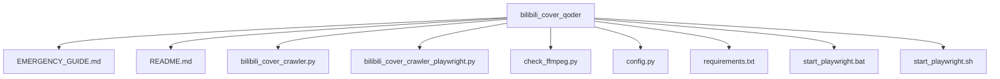
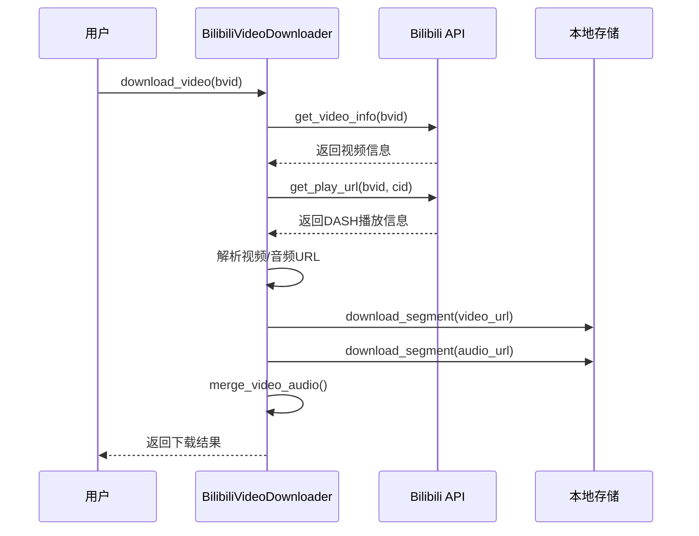
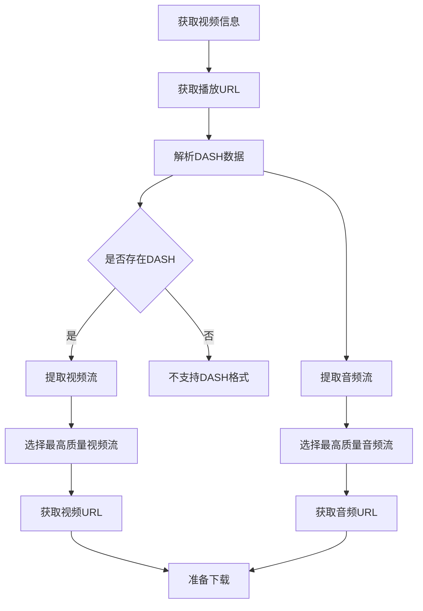
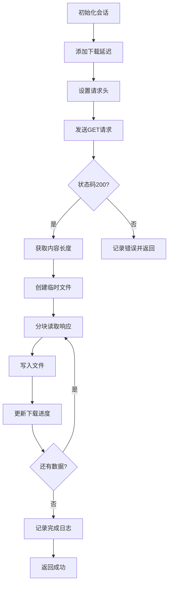
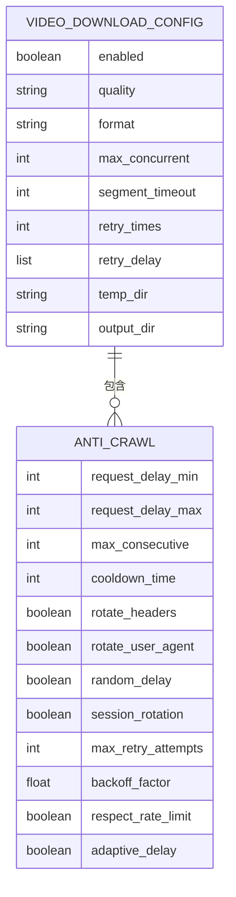
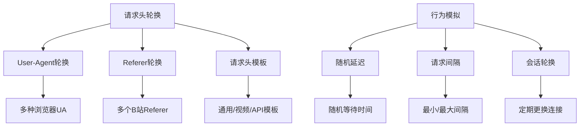
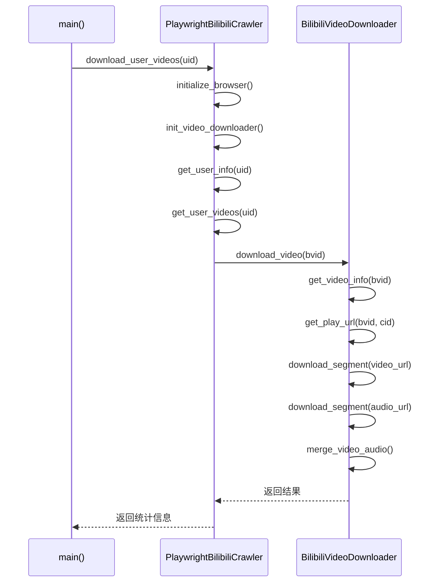

# 视频流下载

<cite>
**本文档引用的文件**  
- [bilibili_cover_crawler_playwright.py](file://bilibili_cover_crawler_playwright.py)
- [config.py](file://config.py)
</cite>

## 目录
1. [项目结构](#项目结构)
2. [核心组件](#核心组件)
3. [视频流下载机制](#视频流下载机制)
4. [DASH流解析与音视频分离](#dash流解析与音视频分离)
5. [分段下载实现](#分段下载实现)
6. [配置管理](#配置管理)
7. [伪装与反爬策略](#伪装与反爬策略)
8. [使用示例](#使用示例)

## 项目结构

**图示来源**  
- [config.py](file://config.py)
- [bilibili_cover_crawler_playwright.py](file://bilibili_cover_crawler_playwright.py)

**本节来源**  
- [config.py](file://config.py)
- [bilibili_cover_crawler_playwright.py](file://bilibili_cover_crawler_playwright.py)

## 核心组件

本项目主要包含两个核心模块：`BilibiliVideoDownloader` 负责视频流的下载与合并，`PlaywrightBilibiliCrawler` 负责通过Playwright模拟浏览器行为获取视频信息。其中视频下载功能由 `BilibiliVideoDownloader` 类实现，包含初始化会话、获取视频信息、下载分段、合并音视频等核心方法。

**本节来源**  
- [bilibili_cover_crawler_playwright.py](file://bilibili_cover_crawler_playwright.py#L33-L490)

## 视频流下载机制

视频流下载机制基于DASH（Dynamic Adaptive Streaming over HTTP）协议，通过异步HTTP请求获取视频和音频分段，使用aiohttp库实现高效的并发下载。系统首先获取视频的播放信息，解析出视频和音频的独立URL，然后分别下载.m4s格式的视频和音频分段，最后使用FFmpeg将两者合并为完整的MP4文件。

**图示来源**  
- [bilibili_cover_crawler_playwright.py](file://bilibili_cover_crawler_playwright.py#L391-L490)
- [config.py](file://config.py#L300-L350)

**本节来源**  
- [bilibili_cover_crawler_playwright.py](file://bilibili_cover_crawler_playwright.py#L33-L490)

## DASH流解析与音视频分离

DASH流解析通过调用B站API获取视频的播放信息，从返回的JSON数据中提取DASH格式的视频和音频流。系统选择最高质量的视频流（基于分辨率）和音频流（基于码率），获取其`baseUrl`作为下载地址。视频流和音频流被分别保存为`.m4s`格式的临时文件，为后续合并做准备。

**图示来源**  
- [bilibili_cover_crawler_playwright.py](file://bilibili_cover_crawler_playwright.py#L391-L490)
- [config.py](file://config.py#L300-L350)

**本节来源**  
- [bilibili_cover_crawler_playwright.py](file://bilibili_cover_crawler_playwright.py#L391-L490)

## 分段下载实现

`download_segment()` 方法是分段下载的核心实现，采用异步分块下载方式，支持进度回调和临时文件存储。

该方法首先初始化HTTP会话，设置包含Referer和User-Agent的请求头，然后发送GET请求。下载过程中使用`iter_chunked(8192)`方法分块读取响应内容，每读取一块就写入本地文件，并通过`progress_callback`更新下载进度。下载成功后返回True，失败则记录错误信息并返回False。

**图示来源**  
- [bilibili_cover_crawler_playwright.py](file://bilibili_cover_crawler_playwright.py#L137-L194)

**本节来源**  
- [bilibili_cover_crawler_playwright.py](file://bilibili_cover_crawler_playwright.py#L137-L194)

## 配置管理

系统通过`config.py`文件集中管理所有配置，特别是`VIDEO_DOWNLOAD_CONFIG`配置项控制视频下载行为。

关键配置包括：
- **并发控制**：`max_concurrent` 设置最大并发下载数
- **下载超时**：`segment_timeout` 设置分段下载超时时间（秒）
- **重试策略**：`retry_times` 设置重试次数，`retry_delay` 设置重试延迟阶段
- **临时存储**：`temp_dir` 指定临时文件目录，`output_dir` 指定输出目录

**图示来源**  
- [config.py](file://config.py#L300-L350)

**本节来源**  
- [config.py](file://config.py#L300-L350)

## 伪装与反爬策略

为避免被服务器拦截，系统采用多种伪装和反爬策略，模拟真实用户行为。

系统通过以下方式实现伪装：
- **Referer伪装**：从`referers`列表中随机选择Referer，模拟从不同B站页面跳转
- **User-Agent伪装**：从`user_agents`列表中随机选择UA，模拟不同浏览器和操作系统
- **请求头轮换**：使用不同的请求头模板，模拟不同类型的请求
- **行为模拟**：添加随机延迟，控制请求频率，避免触发反爬机制

**图示来源**  
- [config.py](file://config.py#L300-L350)
- [bilibili_cover_crawler_playwright.py](file://bilibili_cover_crawler_playwright.py#L137-L194)

**本节来源**  
- [config.py](file://config.py#L300-L350)
- [bilibili_cover_crawler_playwright.py](file://bilibili_cover_crawler_playwright.py#L137-L194)

## 使用示例

以下是异步下载器的使用示例：

系统提供进度监控功能，在下载过程中通过`tqdm`进度条显示下载进度。对于网络中断情况，系统通过重试机制实现断线重连，`retry_times`配置项控制重试次数，`retry_delay`配置项设置重试间隔，确保在网络不稳定情况下仍能完成下载任务。

**图示来源**  
- [bilibili_cover_crawler_playwright.py](file://bilibili_cover_crawler_playwright.py#L1339-L1339)
- [bilibili_cover_crawler_playwright.py](file://bilibili_cover_crawler_playwright.py#L391-L490)

**本节来源**  
- [bilibili_cover_crawler_playwright.py](file://bilibili_cover_crawler_playwright.py#L1339-L1339)
- [bilibili_cover_crawler_playwright.py](file://bilibili_cover_crawler_playwright.py#L391-L490)