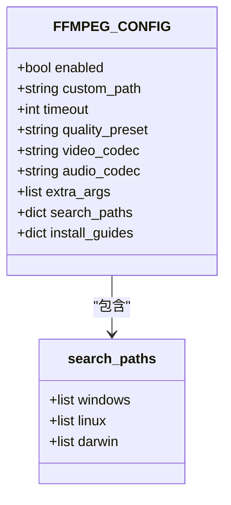
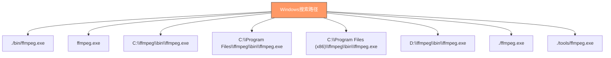
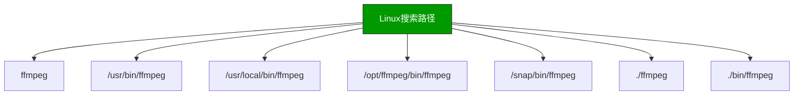
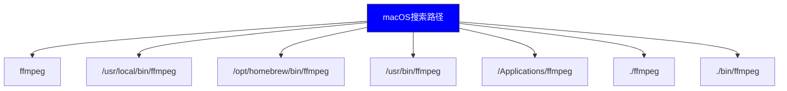
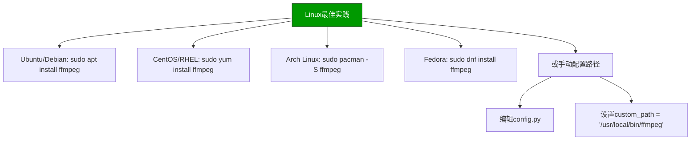
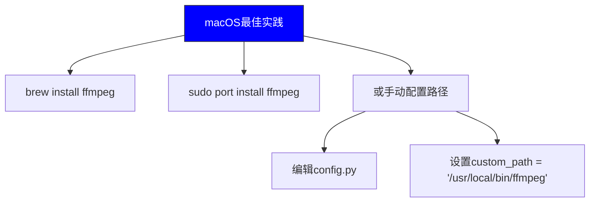

# FFmpeg路径配置

<cite>
**本文档引用的文件**   
- [config.py](file://config.py)
- [check_ffmpeg.py](file://check_ffmpeg.py)
- [bilibili_cover_crawler_playwright.py](file://bilibili_cover_crawler_playwright.py)
</cite>

## 目录
1. [简介](#简介)
2. [配置结构](#配置结构)
3. [自定义路径优先级](#自定义路径优先级)
4. [跨平台搜索路径](#跨平台搜索路径)
5. [路径检测逻辑](#路径检测逻辑)
6. [最佳实践](#最佳实践)
7. [降级处理机制](#降级处理机制)

## 简介
本文档详细说明了哔哩哔哩封面爬虫项目中FFmpeg路径配置机制。文档涵盖自定义路径（custom_path）的优先级规则、跨平台搜索路径（search_paths）的结构设计及其在Windows、Linux、macOS系统中的具体实现。通过分析config.py中的FFMPEG_CONFIG配置项，说明程序如何按优先级顺序查找FFmpeg可执行文件。结合check_ffmpeg.py的check_ffmpeg()函数实现，解析路径检测逻辑流程，包括自定义路径验证、PATH环境变量检测和平台特定路径遍历策略。

**Section sources**
- [config.py](file://config.py#L352-L399)
- [check_ffmpeg.py](file://check_ffmpeg.py#L0-L45)

## 配置结构
FFmpeg配置采用分层结构设计，包含功能开关、路径配置、编码参数和平台特定设置。配置项以字典形式组织，支持灵活的跨平台适配。



**Diagram sources**
- [config.py](file://config.py#L352-L399)

**Section sources**
- [config.py](file://config.py#L352-L399)

## 自定义路径优先级
自定义路径（custom_path）在FFmpeg路径查找机制中具有最高优先级。当用户在配置文件中指定自定义路径时，系统将首先验证该路径的有效性。


**Diagram sources**
- [check_ffmpeg.py](file://check_ffmpeg.py#L42-L80)
- [bilibili_cover_crawler_playwright.py](file://bilibili_cover_crawler_playwright.py#L201-L224)

**Section sources**
- [check_ffmpeg.py](file://check_ffmpeg.py#L42-L80)
- [bilibili_cover_crawler_playwright.py](file://bilibili_cover_crawler_playwright.py#L201-L224)

## 跨平台搜索路径
跨平台搜索路径设计考虑了不同操作系统的安装习惯和文件系统结构。每个平台都有特定的搜索路径列表，按照从高到低的优先级排列。

### Windows搜索路径
Windows平台的搜索路径优先考虑项目本地安装、当前目录和常见安装位置。



**Diagram sources**
- [config.py](file://config.py#L362-L373)

### Linux搜索路径
Linux平台的搜索路径覆盖了包管理器安装、系统安装和本地安装的常见位置。



**Diagram sources**
- [config.py](file://config.py#L374-L381)

### macOS搜索路径
macOS平台的搜索路径特别考虑了Homebrew包管理器的不同架构安装位置。



**Diagram sources**
- [config.py](file://config.py#L382-L387)

**Section sources**
- [config.py](file://config.py#L362-L387)

## 路径检测逻辑
路径检测逻辑遵循严格的优先级顺序，确保系统能够可靠地找到可用的FFmpeg可执行文件。

```mermaid
sequenceDiagram
participant User as "用户"
participant Config as "配置文件"
participant System as "系统"
participant Search as "搜索路径"
User->>Config : 设置自定义路径
Config->>System : 检查自定义路径是否存在
alt 路径存在
System-->>Config : 返回路径
Config-->>User : 使用自定义路径
else 路径不存在
System->>System : 检查PATH环境变量
alt PATH中找到
System-->>Config : 返回PATH路径
Config-->>User : 使用PATH路径
else 未找到
System->>Search : 遍历平台特定搜索路径
loop 每个搜索路径
Search->>Search : 检查路径是否存在
alt 路径存在
Search-->>System : 返回第一个有效路径
break 返回路径
end
end
alt 找到路径
System-->>User : 使用搜索到的路径
else 未找到
System-->>User : 返回空值
end
end
end
```

**Diagram sources**
- [check_ffmpeg.py](file://check_ffmpeg.py#L0-L80)
- [bilibili_cover_crawler_playwright.py](file://bilibili_cover_crawler_playwright.py#L192-L267)

**Section sources**
- [check_ffmpeg.py](file://check_ffmpeg.py#L0-L80)
- [bilibili_cover_crawler_playwright.py](file://bilibili_cover_crawler_playwright.py#L192-L267)

## 最佳实践
为确保FFmpeg功能正常工作，建议遵循以下最佳实践。

### Windows系统配置
在Windows系统中，推荐使用包管理器安装或配置自定义路径。


**Diagram sources**
- [bilibili_cover_crawler_playwright.py](file://bilibili_cover_crawler_playwright.py#L283-L309)

### Linux系统配置
在Linux系统中，推荐使用系统包管理器进行安装。



**Diagram sources**
- [bilibili_cover_crawler_playwright.py](file://bilibili_cover_crawler_playwright.py#L283-L309)

### macOS系统配置
在macOS系统中，推荐使用Homebrew进行安装。



**Diagram sources**
- [bilibili_cover_crawler_playwright.py](file://bilibili_cover_crawler_playwright.py#L283-L309)

**Section sources**
- [bilibili_cover_crawler_playwright.py](file://bilibili_cover_crawler_playwright.py#L283-L309)

## 降级处理机制
当指定路径不存在时，系统会按照预定义的降级策略进行处理，确保程序的健壮性。


**Diagram sources**
- [check_ffmpeg.py](file://check_ffmpeg.py#L78-L115)
- [bilibili_cover_crawler_playwright.py](file://bilibili_cover_crawler_playwright.py#L249-L284)

**Section sources**
- [check_ffmpeg.py](file://check_ffmpeg.py#L78-L115)
- [bilibili_cover_crawler_playwright.py](file://bilibili_cover_crawler_playwright.py#L249-L284)