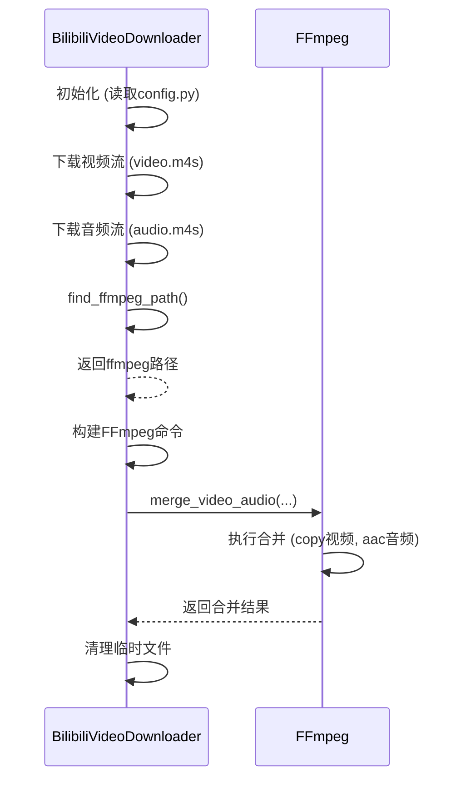

# 编码参数配置

<cite>
**Referenced Files in This Document**   
- [config.py](file://config.py#L352-L399)
- [bilibili_cover_crawler_playwright.py](file://bilibili_cover_crawler_playwright.py#L201-L463)
- [check_ffmpeg.py](file://check_ffmpeg.py#L1-L177)
</cite>

## 目录
1. [编码预设（quality_preset）](#编码预设quality_preset)
2. [视频编解码器（video_codec）](#视频编解码器video_codec)
3. [音频编解码器（audio_codec）](#音频编解码器audio_codec)
4. [FFmpeg配置与合并流程](#ffmpeg配置与合并流程)
5. [推荐配置组合](#推荐配置组合)
6. [调优建议](#调优建议)

## 编码预设（quality_preset）

`quality_preset` 参数用于控制视频编码的速度与质量之间的权衡。该参数在 `config.py` 文件的 `FFMPEG_CONFIG` 配置中定义，其值直接影响 FFmpeg 编码过程的压缩效率和处理时间。

根据配置文件，`quality_preset` 的可选值包括：`ultrafast`、`superfast`、`veryfast`、`faster`、`fast`、`medium`、`slow`、`slower`、`veryslow`。

- **`ultrafast` 到 `fast`**：这些预设优先考虑编码速度，牺牲了压缩效率和输出质量。适用于需要快速处理大量视频的场景，如批量转码或实时流处理。
- **`medium`**：这是默认的平衡点，提供合理的编码速度和良好的压缩效率。在大多数情况下，`medium` 是一个理想的折衷选择。
- **`slow` 到 `veryslow`**：这些预设显著增加编码时间，以换取更高的压缩率和更好的视觉质量。适用于对输出质量要求极高的场景，如电影制作或高质量存档。

在本项目中，`quality_preset` 的默认值被设置为 `'fast'`，这表明项目优先考虑处理速度，以确保视频合并操作能够快速完成，同时保持可接受的输出质量。

**Section sources**
- [config.py](file://config.py#L356)

## 视频编解码器（video_codec）

`video_codec` 参数决定了视频流的编码方式。在 `FFMPEG_CONFIG` 配置中，此参数支持多种模式，其中最核心的是 `'copy'` 模式。

- **`copy` 模式**：这是本项目默认采用的模式（`'video_codec': 'copy'`）。在此模式下，FFmpeg 不会对视频流进行任何重新编码，而是直接将输入的视频流复制到输出文件中。这种方式实现了**无损且极速的合并**，因为它避免了耗时的解码和编码过程。这对于从 Bilibili 下载的 DASH 流（如 `.m4s` 文件）进行合并时尤其重要，因为它能保持原始视频的最高质量，并极大地缩短处理时间。
- **`libx264` / `libx265` 等**：这些是具体的视频编码库。选择这些值会强制 FFmpeg 使用 H.264 或 H.265 编码器对视频流进行重新编码。这会带来更高的压缩率（文件更小），但会显著增加 CPU 负载和处理时间，并可能导致质量损失。此模式通常用于需要调整分辨率、码率或格式转换的场景。

**Section sources**
- [config.py](file://config.py#L357)

## 音频编解码器（audio_codec）

`audio_codec` 参数用于指定音频流的处理方式。其配置选项与视频编解码器类似，但针对音频流。

- **`aac`**：这是本项目的默认设置（`'audio_codec': 'aac'`）。与 `video_codec` 的 `'copy'` 模式不同，音频流默认会被重新编码为 AAC 格式。AAC 是一种广泛兼容且高效的音频编码格式，适合与 MP4 容器结合使用。这意味着即使视频流是直接复制的，音频流也会经过 FFmpeg 的解码和重新编码过程。
- **`copy`**：如果设置为 `'copy'`，FFmpeg 会像处理视频流一样，直接复制原始的音频流（例如，如果原始音频是 AAC 或 MP3 格式）。这可以实现完全无损的快速合并，但要求输入的音频格式与输出容器兼容。
- **`mp3`**：此选项会将音频重新编码为 MP3 格式，适用于需要 MP3 音频的特定场景。

**Section sources**
- [config.py](file://config.py#L358)

## FFmpeg配置与合并流程

本项目的 FFmpeg 配置旨在实现高效、可靠的音视频合并。其核心流程和配置如下：

1.  **路径查找**：`find_ffmpeg_path` 函数负责在系统中定位 FFmpeg 可执行文件。它遵循一个优先级搜索策略：首先检查配置中的自定义路径，然后在系统 `PATH` 中查找，最后遍历针对不同操作系统（Windows, Linux, macOS）预定义的常见安装路径列表。这确保了程序在不同环境下的可移植性。

2.  **合并命令构建**：`merge_video_audio` 方法是执行合并的核心。它使用 `FFMPEG_CONFIG` 中的配置来构建 FFmpeg 命令行：
    ```python
    cmd = [
        ffmpeg_path, '-y',
        '-i', str(video_path),  # 输入视频流
        '-i', str(audio_path),  # 输入音频流
        '-c:v', config.FFMPEG_CONFIG.get('video_codec', 'copy'),  # 视频编解码器
        '-c:a', config.FFMPEG_CONFIG.get('audio_codec', 'aac'),   # 音频编解码器
        '-preset', config.FFMPEG_CONFIG.get('quality_preset', 'fast') # 编码预设
    ]
    ```
    此命令将两个输入文件（视频和音频）合并为一个 MP4 文件，并应用配置的编解码和预设。

3.  **执行与错误处理**：程序使用 `subprocess.run` 执行 FFmpeg 命令，并设置了超时机制（默认 300 秒）和 UTF-8 字符编码，以防止因长时间运行或乱码导致的程序崩溃。



**Diagram sources**
- [bilibili_cover_crawler_playwright.py](file://bilibili_cover_crawler_playwright.py#L201-L344)
- [config.py](file://config.py#L352-L399)

**Section sources**
- [bilibili_cover_crawler_playwright.py](file://bilibili_cover_crawler_playwright.py#L201-L463)

## 推荐配置组合

基于 `FFMPEG_CONFIG` 的默认设置，项目推荐的配置组合是：

- **`video_codec: 'copy'`**
- **`audio_codec: 'aac'`**
- **`quality_preset: 'fast'`**

这个组合旨在实现**快速、高效且质量可接受的合并**。通过复制视频流，避免了耗时的重编码，保证了视频质量。将音频编码为 AAC 确保了与 MP4 容器的最佳兼容性和良好的音质。`fast` 预设则确保了即使在音频重编码时，整个过程也能快速完成。

## 调优建议

根据不同的使用场景，可以对默认配置进行调整：

- **追求极致速度（快速处理）**：
  - 将 `audio_codec` 也设置为 `'copy'`。这将实现完全的流复制，合并速度将达到最快，几乎是即时的。
  - 适用场景：当原始音频格式（如 AAC）与 MP4 兼容，且对文件大小不敏感时。

- **追求最高质量（高质量输出）**：
  - 将 `quality_preset` 调整为 `'slow'` 或 `'slower'`。这会显著增加编码时间，但能生成更小、质量更高的文件。
  - 将 `video_codec` 从 `'copy'` 改为 `'libx264'` 或 `'libx265'`，并配合 `slow` 预设，可以对视频进行深度优化和压缩。
  - 适用场景：当需要长期存档或对画质有极高要求，且不介意较长的处理时间时。

- **平衡模式（推荐默认）**：
  - 维持当前的默认配置（`video_codec: 'copy'`, `audio_codec: 'aac'`, `quality_preset: 'fast'`）。
  - 适用场景：适用于绝大多数日常使用，如下载 Bilibili 视频进行本地观看，它在速度、质量和兼容性之间取得了最佳平衡。