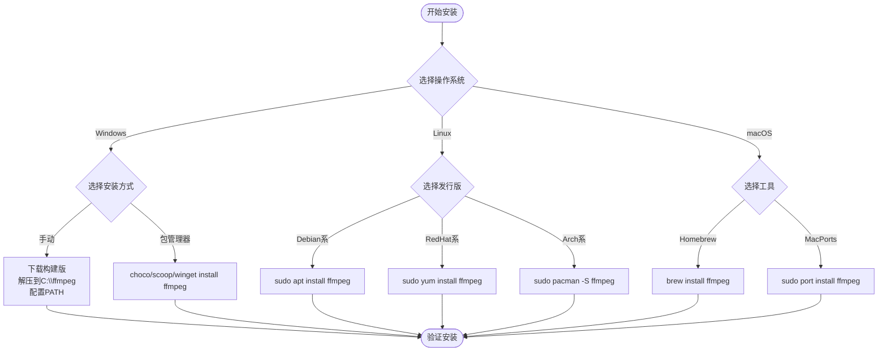

# 跨平台集成指南

<cite>
**Referenced Files in This Document**  
- [config.py](file://config.py)
- [check_ffmpeg.py](file://check_ffmpeg.py)
</cite>

## 目录
1. [简介](#简介)
2. [FFmpeg 安装指南](#ffmpeg-安装指南)
3. [平台路径差异与配置影响](#平台路径差异与配置影响)
4. [环境变量配置](#环境变量配置)
5. [安装验证](#安装验证)
6. [官方构建页面链接](#官方构建页面链接)

## 简介
本文档基于项目中的 `config.py` 和 `check_ffmpeg.py` 文件内容，提供详细的跨平台 FFmpeg 集成方案。旨在指导用户在 Windows、Linux 和 macOS 三大操作系统下完成 FFmpeg 的安装、环境变量配置及功能验证，确保视频处理功能正常运行。

**Section sources**
- [config.py](file://config.py#L300-L399)
- [check_ffmpeg.py](file://check_ffmpeg.py#L1-L30)

## FFmpeg 安装指南

### Windows 安装方法
**方法1：手动安装**
1. 访问 [FFmpeg 官方下载页面](https://ffmpeg.org/download.html)
2. 下载 Windows 版本（推荐选择 "Windows builds by BtbN"）
3. 解压到 `C:\ffmpeg`
4. 将 `C:\ffmpeg\bin` 添加到系统 PATH 环境变量
5. 重启命令行终端

**方法2：使用包管理器**
- **Chocolatey**: `choco install ffmpeg`
- **Scoop**: `scoop install ffmpeg`
- **winget**: `winget install ffmpeg`

### Linux 安装方法
根据不同发行版使用相应的包管理器：
- **Ubuntu/Debian**: `sudo apt install ffmpeg`
- **CentOS/RHEL**: `sudo yum install ffmpeg` 或 `sudo dnf install ffmpeg`
- **Arch Linux**: `sudo pacman -S ffmpeg`
- **Fedora**: `sudo dnf install ffmpeg`

### macOS 安装方法
推荐使用 Homebrew 进行安装：
- **Homebrew**: `brew install ffmpeg`
- **MacPorts**: `sudo port install ffmpeg`



**Diagram sources**
- [config.py](file://config.py#L350-L399)
- [check_ffmpeg.py](file://check_ffmpeg.py#L100-L150)

**Section sources**
- [config.py](file://config.py#L350-L399)
- [check_ffmpeg.py](file://check_ffmpeg.py#L100-L150)

## 平台路径差异与配置影响

### 可执行文件后缀差异
- **Windows**: 必须包含 `.exe` 后缀（如 `ffmpeg.exe`）
- **Linux/macOS**: 无后缀（直接使用 `ffmpeg`）

### 路径分隔符差异
- **Windows**: 使用反斜杠 `\` 作为路径分隔符
- **Linux/macOS**: 使用正斜杠 `/` 作为路径分隔符

### 配置文件中的路径搜索顺序
`config.py` 中定义了不同平台的搜索路径优先级：

**Windows 搜索路径（按优先级）**
1. `./bin/ffmpeg.exe`（项目本地）
2. `ffmpeg.exe`（当前目录或PATH）
3. `C:\ffmpeg\bin\ffmpeg.exe`（常见安装路径）
4. `C:\Program Files\ffmpeg\bin\ffmpeg.exe`

**Linux 搜索路径（按优先级）**
1. `ffmpeg`（PATH中）
2. `/usr/bin/ffmpeg`（系统安装）
3. `/usr/local/bin/ffmpeg`（本地安装）
4. `/opt/ffmpeg/bin/ffmpeg`（可选安装）

**macOS 搜索路径（按优先级）**
1. `ffmpeg`（PATH中或Homebrew）
2. `/usr/local/bin/ffmpeg`（Intel芯片Homebrew）
3. `/opt/homebrew/bin/ffmpeg`（Apple Silicon芯片Homebrew）
4. `/Applications/ffmpeg`（应用程序目录）


**Diagram sources**
- [config.py](file://config.py#L300-L399)

**Section sources**
- [config.py](file://config.py#L300-L399)

## 环境变量配置

### Windows 环境变量配置步骤
1. 右键"此电脑" → "属性" → "高级系统设置"
2. 点击"环境变量"
3. 在"系统变量"中找到 `Path`，点击"编辑"
4. 添加 FFmpeg 的 bin 目录路径（如 `C:\ffmpeg\bin`）
5. 点击"确定"保存所有更改
6. 重启命令提示符或 PowerShell

### Linux/macOS 环境变量配置
将以下内容添加到 shell 配置文件（如 `~/.bashrc`、`~/.zshrc`）：
```bash
export PATH="/usr/local/bin:$PATH"
```
然后执行：
```bash
source ~/.bashrc  # 或 source ~/.zshrc
```

**Section sources**
- [check_ffmpeg.py](file://check_ffmpeg.py#L40-L60)

## 安装验证

安装完成后，通过以下命令验证 FFmpeg 是否正确安装：

```bash
ffmpeg -version
```

预期输出应包含 FFmpeg 版本信息，如：
```
ffmpeg version N-12345-gabcde1234 Copyright (c) 2000-2023 the FFmpeg developers
```

若命令无法识别，请检查：
1. 环境变量是否正确配置
2. FFmpeg 可执行文件是否存在
3. 是否已重启终端会话


**Diagram sources**
- [check_ffmpeg.py](file://check_ffmpeg.py#L70-L90)

**Section sources**
- [check_ffmpeg.py](file://check_ffmpeg.py#L70-L90)

## 官方构建页面链接

为获取最新版本和构建信息，请访问以下官方页面：

- **Windows**: [https://ffmpeg.org/download.html#build-windows](https://ffmpeg.org/download.html#build-windows)
- **Linux**: [https://ffmpeg.org/download.html#build-linux](https://ffmpeg.org/download.html#build-linux)
- **macOS**: [https://ffmpeg.org/download.html#build-mac](https://ffmpeg.org/download.html#build-mac)

这些链接在 `config.py` 的 `FFMPEG_CONFIG['install_guides']` 中定义，确保用户能够获取最新的官方构建版本。

**Section sources**
- [config.py](file://config.py#L390-L399)