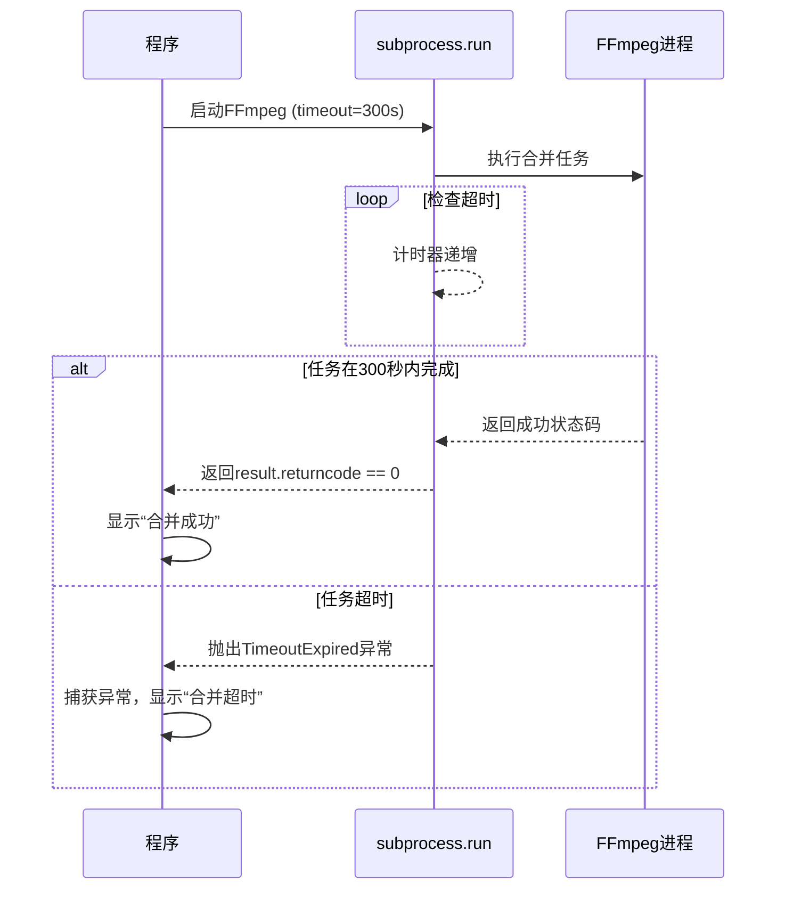
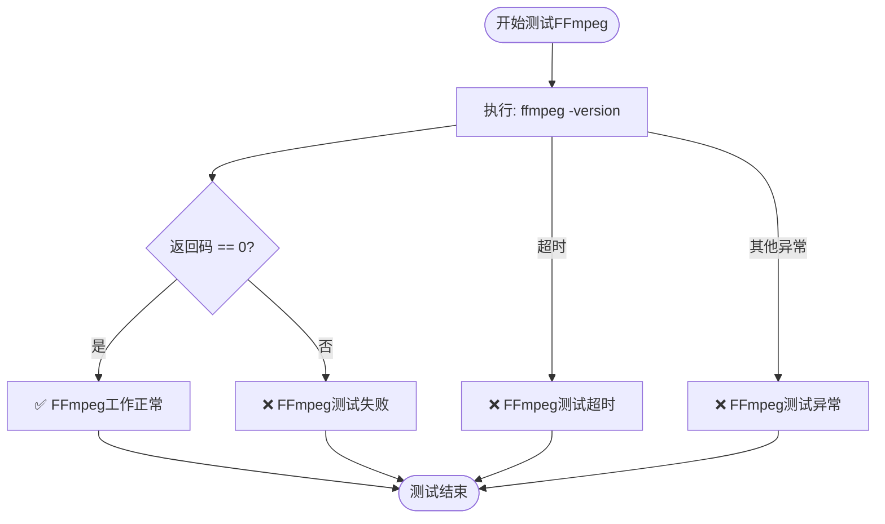

# 运行时行为控制

<cite>
**本文档引用的文件**
- [check_ffmpeg.py](file://check_ffmpeg.py)
- [config.py](file://config.py)
- [bilibili_cover_crawler_playwright.py](file://bilibili_cover_crawler_playwright.py)
</cite>

## 目录
1. [引言](#引言)
2. [FFmpeg运行时控制机制](#ffmpeg运行时控制机制)
3. [超时参数在长时间合并任务中的重要性](#超时参数在长时间合并任务中的重要性)
4. [test_ffmpeg()函数的边界情况处理](#test_ffmpeg函数的边界情况处理)
5. [FFmpeg测试流程的启动必要性](#ffmpeg测试流程的启动必要性)
6. [extra_args额外参数的用途](#extra_args额外参数的用途)
7. [结论与最佳实践](#结论与最佳实践)

## 引言
本文档深入探讨了项目中FFmpeg的运行时控制机制，重点分析了执行超时（timeout）参数的作用及其在长时间视频合并任务中的关键性。通过分析`check_ffmpeg.py`中的`test_ffmpeg()`函数，详细说明了程序如何通过`subprocess`调用验证FFmpeg功能完整性，并妥善处理超时、异常等边界情况。同时，解释了在程序启动时进行FFmpeg测试的必要性，以及如何根据测试结果引导用户进行安装或修复。此外，还涵盖了`extra_args`额外参数的用途，特别是`'-strict experimental'`对特定编码格式的支持。

## FFmpeg运行时控制机制
项目通过`subprocess.run()`方法调用FFmpeg，实现了对FFmpeg执行过程的全面控制。该机制不仅用于测试FFmpeg的可用性，还在视频下载功能中用于合并视频和音频流。核心控制参数包括`timeout`（超时）、`capture_output`（捕获输出）和`text`（文本模式），确保了对FFmpeg进程的稳定管理和结果的可靠获取。

**Section sources**
- [check_ffmpeg.py](file://check_ffmpeg.py#L73-L93)
- [bilibili_cover_crawler_playwright.py](file://bilibili_cover_crawler_playwright.py#L357-L362)

## 超时参数在长时间合并任务中的重要性
`timeout`参数是FFmpeg运行时控制的核心，它定义了进程执行的最大允许时间。在长时间的视频合并任务中，此参数至关重要。

在`config.py`中，`FFMPEG_CONFIG['timeout']`被设置为300秒（5分钟），这是一个合理的默认值，适用于大多数视频合并场景。当执行`subprocess.run()`时，此超时值被传入，如`bilibili_cover_crawler_playwright.py`中的代码所示。如果FFmpeg进程在指定时间内未能完成，将抛出`subprocess.TimeoutExpired`异常，程序可以据此进行优雅的错误处理，避免进程无限挂起，从而保证了主程序的健壮性和用户体验。

**Diagram sources**
- [config.py](file://config.py#L355)
- [bilibili_cover_crawler_playwright.py](file://bilibili_cover_crawler_playwright.py#L357)

**Section sources**
- [config.py](file://config.py#L355)
- [bilibili_cover_crawler_playwright.py](file://bilibili_cover_crawler_playwright.py#L357-L362)

## test_ffmpeg()函数的边界情况处理
`check_ffmpeg.py`中的`test_ffmpeg()`函数是验证FFmpeg功能完整性的关键。它通过调用`ffmpeg -version`来测试FFmpeg是否能正常工作，并精心处理了多种边界情况。

该函数使用`try-except`块捕获所有可能的异常。首先，它检查`subprocess.run()`的返回码，`returncode == 0`表示命令成功执行。其次，它专门捕获`subprocess.TimeoutExpired`异常，以处理测试过程中的超时情况（在代码中，测试超时设置为10秒）。最后，它捕获所有其他`Exception`，以应对文件不存在、权限不足等未知错误。这种分层的异常处理策略确保了测试的全面性和程序的稳定性。

**Diagram sources**
- [check_ffmpeg.py](file://check_ffmpeg.py#L78-L93)

**Section sources**
- [check_ffmpeg.py](file://check_ffmpeg.py#L73-L93)

## FFmpeg测试流程的启动必要性
在程序启动时进行FFmpeg测试是确保后续功能（如视频合并）能够顺利执行的必要步骤。`check_ffmpeg.py`的`main()`函数在启动时会自动执行这一流程。

该流程首先调用`check_ffmpeg()`函数在系统中查找FFmpeg可执行文件，然后调用`test_ffmpeg()`函数验证其功能。如果测试失败或未找到FFmpeg，程序不会直接崩溃，而是调用`show_installation_guide()`函数，向用户清晰地展示在不同操作系统（Windows、Linux、macOS）下的安装方法。这种主动的、用户友好的引导机制，极大地降低了用户的使用门槛，避免了因环境配置问题导致的功能缺失，是程序健壮性的重要体现。

**Section sources**
- [check_ffmpeg.py](file://check_ffmpeg.py#L117-L150)

## extra_args额外参数的用途
`extra_args`是`FFMPEG_CONFIG`配置中的一个列表，用于向FFmpeg命令行传递额外的参数。在`config.py`中，它被预设为`['-strict', 'experimental']`。

`'-strict experimental'`参数允许FFmpeg使用实验性的编码器或功能。这对于支持某些较新或非标准的编码格式至关重要。例如，在合并某些特殊格式的音视频流时，如果不启用此选项，FFmpeg可能会拒绝执行并报错。在`bilibili_cover_crawler_playwright.py`的`merge_video_audio()`方法中，程序会检查`extra_args`配置，如果存在，则将其`extend`到FFmpeg命令列表中，从而确保了对这些特殊功能的支持，增强了程序的兼容性和灵活性。

**Section sources**
- [config.py](file://config.py#L358)
- [bilibili_cover_crawler_playwright.py](file://bilibili_cover_crawler_playwright.py#L345-L348)

## 结论与最佳实践
综上所述，该项目通过精心设计的运行时控制机制，确保了FFmpeg功能的可靠集成。`timeout`参数是防止长时间任务阻塞的关键；`test_ffmpeg()`函数的多层异常处理保证了测试的鲁棒性；启动时的自动测试和安装引导为用户提供了无缝的体验；而`extra_args`则提供了必要的功能扩展能力。

最佳实践建议：用户应确保FFmpeg已正确安装并可通过`PATH`访问，或在`config.py`中明确设置`custom_path`。对于处理超大文件的用户，可根据需要适当增加`timeout`值。开发者在扩展功能时，应充分利用`extra_args`机制来支持新的FFmpeg特性。