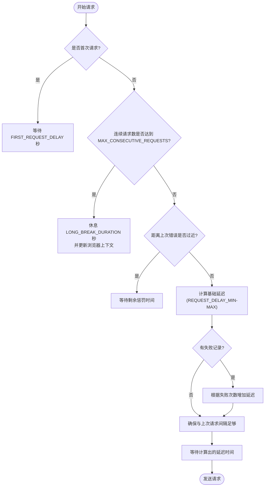

# 反反爬配置

<cite>
**本文档中引用的文件**  
- [config.py](file://config.py)
- [bilibili_cover_crawler_playwright.py](file://bilibili_cover_crawler_playwright.py)
</cite>

## 目录
1. [引言](#引言)
2. [核心反反爬参数详解](#核心反反爬参数详解)
3. [Playwright浏览器配置](#playwright浏览器配置)
4. [请求行为模拟策略](#请求行为模拟策略)
5. [网络异常应对与调参建议](#网络异常应对与调参建议)
6. [配置协同工作机制](#配置协同工作机制)

## 引言
本文档全面阐述`config.py`文件中与反反爬机制相关的配置项，重点分析请求间隔、连续请求上限、错误冷却时间、User-Agent轮换列表及浏览器启动参数等关键设置。通过解析这些参数在`bilibili_cover_crawler_playwright.py`中的实际应用，说明其如何协同工作以模拟真实用户行为，避免被B站识别为自动化脚本。同时，结合Playwright配置，探讨如何在爬取效率与隐蔽性之间取得平衡，并提供在网络不稳定或频繁被封禁时的调参建议。

## 核心反反爬参数详解

### 请求间隔配置（REQUEST_DELAY_MIN/MAX）
该配置定义了API请求的最小和最大延迟时间，通过随机化请求间隔来模拟人类操作的不确定性。

- **REQUEST_DELAY_MIN**: 最小请求间隔，单位为秒，当前设置为3秒。
- **REQUEST_DELAY_MAX**: 最大请求间隔，单位为秒，当前设置为8秒。

在实际运行中，系统会在这两个值之间随机选择一个延迟时间，有效避免了固定频率请求带来的机器特征。

**Section sources**
- [config.py](file://config.py#L100-L101)

### 连续请求上限（MAX_CONSECUTIVE_REQUESTS）
此参数设定了在触发长时间休息前允许的连续请求数量，当前值为30次。当连续请求达到此上限时，系统将强制进入长时间休息状态，模拟用户在浏览一段时间后暂停的行为。

**Section sources**
- [config.py](file://config.py#L104)

### 错误冷却时间（ERROR_COOLDOWN）
当系统检测到反爬措施（如429状态码、"请求过于频繁"等）时，将启动冷却机制。`ERROR_COOLDOWN`定义了基础冷却时间，单位为秒，当前设置为180秒（3分钟）。在重试过程中，冷却时间会根据重试次数和连续失败次数动态增加，实现指数级退避策略。

**Section sources**
- [config.py](file://config.py#L105)

### User-Agent轮换列表（USER_AGENTS）
该列表包含了多种主流浏览器和操作系统的User-Agent字符串，通过随机轮换使用，使每次请求的客户端标识都不同，极大降低了被识别为自动化脚本的风险。列表覆盖了：
- Chrome（Windows、macOS、Linux）
- Firefox（Windows、macOS、Linux）
- Edge（Windows）
- Safari（macOS）

这种多样化的User-Agent池模拟了真实用户群体的浏览器分布。

**Section sources**
- [config.py](file://config.py#L70-L99)

### 请求失败惩罚时间（REQUEST_FAILURE_PENALTY）
当请求失败时，即使未达到`ERROR_COOLDOWN`的触发条件，也会施加一个较短的惩罚性延迟，当前设置为10秒。这确保了在出现轻微异常时也能适当放缓请求节奏。

**Section sources**
- [config.py](file://config.py#L107)

## Playwright浏览器配置

### 浏览器启动参数（BROWSER_ARGS）
`BROWSER_ARGS`列表包含了一系列Chrome启动参数，用于构建一个更真实、更隐蔽的浏览器环境。关键参数包括：
- `--disable-blink-features=AutomationControlled`: 隐藏自动化控制标识，防止被JavaScript检测到。
- `--no-sandbox` 和 `--disable-setuid-sandbox`: 在特定环境下禁用沙箱，提高兼容性。
- `--disable-extensions`: 禁用扩展，模拟纯净浏览器环境。
- `--disable-features=VizDisplayCompositor`: 禁用显示合成器，减少特征暴露。

这些参数共同作用，使Playwright控制的浏览器在指纹特征上更接近真实用户。

**Section sources**
- [config.py](file://config.py#L50-L69)

### Playwright运行配置（PLAYWRIGHT_CONFIG）
该字典定义了Playwright浏览器的核心运行时配置：
- `headless: True`: 当前为无头模式，可在调试时改为`False`以观察浏览器行为。
- `slow_mo: 2000`: 每个操作（如点击、滚动）后增加2000毫秒的延迟，精确模拟人类操作速度。
- `timeout: 120000`: 页面加载超时设置为2分钟，适应网络波动。
- `viewport`: 设置为1920x1080，模拟主流桌面分辨率。

**Section sources**
- [config.py](file://config.py#L30-L48)

## 请求行为模拟策略

### 智能延迟机制
系统通过`smart_delay`方法实现复杂的延迟策略，综合考虑多种因素：


**Diagram sources**
- [bilibili_cover_crawler_playwright.py](file://bilibili_cover_crawler_playwright.py#L1000-L1100)

### 浏览器上下文轮换
当连续请求达到上限或发生错误后，系统会调用`update_browser_context`方法。该方法会：
1. 关闭当前页面和上下文。
2. 创建一个新的浏览器上下文。
3. 随机选择一个新的User-Agent。
4. 设置新的请求头。
5. 创建新页面。

这相当于“刷新”了整个浏览器会话，更换了IP之外的几乎所有客户端标识，是应对严格反爬的有效手段。

**Section sources**
- [bilibili_cover_crawler_playwright.py](file://bilibili_cover_crawler_playwright.py#L1100-L1200)

## 网络异常应对与调参建议

### 网络不稳定时的调参
当检测到网络延迟高或丢包严重时，应适当增加请求间隔，降低服务器压力，避免因超时重试而触发反爬。
```python
# 建议调整
REQUEST_DELAY_MIN = 5
REQUEST_DELAY_MAX = 12
PAGE_LOAD_TIMEOUT = 60000  # 增加页面加载超时
RETRY_DELAY = 15           # 增加重试间隔
```

### 频繁被封禁时的调参
若程序频繁被B站拦截，表明反爬策略过于激进，需大幅降低请求频率并增加隐蔽性。
```python
# 建议调整
REQUEST_DELAY_MIN = 15     # 增加到15-30秒
REQUEST_DELAY_MAX = 30
MAX_CONSECUTIVE_REQUESTS = 10  # 减少连续请求数
ERROR_COOLDOWN = 1200      # 增加到20分钟
PLAYWRIGHT_CONFIG['slow_mo'] = 5000  # 增加操作延迟
```

### 平衡效率与隐蔽性的调参
在确保不被封禁的前提下，可微调参数以提高效率。
```python
# 建议调整
REQUEST_DELAY_MIN = 2      # 略微缩短最小间隔
REQUEST_DELAY_MAX = 6
MAX_CONSECUTIVE_REQUESTS = 50  # 增加连续请求数
LONG_BREAK_DURATION = 10   # 缩短休息时间
```

**Section sources**
- [config.py](file://config.py#L100-L108)

## 配置协同工作机制
所有反反爬配置并非孤立工作，而是形成一个有机的整体。`smart_delay`方法作为核心调度器，整合了`REQUEST_DELAY_MIN/MAX`、`MAX_CONSECUTIVE_REQUESTS`、`ERROR_COOLDOWN`等参数，根据当前的请求状态（首次请求、连续请求数、失败记录）动态计算出最终的延迟时间。同时，`USER_AGENTS`和`BROWSER_ARGS`确保了每次请求的客户端指纹都具有高度的随机性和真实性。当所有策略都失效时，`update_browser_context`提供了一种终极的“隐身”手段。这种多层次、动态调整的策略组合，使得爬虫能够在复杂多变的反爬环境中保持稳定运行。

**Section sources**
- [bilibili_cover_crawler_playwright.py](file://bilibili_cover_crawler_playwright.py#L1000-L1300)
- [config.py](file://config.py#L30-L108)