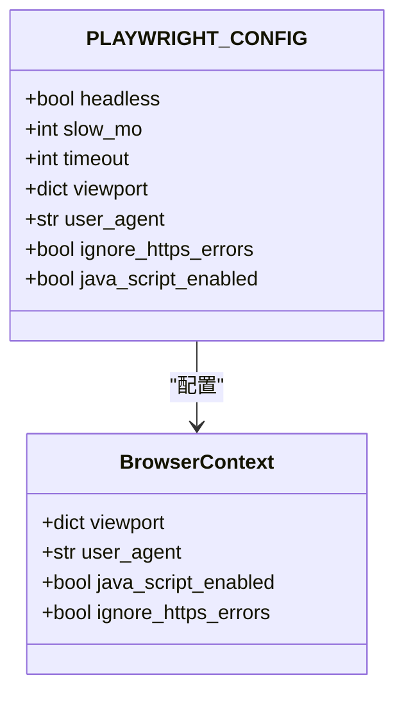
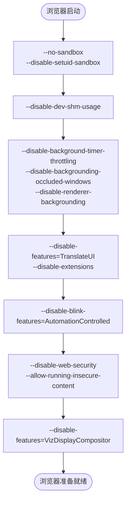
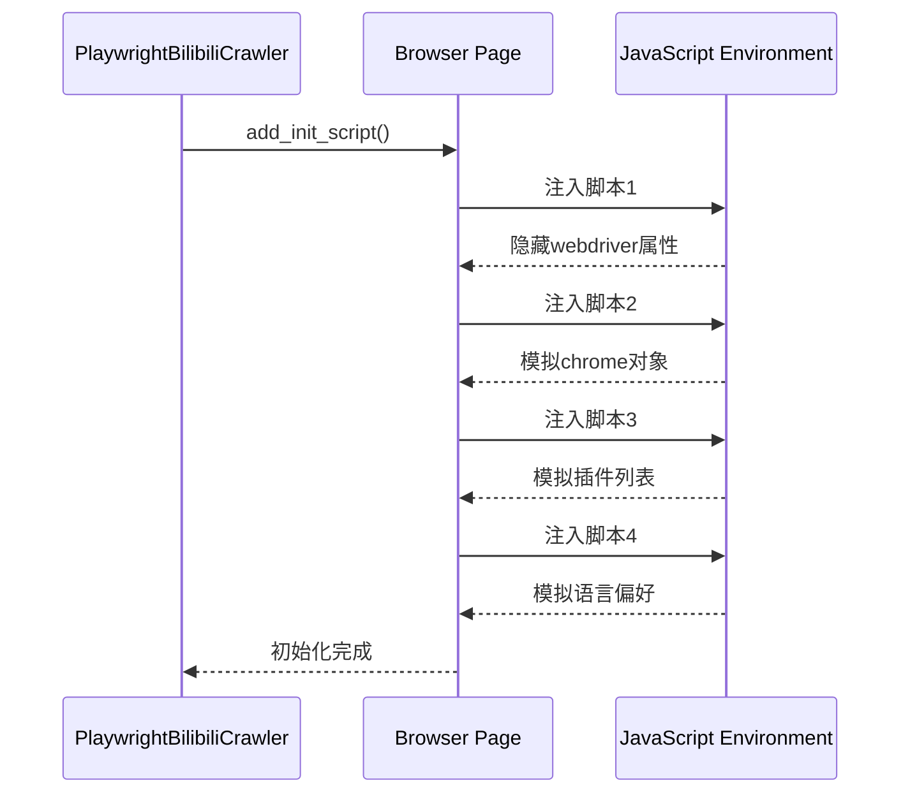
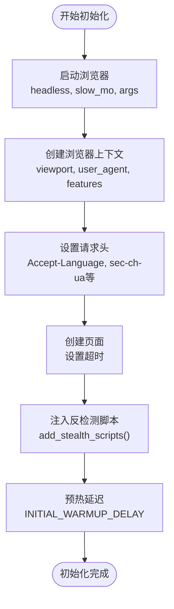
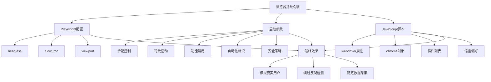

# 浏览器指纹伪装

<cite>
**Referenced Files in This Document**   
- [config.py](file://config.py)
- [bilibili_cover_crawler_playwright.py](file://bilibili_cover_crawler_playwright.py)
</cite>

## 目录
1. [浏览器指纹伪装配置总览](#浏览器指纹伪装配置总览)
2. [Playwright核心配置解析](#playwright核心配置解析)
3. [浏览器启动参数详解](#浏览器启动参数详解)
4. [反检测脚本注入机制](#反检测脚本注入机制)
5. [浏览器初始化流程](#浏览器初始化流程)
6. [综合伪装策略](#综合伪装策略)

## 浏览器指纹伪装配置总览

本项目通过多层次的配置和代码实现，构建了一个高度仿真的浏览器环境，有效隐藏了自动化工具的特征。系统主要通过三个层面实现浏览器指纹伪装：

1. **Playwright运行时配置**：通过`PLAYWRIGHT_CONFIG`字典定义了浏览器的基本行为特征
2. **浏览器启动参数**：通过`BROWSER_ARGS`列表传递底层Chromium参数
3. **JavaScript反检测脚本**：通过`add_stealth_scripts()`方法注入脚本，修改浏览器的JavaScript属性

这些配置共同作用，使得自动化爬虫能够模拟真实用户的行为和环境，从而绕过哔哩哔哩等网站的反爬虫检测机制。

**Section sources**
- [config.py](file://config.py#L26-L36)
- [config.py](file://config.py#L37-L55)
- [bilibili_cover_crawler_playwright.py](file://bilibili_cover_crawler_playwright.py#L581-L614)

## Playwright核心配置解析

`PLAYWRIGHT_CONFIG`配置字典定义了Playwright浏览器的核心行为特征，这些配置直接影响浏览器的外观和行为模式。



**Diagram sources**
- [config.py](file://config.py#L26-L36)
- [bilibili_cover_crawler_playwright.py](file://bilibili_cover_crawler_playwright.py#L526-L540)

### headless配置

`headless`配置项控制浏览器是否以无头模式运行。在本项目中，该值被设置为`True`，但注释中明确指出"改为非无头模式，便于调试"。

- **作用**：当设置为`False`时，浏览器会显示图形界面，便于开发者观察和调试爬虫行为
- **伪装意义**：虽然无头模式本身不会被直接检测，但结合其他配置可以更好地模拟真实用户环境
- **调试价值**：在开发和调试阶段，非无头模式可以帮助开发者直观地看到页面加载和交互过程

### slow_mo配置

`slow_mo`配置项设置了操作之间的延迟，单位为毫秒。

- **当前值**：2000毫秒（2秒）
- **作用**：在每个浏览器操作（如点击、输入、导航）之间添加延迟
- **伪装意义**：模拟真实用户的操作节奏，避免过快的操作被识别为自动化行为
- **优化策略**：2秒的延迟足够长，可以有效降低被检测的风险，同时不会显著影响爬取效率

### viewport配置

`viewport`配置项定义了浏览器窗口的视口大小。

- **当前值**：宽度1920像素，高度1080像素
- **作用**：设置浏览器窗口的尺寸
- **伪装意义**：1920x1080是当前最主流的桌面显示器分辨率，使用该尺寸可以模拟大多数真实用户的设备环境
- **兼容性**：该分辨率能够完整显示大多数网页内容，避免因窗口过小导致的布局问题

**Section sources**
- [config.py](file://config.py#L26-L36)

## 浏览器启动参数详解

`BROWSER_ARGS`列表包含了传递给Chromium浏览器的启动参数，这些参数在浏览器进程启动时生效，能够深入修改浏览器的行为和特征。



**Diagram sources**
- [config.py](file://config.py#L37-L55)

### 沙箱与内存管理参数

```python
'--no-sandbox',
'--disable-setuid-sandbox', 
'--disable-dev-shm-usage'
```

- **`--no-sandbox`**：禁用沙箱模式。在某些服务器环境中，沙箱可能无法正常工作，禁用它可以确保浏览器稳定运行
- **`--disable-setuid-sandbox`**：禁用setuid沙箱，进一步降低权限限制
- **`--disable-dev-shm-usage`**：禁用/dev/shm的使用，改为使用磁盘临时文件，避免在Docker等容器环境中因共享内存不足导致的问题

### 背景活动控制参数

```python
'--disable-background-timer-throttling',
'--disable-backgrounding-occluded-windows',
'--disable-renderer-backgrounding'
```

- 这些参数共同作用，防止浏览器在后台运行时降低性能或限制JavaScript定时器的执行
- **伪装意义**：确保即使在自动化环境中，浏览器也能保持与前台运行时相同的性能表现，避免因性能差异被检测

### 功能禁用参数

```python
'--disable-features=TranslateUI',
'--disable-extensions',
'--no-first-run',
'--no-default-browser-check',
'--disable-default-apps'
```

- **`--disable-features=TranslateUI`**：禁用翻译界面，避免出现翻译提示
- **`--disable-extensions`**：禁用所有扩展程序，保持浏览器的纯净状态
- **`--no-first-run`**：跳过首次运行的设置向导
- **`--no-default-browser-check`**：不检查是否为默认浏览器
- **`--disable-default-apps`**：禁用默认安装的应用程序

### 自动化标识隐藏参数

```python
'--disable-blink-features=AutomationControlled'
```

- **核心作用**：这是最重要的反检测参数之一，它隐藏了浏览器的自动化控制标识
- **技术原理**：现代浏览器（如Chromium）会通过`navigator.webdriver`属性暴露是否被自动化工具控制。此参数试图隐藏这一特征
- **局限性**：仅靠此参数不足以完全隐藏自动化特征，需要配合JavaScript脚本进一步修改

### 安全策略参数

```python
'--disable-web-security', 
'--allow-running-insecure-content'
```

- **`--disable-web-security`**：禁用同源策略等Web安全限制
- **`--allow-running-insecure-content`**：允许在HTTPS页面上运行HTTP内容
- **风险与收益**：虽然降低了安全性，但提高了爬虫的兼容性，能够访问更多类型的页面内容

### 显示合成器参数

```python
'--disable-features=VizDisplayCompositor'
```

- 禁用显示合成器功能，可能与页面渲染性能和特征有关
- 有助于减少浏览器的特征指纹，使其更接近普通用户的配置

**Section sources**
- [config.py](file://config.py#L37-L55)

## 反检测脚本注入机制

`add_stealth_scripts()`方法通过`page.add_init_script()`注入JavaScript代码，直接修改浏览器的JavaScript环境，隐藏自动化特征。



**Diagram sources**
- [bilibili_cover_crawler_playwright.py](file://bilibili_cover_crawler_playwright.py#L581-L614)

### 隐藏webdriver属性

```javascript
Object.defineProperty(navigator, 'webdriver', {
    get: () => undefined,
});
```

- **检测目标**：许多网站通过检查`navigator.webdriver`属性来识别自动化浏览器
- **解决方案**：重新定义该属性的getter方法，使其返回`undefined`
- **效果**：当网站尝试读取`navigator.webdriver`时，将得到`undefined`而不是`true`，从而绕过检测

### 模拟chrome对象

```javascript
window.chrome = {
    runtime: {},
    loadTimes: function() {},
    csi: function() {},
    app: {}
};
```

- **检测目标**：真实Chrome浏览器存在`window.chrome`对象，而无头浏览器可能缺少该对象或其属性
- **解决方案**：创建一个模拟的`chrome`对象，包含常见的属性和方法
- **效果**：使自动化浏览器的JavaScript环境更接近真实Chrome浏览器

### 模拟插件列表

```javascript
Object.defineProperty(navigator, 'plugins', {
    get: () => [1, 2, 3, 4, 5],
});
```

- **检测目标**：通过`navigator.plugins`获取浏览器安装的插件列表，异常的插件列表可能暴露自动化环境
- **解决方案**：重新定义`plugins`属性的getter，返回一个固定长度的数组
- **效果**：避免返回空数组或异常的插件信息，模拟真实浏览器的插件环境

### 模拟语言偏好

```javascript
Object.defineProperty(navigator, 'languages', {
    get: () => ['zh-CN', 'zh', 'en'],
});
```

- **检测目标**：`navigator.languages`反映用户的语言偏好设置
- **解决方案**：重新定义该属性，返回常见的中文和英文语言偏好
- **效果**：模拟中国地区用户的语言设置，增强环境的真实性

**Section sources**
- [bilibili_cover_crawler_playwright.py](file://bilibili_cover_crawler_playwright.py#L581-L614)

## 浏览器初始化流程

`initialize_browser()`方法整合了所有配置，创建了一个高度仿真的浏览器环境。



**Diagram sources**
- [bilibili_cover_crawler_playwright.py](file://bilibili_cover_crawler_playwright.py#L517-L579)

### 浏览器启动阶段

```python
self.browser = await self.playwright.chromium.launch(
    headless=config.PLAYWRIGHT_CONFIG['headless'],
    slow_mo=config.PLAYWRIGHT_CONFIG['slow_mo'],
    args=config.BROWSER_ARGS
)
```

- 使用`PLAYWRIGHT_CONFIG`中的`headless`和`slow_mo`配置
- 传入`BROWSER_ARGS`中的所有启动参数
- 这是创建仿真环境的第一步，奠定了浏览器的基础特征

### 上下文创建阶段

```python
self.context = await self.browser.new_context(
    viewport=config.PLAYWRIGHT_CONFIG['viewport'],
    user_agent=random.choice(config.USER_AGENTS),
    java_script_enabled=config.PLAYWRIGHT_CONFIG['java_script_enabled'],
    ignore_https_errors=config.PLAYWRIGHT_CONFIG['ignore_https_errors'],
    locale='zh-CN',
    timezone_id='Asia/Shanghai',
    geolocation={'latitude': 39.9042, 'longitude': 116.4074},
    permissions=['geolocation']
)
```

- 设置视口大小、JavaScript启用状态和HTTPS错误忽略
- 配置区域设置为中文（`zh-CN`）
- 设置时区为亚洲/上海
- 模拟地理位置为中国北京
- 授予地理位置权限
- 这些配置共同构建了一个中国地区用户的典型浏览器环境

### 请求头设置

```python
await self.context.set_extra_http_headers({
    'Accept-Language': 'zh-CN,zh;q=0.9,en;q=0.8',
    'Accept-Encoding': 'gzip, deflate, br',
    'Cache-Control': 'no-cache',
    'Pragma': 'no-cache',
    'sec-ch-ua': '"Chromium";v="120", "Not_A Brand";v="8", "Google Chrome";v="120"',
    'sec-ch-ua-mobile': '?0',
    'sec-ch-ua-platform': '"Windows"',
    'Sec-Fetch-Dest': 'document',
    'Sec-Fetch-Mode': 'navigate',
    'Sec-Fetch-Site': 'none',
    'Sec-Fetch-User': '?1',
    'Upgrade-Insecure-Requests': '1'
})
```

- 设置符合中国用户习惯的Accept-Language
- 包含现代浏览器的Client Hints（sec-ch-ua系列）
- 添加各种安全和导航相关的请求头
- 使HTTP请求头与真实浏览器的请求头高度相似

### 反检测脚本注入

```python
await self.add_stealth_scripts()
```

- 调用`add_stealth_scripts()`方法，注入所有反检测脚本
- 这是隐藏自动化特征的关键步骤
- 在页面创建之前注入，确保脚本在页面加载时就已经生效

### 预热延迟

```python
print(f"🌡️ 预热等待 {config.INITIAL_WARMUP_DELAY} 秒...")
```

- 添加3秒的预热延迟
- 模拟用户启动浏览器后的准备时间
- 避免立即开始操作而暴露自动化特征

**Section sources**
- [bilibili_cover_crawler_playwright.py](file://bilibili_cover_crawler_playwright.py#L517-L579)

## 综合伪装策略

本项目通过多层配置和代码实现，构建了一个全面的浏览器指纹伪装系统。



**Diagram sources**
- [config.py](file://config.py#L26-L55)
- [bilibili_cover_crawler_playwright.py](file://bilibili_cover_crawler_playwright.py#L517-L614)

### 多层次防御体系

1. **进程层伪装**：通过`BROWSER_ARGS`修改浏览器进程的底层行为
2. **环境层伪装**：通过`PLAYWRIGHT_CONFIG`和上下文配置模拟真实用户的设备和网络环境
3. **JavaScript层伪装**：通过注入脚本修改浏览器的JavaScript API，隐藏自动化特征
4. **行为层伪装**：通过`slow_mo`和预热延迟模拟真实用户的操作节奏

### 动态特征轮换

系统还实现了动态特征轮换机制：

- **User-Agent轮换**：从`USER_AGENTS`列表中随机选择User-Agent
- **请求头轮换**：在更新浏览器上下文时随机设置额外的请求头
- **上下文轮换**：在连续请求达到限制时，创建新的浏览器上下文，相当于更换身份

### 实际效果评估

这种综合伪装策略能够有效应对大多数基于浏览器指纹的检测：

- **规避简单检测**：通过隐藏`navigator.webdriver`等明显特征
- **模拟真实环境**：通过合理的分辨率、时区、语言等配置
- **行为模拟**：通过操作延迟和预热时间模拟人类行为
- **降低风险**：多层伪装使得单一特征异常不会导致整体被识别

通过这种全面的伪装策略，爬虫能够在不触发反爬虫机制的情况下，稳定地采集哔哩哔哩网站的数据。

**Section sources**
- [config.py](file://config.py#L26-L55)
- [bilibili_cover_crawler_playwright.py](file://bilibili_cover_crawler_playwright.py#L517-L614)