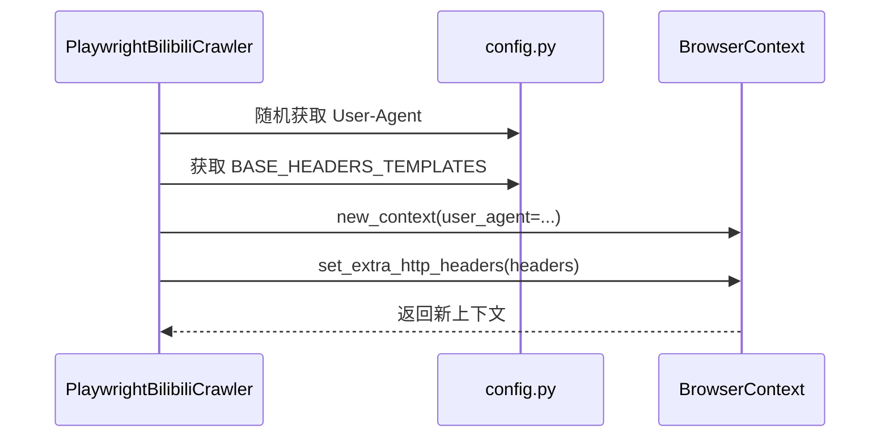

# 请求头轮换配置

<cite>
**本文档引用的文件**  
- [config.py](file://config.py#L56-L119)
- [bilibili_cover_crawler_playwright.py](file://bilibili_cover_crawler_playwright.py#L535-L548)
</cite>

## 目录
1. [USER_AGENTS 配置说明](#user_agents-配置说明)  
2. [BASE_HEADERS_TEMPLATES 配置说明](#base_headers_templates-配置说明)  
3. [动态请求头机制工作流程](#动态请求头机制工作流程)  
4. [关键请求头字段解析](#关键请求头字段解析)  
5. [自定义 User-Agent 添加指南](#自定义-user-agent-添加指南)

### USER_AGENTS 配置说明
`config.py` 文件中的 `USER_AGENTS` 列表定义了多种主流浏览器在不同操作系统下的 User-Agent 字符串，用于模拟真实用户访问行为。该列表包含以下浏览器类型：

- **Chrome**：支持 Windows、macOS 和 Linux 系统，涵盖多个版本（如 Chrome/120.0.0.0、Chrome/119.0.0.0）
- **Firefox**：支持 Windows、Linux 系统，版本包括 120.0、119.0 等
- **Edge**：基于 Chromium 内核的 Edge 浏览器，适用于 Windows 平台
- **Safari**：适用于 macOS 系统，版本为 17.1 和 17.0

通过轮换这些 User-Agent，可以有效避免因固定请求模式而被目标网站识别为自动化脚本。

**Section sources**  
- [config.py](file://config.py#L56-L80)

### BASE_HEADERS_TEMPLATES 配置说明
`BASE_HEADERS_TEMPLATES` 是一个包含多个请求头模板的列表，每个模板对应一种浏览器类型（Chrome、Firefox、Safari），用于在创建浏览器上下文时设置更真实的请求头。各模板包含以下通用字段：

- `Accept`：声明客户端可接受的内容类型
- `Accept-Language`：表示用户偏好的语言
- `Accept-Encoding`：支持的压缩编码方式
- `Connection`：连接管理方式
- `Upgrade-Insecure-Requests`：指示浏览器希望升级不安全请求
- `Sec-Fetch-*` 系列字段：用于增强安全性和模拟现代浏览器行为

此外，Chrome 模板还包含 `sec-ch-ua`、`sec-ch-ua-mobile` 和 `sec-ch-ua-platform` 等客户端提示（Client Hints）字段，进一步提升请求的真实性。

**Section sources**  
- [config.py](file://config.py#L83-L119)

### 动态请求头机制工作流程
在 `PlaywrightBilibiliCrawler` 类中，通过 `initialize_browser()` 方法实现动态请求头机制。其核心流程如下：

1. **随机选择 User-Agent**：从 `USER_AGENTS` 列表中随机选取一个 User-Agent，用于初始化浏览器上下文。
2. **创建浏览器上下文**：调用 `self.browser.new_context()` 时传入随机选中的 User-Agent 和视口等配置。
3. **设置通用请求头**：通过 `context.set_extra_http_headers()` 方法设置一组基础请求头，这些头信息来自 `BASE_HEADERS_TEMPLATES` 中的某个模板或手动构建的通用头。
4. **上下文更新机制**：当连续请求达到阈值或发生错误时，调用 `update_browser_context()` 方法重新创建新的上下文，并再次随机选择 User-Agent 和请求头，从而实现周期性轮换。

此机制确保每次请求都具有不同的指纹特征，显著降低被反爬虫系统检测的风险。



**Diagram sources**  
- [bilibili_cover_crawler_playwright.py](file://bilibili_cover_crawler_playwright.py#L535)
- [bilibili_cover_crawler_playwright.py](file://bilibili_cover_crawler_playwright.py#L548)

**Section sources**  
- [bilibili_cover_crawler_playwright.py](file://bilibili_cover_crawler_playwright.py#L535-L548)

### 关键请求头字段解析
以下是对 `BASE_HEADERS_TEMPLATES` 中关键字段的详细说明：

- **`sec-ch-ua`**：客户端提示字段，用于告知服务器当前使用的浏览器品牌及版本。例如 `"Google Chrome";v="120"` 表示使用 Chrome 120 版本。
- **`sec-ch-ua-mobile`**：指示用户代理是否运行在移动设备上，`?0` 表示非移动设备。
- **`sec-ch-ua-platform`**：指明操作系统平台，如 `"Windows"` 或 `"macOS"`，有助于模拟特定环境。
- **`Accept-Language`**：设置语言偏好，如 `zh-CN,zh;q=0.9` 表示优先中文，其次为英文。
- **`Connection: keep-alive`**：保持长连接，减少重复建立连接的开销，提升性能。
- **`Sec-Fetch-*` 系列**：用于描述请求的上下文，如目标资源类型（`Sec-Fetch-Dest`）、请求模式（`Sec-Fetch-Mode`）等，增强请求的真实性。

合理配置这些字段可使爬虫请求更接近真实用户行为，提高通过率。

**Section sources**  
- [config.py](file://config.py#L83-L119)

### 自定义 User-Agent 添加指南
若需添加自定义 User-Agent，可按照以下步骤操作：

1. 打开 `config.py` 文件。
2. 找到 `USER_AGENTS` 列表。
3. 在适当位置添加新的 User-Agent 字符串，格式如下：
   ```python
   'Mozilla/5.0 (平台信息) AppleWebKit/内核版本 (KHTML, like Gecko) 浏览器标识 版本号 Safari/内核版本',
   ```
   例如添加 Opera 浏览器：
   ```python
   'Mozilla/5.0 (Windows NT 10.0; Win64; x64) AppleWebKit/537.36 (KHTML, like Gecko) Chrome/120.0.0.0 Safari/537.36 OPR/86.0.4363.59',
   ```
4. 同步更新 `BASE_HEADERS_TEMPLATES`，为新浏览器添加对应的请求头模板，确保请求头与 User-Agent 一致。
5. 保存文件后重新运行爬虫程序，即可启用新的 User-Agent。

建议定期更新 User-Agent 列表以适应浏览器版本变化，并避免使用过时或已被广泛识别的字符串。

**Section sources**  
- [config.py](file://config.py#L56-L80)