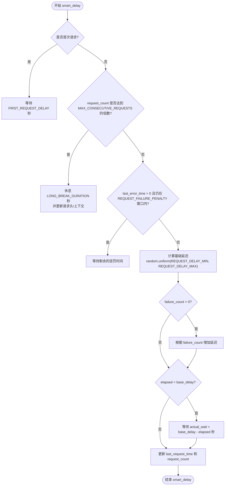

# 请求行为配置

<cite>
**Referenced Files in This Document**   
- [config.py](file://config.py)
- [bilibili_cover_crawler.py](file://bilibili_cover_crawler.py)
- [bilibili_cover_crawler_playwright.py](file://bilibili_cover_crawler_playwright.py)
</cite>

## Table of Contents
1. [请求行为配置项详解](#请求行为配置项详解)
2. [智能延迟机制分析](#智能延迟机制分析)
3. [高频率封禁场景调参建议](#高频率封禁场景调参建议)

## 请求行为配置项详解

`config.py` 文件中定义了一系列关键的配置项，用于控制爬虫的请求行为，旨在模拟人类浏览模式，避免触发B站的频率限制机制。

### REQUEST_DELAY_MIN 与 REQUEST_DELAY_MAX（请求间隔范围）

`REQUEST_DELAY_MIN` 和 `REQUEST_DELAY_MAX` 定义了两次请求之间的基础延迟时间范围，单位为秒。

- **REQUEST_DELAY_MIN**: 最小请求间隔，当前配置为 `3` 秒。
- **REQUEST_DELAY_MAX**: 最大请求间隔，当前配置为 `8` 秒。

该配置项主要应用于API请求（如获取用户信息、视频列表）。在 `smart_delay()` 方法中，通过 `random.uniform(config.REQUEST_DELAY_MIN, config.REQUEST_DELAY_MAX)` 生成一个在此范围内的随机延迟时间，以模拟人类操作的不规律性，避免固定间隔被识别为自动化脚本。

**Section sources**
- [config.py](file://config.py#L133-L134)
- [bilibili_cover_crawler.py](file://bilibili_cover_crawler.py#L95)

### MAX_CONSECUTIVE_REQUESTS（连续请求数上限）

`MAX_CONSECUTIVE_REQUESTS` 设置了在触发一次长时间休息前，允许连续发出的请求数量，当前配置为 `30` 次。

此参数是模拟人类行为的关键。人类用户不会无休止地连续操作，因此该配置强制爬虫在发出指定数量的请求后暂停。当 `request_count` 计数器达到此值的倍数时，`smart_delay()` 方法会执行一次长时间休息。

**Section sources**
- [config.py](file://config.py#L139)
- [bilibili_cover_crawler.py](file://bilibili_cover_crawler.py#L75)

### LONG_BREAK_DURATION（长休时长）

`LONG_BREAK_DURATION` 定义了在达到 `MAX_CONSECUTIVE_REQUESTS` 后，爬虫需要休息的时长，单位为秒，当前配置为 `15` 秒。

在休息期间，程序会暂停执行，并通过 `tqdm` 进度条显示倒计时。更重要的是，休息结束后会调用 `update_browser_context()` 或 `update_headers()` 方法，更新浏览器上下文或请求头（包括User-Agent），从而改变爬虫的“身份”，进一步降低被追踪和封禁的风险。

**Section sources**
- [config.py](file://config.py#L140)
- [bilibili_cover_crawler.py](file://bilibili_cover_crawler.py#L76)

### ERROR_COOLDOWN（错误冷却时间）

`ERROR_COOLDOWN` 是一个与错误处理相关的参数，表示在检测到反爬措施（如“请求过于频繁”）后，首次冷却的基准时长，单位为秒，当前配置为 `180` 秒（3分钟）。

当 `handle_request_error()` 方法检测到反爬错误时，实际的冷却时间会基于此值进行动态计算，公式为 `cooldown = config.ERROR_COOLDOWN * (attempt + 1) * (1 + self.failure_count * 0.5)`。这意味着重试次数越多或连续失败次数越多，后续的冷却时间会呈指数级增长，以应对更严格的封禁。

**Section sources**
- [config.py](file://config.py#L141)
- [bilibili_cover_crawler.py](file://bilibili_cover_crawler.py#L132)

### REQUEST_FAILURE_PENALTY（失败惩罚时间）

`REQUEST_FAILURE_PENALTY` 定义了单次请求失败后，后续请求需要额外等待的时间窗口，单位为秒，当前配置为 `10` 秒。

其工作逻辑是：当一次请求失败时，`last_error_time` 被记录。在接下来的 `REQUEST_FAILURE_PENALTY` 秒内，任何新的请求在执行 `smart_delay()` 时，都会检查距离上次失败的时间。如果仍在惩罚期内，则会强制等待剩余的惩罚时间，从而避免在短时间内连续发起失败的请求。

**Section sources**
- [config.py](file://config.py#L143)
- [bilibili_cover_crawler.py](file://bilibili_cover_crawler.py#L87)

## 智能延迟机制分析

`smart_delay()` 方法是整个请求控制逻辑的核心，它整合了上述所有配置项，实现了一个多层次、自适应的延迟策略。该方法在 `bilibili_cover_crawler.py` 和 `bilibili_cover_crawler_playwright.py` 中均有实现，逻辑基本一致。



**Diagram sources**
- [bilibili_cover_crawler.py](file://bilibili_cover_crawler.py#L66-L113)
- [bilibili_cover_crawler_playwright.py](file://bilibili_cover_crawler_playwright.py#L747-L796)

**Section sources**
- [bilibili_cover_crawler.py](file://bilibili_cover_crawler.py#L66-L113)
- [bilibili_cover_crawler_playwright.py](file://bilibili_cover_crawler_playwright.py#L747-L796)

该流程图清晰地展示了 `smart_delay()` 的执行逻辑：
1.  **首次请求延迟**：程序启动后，首次请求会额外等待 `FIRST_REQUEST_DELAY` 秒，模拟用户打开浏览器后的预热时间。
2.  **长休检查**：检查连续请求数是否达到上限，若达到则执行长时间休息并更新身份。
3.  **失败惩罚检查**：检查是否在最近的失败惩罚期内，若是则强制等待。
4.  **基础延迟计算**：根据 `REQUEST_DELAY_MIN` 和 `REQUEST_DELAY_MAX` 生成随机的基础延迟。
5.  **失败次数惩罚**：如果存在连续失败，基础延迟会乘以一个惩罚倍数（`1 + (failure_count * 0.8)`），使延迟时间随失败次数增加而变长。
6.  **时间间隔保证**：最后，确保本次请求与上次请求的间隔至少等于计算出的延迟时间。

## 高频率封禁场景调参建议

当爬虫在运行中频繁遭遇“请求过于频繁”的封禁时，表明当前的请求策略过于激进，需要调整配置以降低请求频率和强度。

### 增加延迟范围

最直接有效的方法是增大 `REQUEST_DELAY_MIN` 和 `REQUEST_DELAY_MAX` 的值。例如，可以将配置修改为：
```python
REQUEST_DELAY_MIN = 5  # 增加最小间隔
REQUEST_DELAY_MAX = 12 # 增加最大间隔
```
这将显著降低单位时间内的请求数量，使行为更接近普通用户。

### 减少连续请求数

降低 `MAX_CONSECUTIVE_REQUESTS` 的值，可以更频繁地触发长时间休息。例如：
```python
MAX_CONSECUTIVE_REQUESTS = 15  # 每15次请求就休息一次
```
这能有效打断连续的请求流，避免触发基于请求频率的检测算法。

### 综合调整策略

在极端严格的封禁环境下，建议进行综合调整：
```python
# 更长的请求间隔
REQUEST_DELAY_MIN = 8
REQUEST_DELAY_MAX = 15

# 更频繁的休息
MAX_CONSECUTIVE_REQUESTS = 10

# 更长的休息时间
LONG_BREAK_DURATION = 30

# 更强的失败惩罚
REQUEST_FAILURE_PENALTY = 20
```
通过这种组合策略，可以最大程度地模拟低频率、间歇性的人类浏览行为，从而有效规避B站的反爬虫系统。