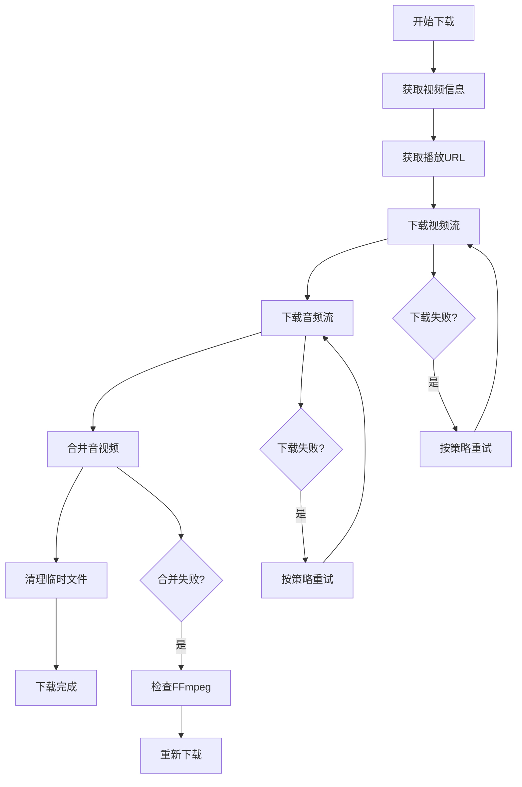

# 视频下载配置

<cite>
**本文档中引用的文件**   
- [config.py](file://config.py#L262-L338)
- [bilibili_cover_crawler_playwright.py](file://bilibili_cover_crawler_playwright.py#L33-L490)
- [bilibili_cover_crawler_playwright.py](file://bilibili_cover_crawler_playwright.py#L493-L799)
- [check_ffmpeg.py](file://check_ffmpeg.py)
- [config.py](file://config.py#L352-L399)
</cite>

## 目录
1. [视频下载配置详解](#视频下载配置详解)
2. [音视频分段下载与合并流程](#音视频分段下载与合并流程)
3. [temp_dir与output_dir用途差异](#temp_dir与output_dir用途差异)
4. [完整配置示例](#完整配置示例)

## 视频下载配置详解

`VIDEO_DOWNLOAD_CONFIG` 配置对象控制着视频下载的核心行为，其各项参数说明如下：

- **enabled**: 是否启用视频下载功能。默认值为 `False`，表示默认关闭视频下载功能。设置为 `True` 可启用下载。
- **quality**: 视频质量选择，可选值为 `'high'`（高质量）、`'medium'`（中等质量）、`'low'`（低质量）。当前实现中优先选择最高分辨率的视频流。
- **format**: 输出格式，当前支持 `'mp4'` 格式。通过 FFmpeg 将音视频流合并为 MP4 文件。
- **max_concurrent**: 最大并发下载数，用于限制同时下载的视频数量。默认值为 `2`，以降低被服务器检测到的风险。
- **retry_times**: 下载重试次数，当下载失败时的重试次数。默认值为 `5` 次。
- **retry_delay**: 重试延迟阶段，单位为秒。采用分阶段延迟策略，配置为 `[3, 8, 15]`，即第一次重试等待 3 秒，第二次 8 秒，第三次及以上 15 秒。
- **temp_dir**: 临时文件目录，用于存放下载过程中的音视频分段文件。默认值为 `'temp_videos'`。

**中文标签**
- enabled: 是否启用
- quality: 视频质量
- format: 输出格式
- max_concurrent: 并发下载数
- retry_times: 重试次数
- retry_delay: 重试延迟
- temp_dir: 临时文件目录
- output_dir: 输出目录

**本节来源**
- [config.py](file://config.py#L262-L338)

## 音视频分段下载与合并流程

视频下载采用 DASH（Dynamic Adaptive Streaming over HTTP）协议，将视频和音频分别下载后再进行合并。工作流程如下：

1. **获取视频信息**：通过 `video_info_api` 获取视频基本信息，包括标题、CID（内容ID）等。
2. **获取播放URL**：调用 `play_url_api` 获取视频和音频的分段下载地址（`baseUrl`）。
3. **分段下载**：分别下载视频流和音频流，保存为 `.m4s` 格式的临时文件。
4. **合并音视频**：使用 FFmpeg 将下载的视频和音频文件合并为最终的 MP4 文件。
5. **清理临时文件**：合并成功后自动删除临时的音视频文件。

该流程通过 `BilibiliVideoDownloader` 类实现，支持断点续传和失败重试机制，确保下载的稳定性和完整性。



**图表来源**
- [bilibili_cover_crawler_playwright.py](file://bilibili_cover_crawler_playwright.py#L33-L490)
- [config.py](file://config.py#L341-L349)

## temp_dir与output_dir用途差异

`temp_dir` 和 `output_dir` 在视频下载过程中扮演不同角色：

- **temp_dir**: 临时文件目录，用于存储下载过程中的原始音视频分段文件（如 `.m4s` 文件）。这些文件是中间产物，在音视频合并完成后会被自动删除。建议将 `temp_dir` 配置在具有足够写入速度和空间的磁盘上，以提高下载效率。
- **output_dir**: 输出目录，用于存放最终合并完成的视频文件（如 `.mp4` 文件）。这些文件是用户最终使用的成品，不会被程序自动删除。

**磁盘空间配置建议**：
- 确保 `temp_dir` 所在磁盘有足够的空间容纳原始音视频文件（通常为最终文件大小的 1.5-2 倍）。
- `output_dir` 只需保留最终文件，空间需求相对较小。
- 推荐将 `temp_dir` 和 `output_dir` 设置在不同的物理磁盘上，以避免 I/O 冲突，提升整体性能。

**本节来源**
- [bilibili_cover_crawler_playwright.py](file://bilibili_cover_crawler_playwright.py#L33-L490)
- [config.py](file://config.py#L262-L338)

## 完整配置示例

启用视频下载功能的完整配置示例如下：

```python
# 启用视频下载
VIDEO_DOWNLOAD_CONFIG = {
    'enabled': True,               # 启用视频下载
    'quality': 'high',             # 高质量
    'format': 'mp4',               # 输出MP4格式
    'max_concurrent': 2,           # 最大并发数
    'retry_times': 5,              # 重试5次
    'retry_delay': [3, 8, 15],     # 重试延迟策略
    'temp_dir': 'temp_videos',     # 临时目录
    'output_dir': 'downloaded_videos'  # 输出目录
}

# FFmpeg配置（必须启用以支持合并）
FFMPEG_CONFIG = {
    'enabled': True,                    # 启用FFmpeg
    'custom_path': '',                  # 自定义路径（可选）
    'timeout': 300,                     # 超时时间
    'quality_preset': 'fast',           # 快速编码
    'video_codec': 'copy',              # 不重编码视频
    'audio_codec': 'aac',               # AAC音频
    'extra_args': ['-strict', 'experimental']  # 额外参数
}
```

**启用步骤**：
1. 将 `VIDEO_DOWNLOAD_CONFIG['enabled']` 设置为 `True`。
2. 确保系统已安装 FFmpeg 并正确配置路径，或使用 `check_ffmpeg.py` 脚本自动检测。
3. 运行 `bilibili_cover_crawler_playwright.py` 并使用 `--download-videos` 参数启动视频下载。

**本节来源**
- [config.py](file://config.py#L262-L338)
- [config.py](file://config.py#L352-L399)
- [bilibili_cover_crawler_playwright.py](file://bilibili_cover_crawler_playwright.py#L493-L799)
- [check_ffmpeg.py](file://check_ffmpeg.py)