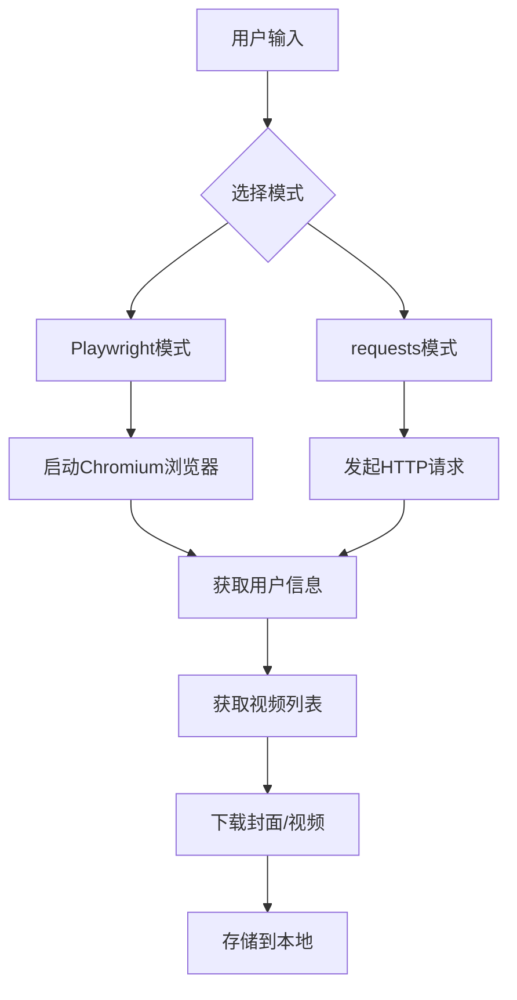
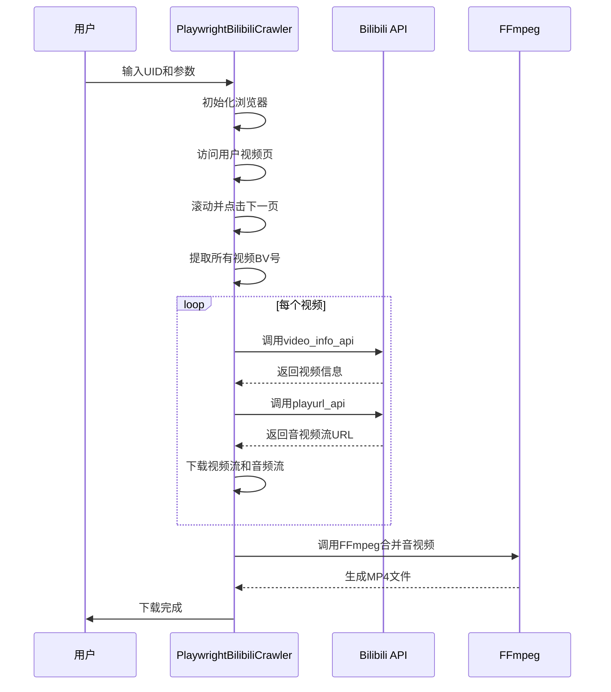

# 项目概述

<cite>
**本文档引用文件**  
- [README.md](file://README.md)
- [bilibili_cover_crawler_playwright.py](file://bilibili_cover_crawler_playwright.py)
- [bilibili_cover_crawler.py](file://bilibili_cover_crawler.py)
- [config.py](file://config.py)
- [check_ffmpeg.py](file://check_ffmpeg.py)
</cite>

## 目录

1. [项目概述](#项目概述)
2. [核心功能与技术特点](#核心功能与技术特点)
3. [项目架构与设计模式](#项目架构与设计模式)
4. [主要功能模块详解](#主要功能模块详解)
5. [配置驱动架构](#配置驱动架构)
6. [反反爬机制](#反反爬机制)
7. [使用场景与示例](#使用场景与示例)
8. [初学者引导](#初学者引导)
9. [高级技术解析](#高级技术解析)

## 项目概述

bilibili_cover_qoder 是一个基于 Python 开发的命令行工具（CLI），旨在为内容创作者、研究人员和个人用户提供批量下载哔哩哔哩（Bilibili）用户视频封面图片和视频文件的能力。该项目通过模拟真实用户行为，实现对目标用户所有公开视频内容的自动化采集，服务于素材备份、数据收集等需求。

项目采用双模式爬虫架构：Playwright 模式和 requests 模式。其中，Playwright 模式作为推荐版本，通过启动无头浏览器环境，真实模拟用户浏览行为，大幅降低被反爬虫系统检测的风险，提高爬取成功率；而 requests 模式则作为轻量级的极限保守版本，适用于对资源占用要求极低的场景。

该项目不仅实现了基础的封面下载功能，还扩展了完整的视频下载能力。通过集成 FFmpeg 工具，程序能够自动下载视频和音频分段流，并将其合并为标准的 MP4 格式文件，极大地提升了实用性。同时，项目内置了断点续传、分页处理、错误重试等机制，确保在复杂网络环境下也能稳定运行。

**Section sources**
- [README.md](file://README.md#L1-L553)

## 核心功能与技术特点

bilibili_cover_qoder 项目具备多项核心功能，满足用户对哔哩哔哩内容批量获取的需求。其主要功能包括：

- **封面下载**：批量下载指定用户所有视频的封面图片，支持按 BV 号和视频标题命名，自动创建以用户 UID 和用户名命名的目录进行存储。
- **视频下载**：支持下载用户的所有视频或指定 BV 号的单个视频。程序通过 Bilibili 的 DASH API 获取视频和音频流，使用 FFmpeg 进行无损合并。
- **分页处理**：自动识别并点击“下一页”按钮，结合页面滚动技术，完整获取用户所有分页的视频列表，确保数据收集的完整性。
- **断点续传**：在下载过程中，程序会检查目标文件是否已存在，若存在则自动跳过，避免重复下载，支持中断后继续。
- **智能反爬**：采用多种策略对抗反爬虫机制，包括请求间隔随机延迟、User-Agent 轮换、浏览器指纹伪装等，有效规避 IP 封禁和访问限制。

在技术实现上，项目展现出显著的特点：

- **双模式爬虫架构**：项目提供 Playwright 和 requests 两种版本。Playwright 版本利用 Chromium 浏览器内核，完美执行 JavaScript，渲染动态内容，能有效绕过复杂的前端反爬检测。requests 版本则直接发起 HTTP 请求，轻量高效，但成功率相对较低。
- **异步编程**：Playwright 版本基于 `asyncio` 框架，使用 `aiohttp` 和 `aiofiles` 库进行异步 HTTP 请求和文件操作，显著提升了下载效率，尤其是在处理大量视频流时。
- **命令行工具（CLI）定位**：项目设计为命令行工具，用户可以通过简单的命令行参数（如 UID、--download-videos）来控制程序行为，易于集成到自动化脚本和批处理任务中。



**Diagram sources**
- [README.md](file://README.md#L1-L553)
- [bilibili_cover_crawler_playwright.py](file://bilibili_cover_crawler_playwright.py#L33-L490)
- [bilibili_cover_crawler.py](file://bilibili_cover_crawler.py#L18-L438)

## 项目架构与设计模式

bilibili_cover_qoder 项目采用了面向对象的设计模式，代码结构清晰，模块化程度高。整个项目围绕核心的爬虫类进行构建，通过类的封装和继承，实现了功能的解耦和复用。

项目的主类 `PlaywrightBilibiliCrawler` 和 `BilibiliCoverCrawler` 分别负责 Playwright 模式和 requests 模式的爬取逻辑。这两个类都遵循了单一职责原则，将浏览器管理、用户信息获取、视频列表获取、封面下载等不同功能封装在独立的方法中。

在 Playwright 版本中，项目还引入了 `BilibiliVideoDownloader` 类，专门负责视频的下载和合并。这种职责分离的设计使得代码更易于维护和扩展。例如，`BilibiliVideoDownloader` 类独立处理与 Bilibili 视频 API 的交互、分段流的下载以及 FFmpeg 的调用，而 `PlaywrightBilibiliCrawler` 类则专注于页面导航和信息提取。

项目还体现了配置驱动的架构思想。几乎所有可变的参数，如请求延迟、重试次数、浏览器设置、FFmpeg 路径等，都被集中定义在 `config.py` 文件中。这使得用户无需修改核心代码即可调整程序行为，极大地提高了配置的灵活性和项目的可维护性。

**Section sources**
- [bilibili_cover_crawler_playwright.py](file://bilibili_cover_crawler_playwright.py#L33-L490)
- [bilibili_cover_crawler.py](file://bilibili_cover_crawler.py#L18-L438)
- [config.py](file://config.py#L0-L399)

## 主要功能模块详解

### 封面下载模块

封面下载是项目的基础功能。程序首先通过用户的 UID 构造访问其视频空间的 URL，然后利用 Playwright 或 requests 库获取页面内容。在 Playwright 模式下，程序会等待页面完全加载，包括 JavaScript 渲染的动态内容。

获取页面后，程序使用配置文件中定义的 CSS 选择器（如 `.bili-video-card`、`.bili-cover-card__thumbnail`）来定位视频封面元素。为了兼容 Bilibili 页面的频繁更新，程序定义了多个选择器，并按优先级顺序尝试，确保在页面结构变化时仍能正常工作。

提取到封面图片的 URL 后，程序会进行 URL 处理，移除可能导致低质量图片的缩略图参数（如 `@160w_120h`），以获取最高质量的原图。随后，程序会清理视频标题中的非法文件名字符，并生成以 `BV号_视频标题.jpg` 格式命名的文件，下载并保存到本地。

### 视频下载模块

视频下载模块是项目的核心增强功能。当用户启用 `--download-videos` 参数时，程序会激活 `BilibiliVideoDownloader` 类。

该模块的工作流程如下：
1.  **获取视频信息**：通过 Bilibili 的 `x/web-interface/view` API 获取视频的元数据，包括标题、分 P 信息（CID）等。
2.  **获取播放地址**：通过 `x/player/playurl` API，传入 BV 号和 CID，获取视频和音频的 DASH 流地址。程序会自动选择分辨率最高的视频流和码率最高的音频流。
3.  **分段下载**：使用 `aiohttp` 异步下载视频流（.m4s）和音频流（.m4s），并保存到临时目录。
4.  **音视频合并**：调用 FFmpeg 命令，将下载的视频和音频文件合并为一个完整的 MP4 文件。程序会自动在系统中搜索 FFmpeg 的安装路径，或使用用户在 `config.py` 中指定的自定义路径。

### 分页处理与数量校验模块

为了确保获取到用户所有的视频，项目实现了智能的分页处理机制。程序不仅会滚动页面以加载懒加载的内容，还会自动识别并点击“下一页”按钮。`PAGINATION_CONFIG` 配置了多个“下一页”按钮的选择器，以应对不同页面版本。

此外，程序还实现了视频数量校验功能。它会解析页面上的分页信息（如“共 X 页 / Y 个”），获取期望的视频总数。在收集完所有视频后，程序会对比实际收集的数量与期望数量，如果误差在允许范围内（默认 10%），则认为数据完整，否则会发出警告。



**Diagram sources**
- [bilibili_cover_crawler_playwright.py](file://bilibili_cover_crawler_playwright.py#L33-L490)
- [config.py](file://config.py#L0-L399)

## 配置驱动架构

bilibili_cover_qoder 项目的核心优势之一是其高度灵活的配置驱动架构。所有程序的行为参数都被集中管理在 `config.py` 文件中，用户无需修改任何业务逻辑代码即可调整程序的运行策略。

`config.py` 文件主要包含以下几大类配置：

- **基础配置**：如 `DOWNLOAD_TIMEOUT`（下载超时时间）、`MAX_RETRIES`（最大重试次数）、`MAX_FILENAME_LENGTH`（文件名长度限制）等。
- **反反爬配置**：这是配置文件的核心。`REQUEST_DELAY_MIN/MAX` 定义了 API 请求的随机延迟范围（Playwright 版本为 3-8 秒），`DOWNLOAD_DELAY_MIN/MAX` 定义了下载文件的延迟。`MAX_CONSECUTIVE_REQUESTS` 限制了连续请求的次数，达到后会触发 `LONG_BREAK_DURATION` 的长时间休息，模拟人类用户的使用习惯。
- **Playwright 浏览器配置**：`PLAYWRIGHT_CONFIG` 字典定义了浏览器的启动参数，如是否无头运行、操作慢动作、视窗大小等。`BROWSER_ARGS` 列表则包含了用于隐藏自动化特征的 Chrome 启动参数。
- **FFmpeg 配置**：`FFMPEG_CONFIG` 定义了 FFmpeg 的启用状态、编码预设、音视频编解码器，并提供了跨平台的路径搜索列表，确保程序能在不同操作系统上自动找到 FFmpeg。

这种设计使得项目非常易于定制。例如，如果用户发现被频繁限制，可以简单地将 `REQUEST_DELAY_MIN` 和 `MAX` 的值调大，而无需理解复杂的爬虫逻辑。

**Section sources**
- [config.py](file://config.py#L0-L399)

## 反反爬机制

bilibili_cover_qoder 项目内置了多层次的反反爬策略，以应对 Bilibili 日益复杂的反爬虫系统。

在 **Playwright 模式**下，反爬能力尤为强大：
- **浏览器指纹伪装**：程序通过 `add_init_script` 注入 JavaScript 代码，隐藏 `navigator.webdriver` 属性，模拟 `navigator.plugins` 和 `navigator.languages`，使浏览器环境看起来与普通用户无异。
- **真实用户行为模拟**：通过 `slow_mo` 参数，所有浏览器操作（如点击、滚动）都会带有延迟，模拟真实用户的操作速度。`smart_delay` 方法还会在连续请求后插入长时间休息。
- **动态上下文更新**：当检测到反爬措施时，`update_browser_context` 方法会关闭当前的浏览器上下文，创建一个新的上下文，并随机更换 User-Agent 和请求头，相当于更换了一个新的“浏览器”身份。

在 **requests 模式**下，虽然没有浏览器环境，但也采用了保守策略：
- **User-Agent 轮换**：从 `USER_AGENTS` 列表中随机选择 User-Agent。
- **请求头多样化**：根据 User-Agent 的类型，匹配不同的 `BASE_HEADERS_TEMPLATES`，并随机添加 `Cache-Control`、`Pragma` 等可选头。
- **指数退避重试**：当请求失败时，程序会根据失败次数和重试次数，采用指数增长的延迟时间进行重试，避免短时间内发起大量请求。

这些机制共同作用，使得项目在长时间、大规模的爬取任务中表现出极高的稳定性和成功率。

**Section sources**
- [bilibili_cover_crawler_playwright.py](file://bilibili_cover_crawler_playwright.py#L493-L2148)
- [bilibili_cover_crawler.py](file://bilibili_cover_crawler.py#L18-L438)
- [config.py](file://config.py#L0-L399)

## 使用场景与示例

bilibili_cover_qoder 项目适用于多种实际场景：

- **UP主素材备份**：内容创作者可以定期使用此工具备份自己或合作 UP 主的视频封面，用于制作年度回顾、宣传海报等。
- **数据收集与研究**：研究人员可以批量下载特定领域（如科技、教育）UP 主的视频封面和信息，用于分析视频封面设计趋势、UP 主内容策略等。
- **个人收藏**：个人用户可以为自己喜欢的 UP 主创建一个本地视频库，即使原视频被删除，本地文件依然存在。

根据 `README.md` 中的指南，以下是几个典型的使用示例：

```bash
# 下载用户137429365的所有视频封面
python bilibili_cover_crawler_playwright.py 137429365

# 下载用户137429365的所有视频（含封面）
python bilibili_cover_crawler_playwright.py 137429365 --download-videos

# 只下载视频，不下载封面
python bilibili_cover_crawler_playwright.py 137429365 --download-videos --no-covers

# 下载单个BV号的视频
python bilibili_cover_crawler_playwright.py --bv BV1xx4y7w147y
```

**Section sources**
- [README.md](file://README.md#L1-L553)

## 初学者引导

对于初学者，使用本项目需要具备以下基础知识：

- **命令行操作**：项目是一个 CLI 工具，用户需要在终端（Windows 的 CMD/PowerShell，macOS/Linux 的 Terminal）中执行命令。了解基本的 `cd`（切换目录）、`python`（运行 Python 脚本）等命令是必要的。
- **Python 基础**：项目使用 Python 3.10+ 开发。用户需要安装 Python 环境，并通过 `pip install -r requirements.txt` 命令安装项目依赖。
- **网络爬虫原理**：理解爬虫是通过模拟 HTTP 请求来获取网页内容的程序。本项目通过分析网页的 HTML 结构来定位和提取所需信息。

初学者建议从 Playwright 版本开始，因为它成功率更高。首先运行 `start_playwright.bat`（Windows）或 `start_playwright.sh`（Linux/macOS）脚本，这些脚本会自动安装所有依赖（包括 Chromium 浏览器），然后按照提示输入 UID 即可开始下载。

**Section sources**
- [README.md](file://README.md#L1-L553)

## 高级技术解析

对于高级用户，本项目涉及了多项前沿技术：

- **异步编程 (asyncio)**：Playwright 版本充分利用了 Python 的 `asyncio` 框架。`BilibiliVideoDownloader` 类中的 `get_video_info`、`get_play_url` 和 `download_segment` 方法都是异步的，允许程序在等待网络 I/O 时处理其他任务，极大地提高了并发下载的效率。
- **浏览器自动化 (Playwright)**：Playwright 提供了比 Selenium 更现代、更高效的 API。它能精确控制浏览器的每一个动作，并能拦截和修改网络请求。项目利用这些特性，不仅能获取数据，还能模拟出难以被检测的用户行为。
- **音视频流处理**：项目利用 Bilibili 的 DASH 技术，将视频和音频分离下载。这避免了直接下载可能被加密或限制的完整视频文件。通过 FFmpeg 的 `copy` 编解码器，合并过程是无损的，保证了最终视频的质量。
- **进程间通信**：`BilibiliVideoDownloader` 类通过 `subprocess.run` 调用 FFmpeg 命令行工具。这涉及到进程间通信，程序需要正确构造命令行参数，并捕获 FFmpeg 的输出和错误，以判断合并是否成功。

这些技术的综合运用，使得 bilibili_cover_qoder 不仅仅是一个简单的爬虫，而是一个集成了现代 Web 自动化、异步网络编程和多媒体处理的综合性工具。

**Section sources**
- [bilibili_cover_crawler_playwright.py](file://bilibili_cover_crawler_playwright.py#L33-L490)
- [check_ffmpeg.py](file://check_ffmpeg.py#L0-L176)